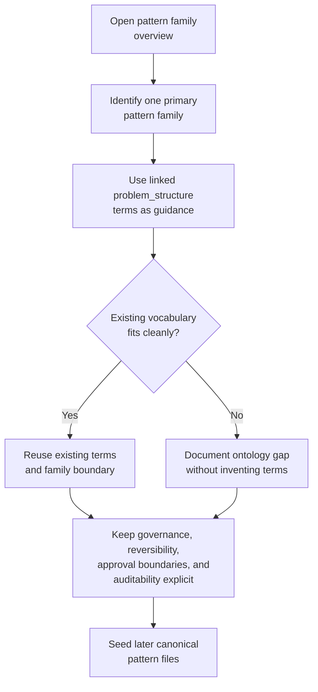

# Pattern family overviews

This directory provides the first narrative layer for the repository's nine top-level pattern families. These docs are not canonical pattern entries; they explain the structural boundaries, neighboring relationships, and authoring intent that later `data/patterns/*.yaml` files should follow.

## How to use these docs

Use the family pages to:

- keep future pattern authoring aligned with the pattern-first browse tree,
- distinguish neighboring families before creating seed YAML entries,
- reuse existing `problem_structure` vocabulary terms where they already fit cleanly,
- document known ontology gaps without papering over them with premature terms.

Each family page should be treated as a narrative anchor for later canonical pattern files, not as a substitute for them.

## Family order

The browse order below follows `docs/index-tree.md` and `data/views/index-tree.yaml`.

| Family | Primary role | Problem-structure linkage |
| --- | --- | --- |
| [gather-retrieve-synthesize](./gather-retrieve-synthesize.md) | Build grounded context from scattered sources | `context-gathering-and-synthesis` |
| [transform-process](./transform-process.md) | Convert, normalize, or restructure inputs into more usable forms | `structured-representation-transformation` |
| [investigate-reconcile-verify](./investigate-reconcile-verify.md) | explain mismatches, restore consistency, or prove correctness | `discrepancy-investigation`, `record-reconciliation`, `evidence-backed-verification` |
| [monitor-detect-triage](./monitor-detect-triage.md) | watch changing signals and route attention | `continuous-monitoring-and-triage` |
| [plan-coordinate-schedule](./plan-coordinate-schedule.md) | sequence work under constraints and across actors | `constraint-aware-planning`, `multi-party-coordination` |
| [recommend-decide-escalate](./recommend-decide-escalate.md) | evaluate options and support governed choice | `recommendation-and-decision-support` |
| [execute-automate](./execute-automate.md) | carry approved work through completion while handling exceptions | `approval-gated-execution`, `exception-aware-orchestration` |
| [optimize-adapt](./optimize-adapt.md) | improve behavior using feedback and changing conditions | `feedback-driven-optimization` |
| [human-agent-collaborative-work](./human-agent-collaborative-work.md) | structure shared work between people and agents | `human-agent-collaboration` |

## Authoring rules carried into Phase 5

When these docs are used to seed canonical patterns:

1. Keep each pattern inside one primary family, even if it relates to several others.
2. Reuse vocabulary ids where they fit cleanly instead of inventing near-duplicates.
3. Treat domains as examples and usage context, not as the top-level organizing spine.
4. Keep governance, reversibility, approval boundaries, and auditability explicit.
5. Use `structured-representation-transformation` for transformation-first patterns and keep verification or execution concerns in adjacent families.

## Navigation notes

The family docs are intentionally cross-linked because real workflows often move across adjacent families:

- gathering often feeds transformation or investigation,
- planning often precedes recommendation or execution,
- execution often produces the signals used in optimization,
- collaborative work can wrap several other families without replacing them.

For the conceptual browse tree that these pages explain, see [docs/index-tree.md](../index-tree.md).
