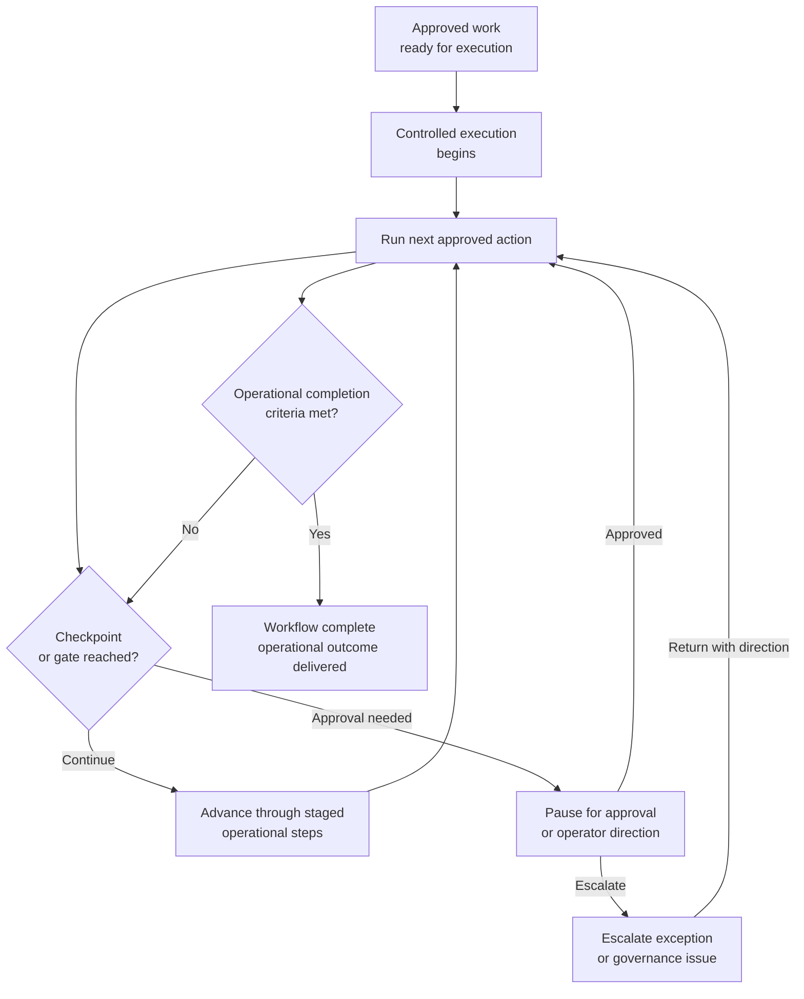

# Execute, automate

**Family id:** `execute-automate`

This family covers workflows that carry approved work through operational completion. Its center of gravity is action under control: invoking tools, moving work across steps, handling exceptions, and finishing the workflow while respecting explicit approval or governance boundaries.

## What belongs in this family

Use this family for patterns that:

- perform approved actions across one or more systems,
- orchestrate multistep work while tracking state and exceptions,
- manage retries, handoffs, and completion criteria,
- convert prior plans or decisions into concrete operational outcomes.

The conceptual seed patterns already named in the browse tree are:

- `approval-gated-action-execution`
- `human-directed-task-orchestration`
- `staged-change-execution-with-rollback-holds`
- `exception-aware-task-execution`
- `workflow-hand-off-and-completion`

## Problem-structure mapping

This family maps directly to two existing `problem_structure` terms:

- `approval-gated-execution`
- `exception-aware-orchestration`

Future canonical patterns should distinguish whether the defining challenge is approval control, operator-directed stepwise execution, staged reversible progression after approval, or resilient execution through edge cases.

## Family boundary

This family starts when the workflow crosses from preparation into action.

- If the main challenge is **deciding what should happen**, see [recommend-decide-escalate](./recommend-decide-escalate.md).
- If the main challenge is **iteratively improving the workflow based on results**, see [optimize-adapt](./optimize-adapt.md).
- If the workflow is mainly **shared human-agent handling of work rather than direct automation**, see [human-agent-collaborative-work](./human-agent-collaborative-work.md).

## Why this family is meaningfully agentic

Execution becomes agentic when the system must choose tools or action paths, recover from failure, respect live constraints, and decide when to pause for approval or escalation instead of blindly running a script. The family is about controlled operational agency, not raw automation throughput.

## Governance and evaluation concerns

Patterns in this family should be explicit about approval boundaries, reversible versus irreversible actions, exception handling, audit trails, and failure containment. Evaluation should consider task completion quality, safe recovery behavior, policy compliance, and whether the system stops when human intervention is required.

## Guidance for future seed patterns

A strong canonical pattern in this family should state:

- what actions the workflow is allowed to take,
- what approvals or control gates must be satisfied,
- what stage transitions, checkpoint signals, and rollback holds govern progression after approval,
- how explicit human direction, takeover-safe pauses, and step boundaries are maintained,
- how state, retries, and exceptions are handled,
- what feedback signals feed later optimization or governance review.

## See also

- Previous family: [recommend-decide-escalate](./recommend-decide-escalate.md)
- Next family: [optimize-adapt](./optimize-adapt.md)
