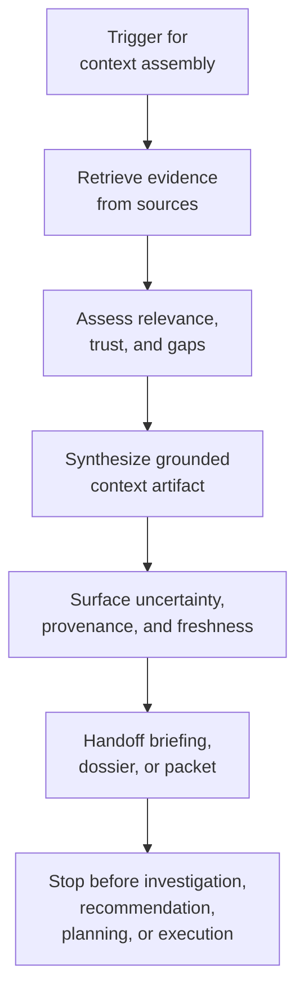

# Gather, retrieve, synthesize

**Family id:** `gather-retrieve-synthesize`

This family covers workflows whose main value comes from assembling the right context before any downstream decision, verification, or action happens. The agentic challenge is not merely fetching data; it is deciding what evidence matters, pulling it from multiple sources, and compressing it into a usable artifact without losing grounding.

## What belongs in this family

Use this family for patterns that:

- retrieve information from scattered or heterogeneous sources,
- merge overlapping evidence into a coherent working picture,
- produce a brief, dossier, summary, or assembled context package for later work,
- improve coverage and relevance rather than directly changing the world.

The conceptual seed patterns already named in the browse tree are:

- `retrieve-and-assemble-context`
- `multi-source-synthesis`
- `evidence-grounded-briefing`

The current canonical family coverage now spans low-risk change digests, moderate citation-verified synthesis, high-risk approval packet assembly, high-risk approval-gated release of one exact briefing revision, and critical crisis briefing synthesis, while preserving a consistent stop point at grounded context handoff.

## Problem-structure mapping

This family maps cleanly to the `problem_structure` term `context-gathering-and-synthesis`.

That mapping should anchor future canonical pattern entries when the main problem is evidence collection plus synthesis, rather than explanation, planning, or execution.

## Family boundary

This family ends when the primary output is a grounded understanding artifact.

Approval-gated release variants still belong here only when they begin from an already-synthesized briefing or context package and end at explicit human approval to release that exact revision into a bounded visibility lane rather than into recommendation, decision, planning, or execution.

Critical-risk variants still belong here only when a critical case is already declared and the workflow remains bounded at time-sensitive evidence assembly, cross-source compression, provenance-preserving synthesis, and crisis-briefing handoff.

- If the workflow mainly **restructures inputs into cleaner or more machine-usable form**, it belongs closer to [transform-process](./transform-process.md).
- If the workflow mainly **explains a mismatch, reconciles records, or confirms correctness**, it belongs closer to [investigate-reconcile-verify](./investigate-reconcile-verify.md).
- If the workflow mainly **ranks options or proposes a course of action**, it belongs closer to [recommend-decide-escalate](./recommend-decide-escalate.md).

## Why this family is meaningfully agentic

Simple retrieval is not enough for the workflows in this family. They become agentic when the system must adapt search paths, resolve partial evidence, decide what is relevant, manage source trust, and synthesize an output that a human or downstream process can actually use.

## Governance and evaluation concerns

Future patterns in this family should usually make source provenance explicit, because credibility often matters more than fluent summarization. Evaluation should emphasize coverage, grounding, traceability to evidence, and whether important uncertainty is surfaced rather than hidden.

For higher-risk uses, provenance and freshness discipline become even more important: a critical crisis brief can still fit this family, but only if human leaders retain all downstream decision authority and the workflow does not collapse into triage, recommendation, investigation, or execution.

## Guidance for future seed patterns

A strong canonical pattern in this family should state:

- what triggers context assembly,
- which source types and trust boundaries matter,
- how synthesis quality is judged,
- when the output is complete enough to hand off to investigation, planning, recommendation, or human review,
- for approval-gated release slices, how one exact briefing revision is held, approved, expired, or superseded before bounded downstream visibility,
- for critical cases, how source freshness, audience-specific redaction, and crisis-briefing handoff are handled without implying action selection or root-cause certainty.

## See also

- Next family: [transform-process](./transform-process.md)
- Neighboring family for evidence resolution: [investigate-reconcile-verify](./investigate-reconcile-verify.md)
