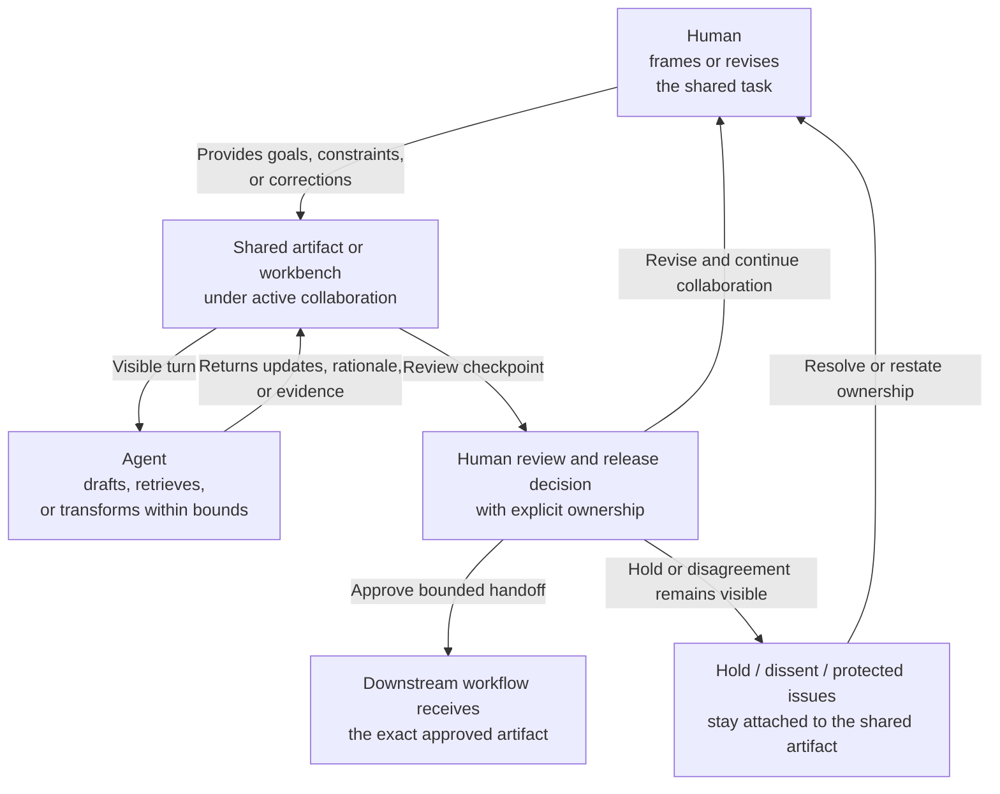

# Human-agent collaborative work

**Family id:** `human-agent-collaborative-work`

This family covers workflows where shared work between people and agents is itself the primary pattern, not just a minor approval step. The center of gravity is deliberate partnership: iterative refinement, visible handoffs, mixed initiative, and joint ownership of outcomes.

## What belongs in this family

Use this family for patterns that:

- depend on repeated back-and-forth between a human and an agent,
- keep responsibilities explicit across drafting, review, approval, and execution steps,
- use shared workbenches or copilot-style loops rather than fully delegated autonomy,
- coordinate judgment, interpretation, and action as a combined workflow.

The conceptual seed patterns already named in the browse tree are:

- `analyst-copilot-loop`
- `approval-centered-collaboration`
- `shared-workbench-orchestration`
- `approval-gated-collaborative-artifact-release`
- `critical-protected-artifact-collaboration`

## Problem-structure mapping

This family maps cleanly to the `problem_structure` term `human-agent-collaboration`.

That mapping should anchor future canonical patterns when collaboration is intrinsic to the workflow shape rather than a control point appended to another family.

## Family boundary

This family can wrap many other families, but it remains distinct when the shared mode of work is the primary reusable structure.

- If collaboration mainly exists to **build a plan**, see [plan-coordinate-schedule](./plan-coordinate-schedule.md).
- If collaboration mainly exists to **review recommendations or escalate decisions**, see [recommend-decide-escalate](./recommend-decide-escalate.md).
- If collaboration mainly exists to **supervise execution or adaptation**, see [execute-automate](./execute-automate.md) or [optimize-adapt](./optimize-adapt.md).

This family also includes an approval-gated release variant where the human-agent loop still centers on one shared artifact, but the key boundary is explicit human approval to release that exact collaboratively prepared artifact into one bounded downstream review lane. That remains collaboration-first only when the workflow preserves disagreement, release ownership, and artifact integrity instead of collapsing into recommendation adjudication, representation transformation, or downstream action.

At the critical end of the family, the collaboration artifact itself can become protected and governance-sensitive. Those patterns still belong here only when the main reusable shape is joint refinement of one severe shared artifact with explicit human ownership, visible dissent, restricted annex handling, and bounded handoff readiness. If the work instead centers on choosing the deciding authority, resequencing a command window, assembling a crisis brief, or carrying out the response, it belongs in an adjacent family.

## Why this family is meaningfully agentic

The family becomes agentic when initiative is shared: the system can propose, transform, retrieve, or execute parts of the work, while the human steers interpretation, accepts or revises outputs, and governs progression. The pattern is not just human approval at the end; it is structured co-production throughout the workflow.

## Governance and evaluation concerns

Future patterns should specify handoff rules, visibility into agent reasoning or evidence, override authority, and what responsibility remains with the human actor. Evaluation should consider usability, trust calibration, handoff clarity, and whether the collaboration design improves outcomes without obscuring accountability.

Critical collaboration variants should also state:

- how protected-room membership and sensitive annex boundaries are enforced,
- how unresolved disagreement remains visible instead of being normalized away,
- who owns release of the shared artifact into the next workflow, and
- which downstream family consumes the artifact once collaboration stops.

## Guidance for future seed patterns

A strong canonical pattern in this family should state:

- which responsibilities stay with the human,
- which responsibilities the agent may initiate or complete,
- how turns, edits, approvals, and release ownership are coordinated,
- whether the pattern stops at approval-readiness guidance, approval-bound artifact release, or severe protected collaboration,
- which adjacent family best describes the substantive work being wrapped.

## See also

- Planning-heavy neighbor: [plan-coordinate-schedule](./plan-coordinate-schedule.md)
- Decision-heavy neighbor: [recommend-decide-escalate](./recommend-decide-escalate.md)
- Execution-heavy neighbor: [execute-automate](./execute-automate.md)
- Feedback-heavy neighbor: [optimize-adapt](./optimize-adapt.md)
