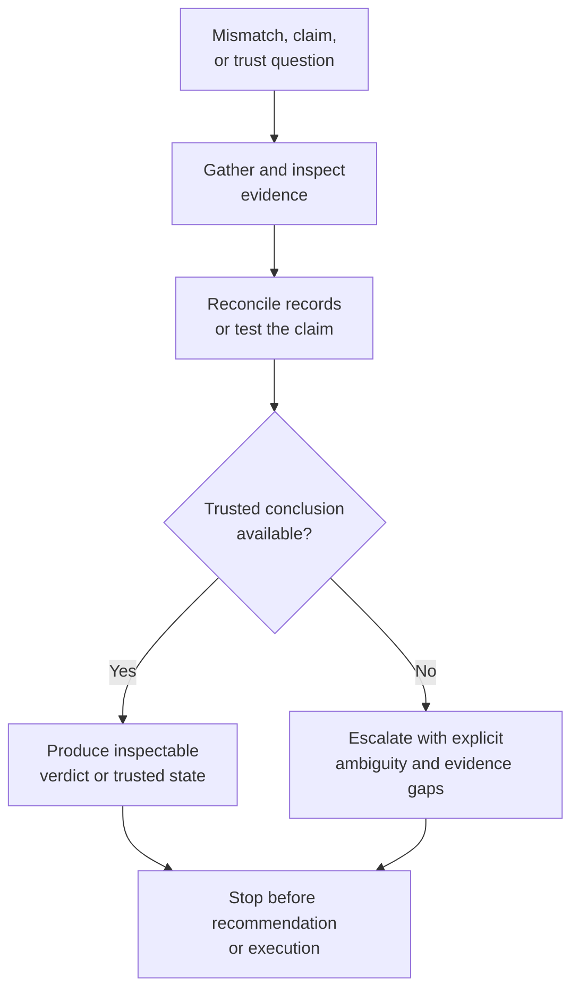

# Investigate, reconcile, verify

**Family id:** `investigate-reconcile-verify`

This family covers workflows that explain mismatches, restore trusted state, or confirm whether a claim, output, or condition is actually correct. It is the repository's main home for evidence-driven checking and discrepancy resolution.

## What belongs in this family

Use this family for patterns that:

- investigate why observed facts do not line up,
- reconcile multiple records that should represent the same reality,
- verify claims, outputs, compliance conditions, or execution results against evidence,
- produce an inspectable conclusion about trust, correctness, or authoritative state.

The conceptual seed patterns already named in the browse tree are:

- `discrepancy-investigation`
- `record-reconciliation`
- `evidence-backed-verification`
- `critical-authoritative-state-restoration`

## Problem-structure mapping

This family maps directly to three existing `problem_structure` terms:

- `discrepancy-investigation`
- `record-reconciliation`
- `evidence-backed-verification`

Future canonical patterns in this family should choose the single primary term that best reflects whether the workflow is centered on explanation, alignment, or proof.

`evidence-gated-verification-for-release` adds a higher-risk approval-gated verification variant for cases where a release, posting, or controlled-use package must be proven evidence-sufficient before humans allow downstream reliance or controlled publication. It stays in-family only when the workflow ends at an inspectable verdict, held-state register, and approval-ready handoff packet rather than deciding a release strategy, repairing records, or carrying out the downstream step.

`critical-authoritative-state-restoration` now gives this family a critical-risk anchor for time-sensitive workflows where the hard problem is determining trusted current state under severe consequences. It stays in-family only when the system is reconciling authoritative discrepancy, surfacing unresolved truth gaps, and handing off a bounded trusted-state package rather than triaging incoming signals, explaining why the discrepancy arose, recommending a response, or executing downstream changes.

## Family boundary

This family starts once the workflow's hard part becomes trust restoration or correctness checking.

- If the workflow mainly **gathers and summarizes context** before any inconsistency is being resolved, see [gather-retrieve-synthesize](./gather-retrieve-synthesize.md).
- If the workflow mainly **monitors ongoing signals and decides what deserves attention**, see [monitor-detect-triage](./monitor-detect-triage.md).
- If the workflow mainly **proposes a next-best action after verification**, see [recommend-decide-escalate](./recommend-decide-escalate.md).

Critical variants still belong here only when the core deliverable is an authoritative current-state determination with explicit holds and evidence lineage. If the main value is severe-signal routing, crisis briefing, response recommendation, or operational action, the workflow belongs in an adjacent family even if some reconciliation occurs on the way.

Approval-gated variants still belong here only when the workflow verifies evidence sufficiency and produces a trust gate for downstream reliance, publication, or execution handoff. If the workflow chooses rollout scope, approves a disposition, repairs the underlying state, or performs the release itself, it has crossed into recommendation, reconciliation, or execution territory instead.

## Why this family is meaningfully agentic

These workflows are agentic when the system must form and narrow hypotheses, inspect conflicting evidence, determine what additional checks are warranted, and present a conclusion that can survive scrutiny. The challenge is not only detection but structured reasoning under uncertainty.

## Governance and evaluation concerns

Patterns in this family should expose evidence quality, confidence, unresolved ambiguity, and the consequences of false confirmation or missed discrepancy. Evaluation should emphasize precision, traceability, auditability, and whether the workflow makes disagreement inspectable instead of obscuring it.

## Guidance for future seed patterns

A strong canonical pattern in this family should state:

- what counts as the trusted source of truth,
- what mismatch or claim triggers the workflow,
- what forms of evidence or checking are required,
- when the result should hand off to triage, recommendation, execution, or human adjudication.

## See also

- Previous family: [transform-process](./transform-process.md)
- Next family: [monitor-detect-triage](./monitor-detect-triage.md)
