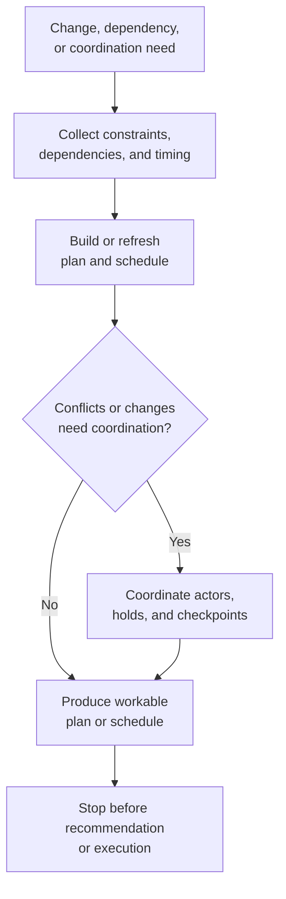

# Plan, coordinate, schedule

**Family id:** `plan-coordinate-schedule`

This family covers workflows that construct viable plans, maintain coordination across actors, or keep schedules aligned as conditions change. It is the main home for structured sequencing under constraints and dependency management.

## What belongs in this family

Use this family for patterns that:

- generate plans that respect constraints, dependencies, and objectives,
- coordinate handoffs across teams, systems, or roles,
- manage schedules, resource allocations, or replanning loops,
- produce a workable path forward rather than only analyzing the situation.

The conceptual seed patterns already named in the browse tree are:

- `constraint-aware-planning`
- `multi-party-coordination`
- `schedule-adjustment-and-replanning`
- `critical-command-window-resequencing`

## Problem-structure mapping

This family maps directly to two existing `problem_structure` terms:

- `constraint-aware-planning`
- `multi-party-coordination`

Future canonical patterns should choose the planning-centered or coordination-centered term based on what makes the workflow difficult.

`critical-command-window-resequencing` now gives this family a critical-risk anchor for workflows where the hard problem is preserving one authoritative command timeline under severe consequences. It stays in-family only when the system is re-sequencing checkpoints, preserving explicit holds, and handing off a bounded command-window coordination packet rather than triaging events, recommending a policy choice, or executing the response.

## Family boundary

This family is about making work executable in principle, not necessarily selecting policy outcomes or carrying out actions.

Critical variants still belong here only when the main artifact is a human-controlled checkpoint ledger, resequenced command timeline, or held coordination packet. If the workflow's main value becomes severe-signal triage, trusted-state restoration, crisis briefing, or downstream operational action, it belongs in an adjacent family even if command-window data is involved.

- If the main challenge is **prioritizing alerts and incoming work**, see [monitor-detect-triage](./monitor-detect-triage.md).
- If the main challenge is **ranking options or preparing a recommendation for a decision-maker**, see [recommend-decide-escalate](./recommend-decide-escalate.md).
- If the main challenge is **actually performing the approved steps across systems**, see [execute-automate](./execute-automate.md).

## Why this family is meaningfully agentic

The family becomes agentic when planning cannot be reduced to one static template. The workflow must reason over shifting constraints, negotiate dependencies, replan after changes, and keep multiple participants aligned without losing intent or control boundaries.

## Governance and evaluation concerns

Patterns here should make trade-offs visible: which constraints are hard, which are soft, who can override the plan, and what replanning authority exists. Evaluation should consider feasibility, stability under change, coordination overhead, and whether the resulting plan is actionable for downstream humans or systems.

## Guidance for future seed patterns

A strong canonical pattern in this family should state:

- what constraints and dependencies govern the plan,
- what actors or systems must stay synchronized,
- what triggers replanning,
- whether the output hands off to recommendation, execution, or collaborative review.

## See also

- Previous family: [monitor-detect-triage](./monitor-detect-triage.md)
- Next family: [recommend-decide-escalate](./recommend-decide-escalate.md)
- Collaboration-heavy neighbor: [human-agent-collaborative-work](./human-agent-collaborative-work.md)
