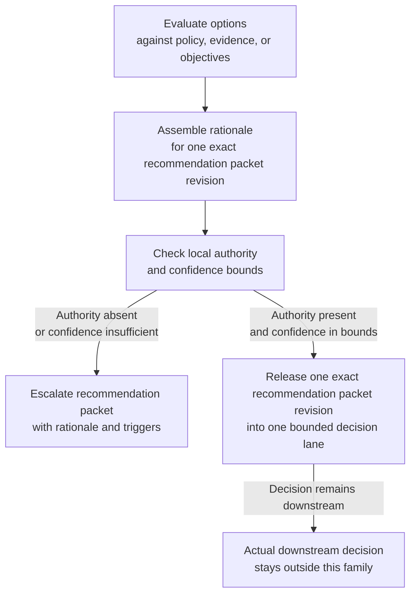

# Recommend, decide, escalate

**Family id:** `recommend-decide-escalate`

This family covers workflows that evaluate alternatives, justify a proposed course of action, and determine when a decision should be escalated rather than taken automatically. It sits between analysis and action, with governance-sensitive choice at the center.

## What belongs in this family

Use this family for patterns that:

- rank options against policy, evidence, or objectives,
- present rationale for a proposed decision,
- determine whether authority exists locally or must be escalated,
- release one exact recommendation packet revision into one bounded human decision lane when approval governs the packet handoff rather than the decision itself,
- support human or downstream system choice without yet performing the operational steps.

The conceptual seed patterns already named in the browse tree are:

- `decision-support-recommendation`
- `policy-aware-escalation`
- `option-ranking-with-rationale`

## Problem-structure mapping

This family maps cleanly to the `problem_structure` term `recommendation-and-decision-support`.

That mapping should anchor future canonical patterns when the main deliverable is a justified recommendation or governed choice.

## Family boundary

This family ends when a decision is supported, selected, escalated, or when one exact recommendation artifact is released into a bounded human decision lane.

Approval-gated release belongs here only when the governed artifact is still a recommendation packet, bounded option set, release manifest, or decision-lane handoff record. Approval in this family governs release of one exact recommendation revision into one named lane; it does not approve the downstream decision, keep a collaborative drafting loop open, transform the packet into a new schema, or authorize execution of any chosen option.

- If the hard part is **constructing the plan or coordinating dependencies**, see [plan-coordinate-schedule](./plan-coordinate-schedule.md).
- If the hard part is **carrying out the chosen action under approvals or exception handling**, see [execute-automate](./execute-automate.md).
- If collaboration itself is the core workflow shape rather than one decision checkpoint, see [human-agent-collaborative-work](./human-agent-collaborative-work.md).
- If the primary artifact is a **briefing/context package**, a **jointly authored shared artifact**, or a **transformed downstream-ready package**, use the adjacent gather, collaborative-work, or transform approval-gated families instead of this one.

## Why this family is meaningfully agentic

The family becomes agentic when the system must weigh trade-offs, apply policy or risk constraints, expose rationale, and recognize when confidence or authority is insufficient for automatic progression. It is not just scoring; it is governed judgment support.

Current canonical anchors now span low-, moderate-, high-, and critical-risk slices. The approval-gated edge in this family is valid only when approval binds one exact recommendation packet revision to one bounded decision lane while leaving the actual choice human-owned. The new critical edge should stay focused on severe authority selection, governed option narrowing, and decision-support packet assembly rather than collapsing into crisis briefing, collaboration-heavy adjudication, command planning, or execution.

## Governance and evaluation concerns

Future patterns should identify decision rights, escalation triggers, rationale requirements, and the cost of bad recommendations. Evaluation should emphasize calibration, policy alignment, explanation quality, and whether escalation behavior is appropriately conservative.

## Guidance for future seed patterns

A strong canonical pattern in this family should state:

- what options or cases are being evaluated,
- what policy, evidence, or goals shape the ranking,
- who owns the final decision,
- when the output should hand off to execution, monitoring, or collaborative review.
- when approval controls release of a recommendation packet, how one exact revision, one bounded option set, and one named decision lane stay explicit without implying that the decision itself has been approved.
- when a critical case should shift from ordinary escalation routing to human-directed authority recommendation with tightly bounded options and explicit irreversibility notes.

## See also

- Previous family: [plan-coordinate-schedule](./plan-coordinate-schedule.md)
- Next family: [execute-automate](./execute-automate.md)
