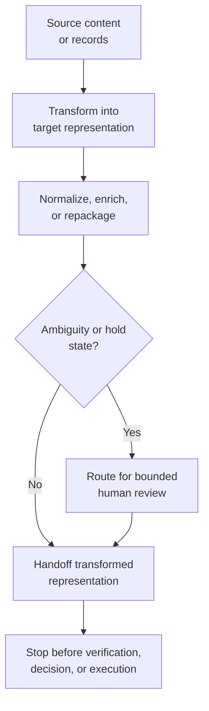

# Transform, process

**Family id:** `transform-process`

This family covers workflows that turn inputs into more usable forms through conversion, normalization, enrichment, extraction, or batch reshaping. The core value is structural transformation: making content or records operationally usable for later retrieval, analysis, reconciliation, execution, or reporting.

## What belongs in this family

Use this family for patterns that:

- convert documents or mixed inputs into structured data,
- normalize inconsistent fields or formats,
- enrich records so downstream workflows can reason over them,
- process content in batches where the main task is transformation rather than judgment.

The canonical patterns currently in this family are:

- `document-to-structured-data-handoff`
- `normalization-and-enrichment`
- `batch-content-transformation`
- `change-triggered-representation-refresh`
- `critical-channel-safe-state-packaging`
- `approval-gated-transformation-release`

## Problem-structure mapping status

This family now maps directly to `structured-representation-transformation` in `data/vocabularies/problem-structures.yaml`.

Use that term when the primary deliverable is a normalized, enriched, or schema-aligned representation that can be handed off downstream without turning the workflow into synthesis, verification, or execution.

`critical-channel-safe-state-packaging` now gives this family a critical-risk anchor for workflows whose main output is a governed package or staged representation for high-consequence audiences. It stays in-family only when the system is transforming authoritative state into channel-safe structured artifacts with explicit lineage, hold states, and release manifests rather than composing a narrative crisis brief, recommending a course of action, or executing communications.

`approval-gated-transformation-release` now covers the family's `approval-gated-execution` architecture slice for cases where the primary output is a transformed downstream-ready package plus an approval manifest. It stays in-family only when the gate is about releasing the transformed representation itself; if the workflow's main value is deciding whether the package is truly ready, recommending what to do with it, or performing the downstream action, it belongs in an adjacent verification, recommendation, or execution family.

## Family boundary

This family is about changing representation, shape, or usability.

- If the main task is **assembling evidence into a brief**, see [gather-retrieve-synthesize](./gather-retrieve-synthesize.md).
- If the main task is **checking whether transformed output is correct or reconciling it with another source of truth**, see [investigate-reconcile-verify](./investigate-reconcile-verify.md).
- If the main task is **taking action on transformed outputs inside an operational workflow**, see [execute-automate](./execute-automate.md).

Critical variants still belong here only when the main value is a constrained transformed package or representation. If the primary handoff is a crisis situation brief, recommendation, approval packet, or executed submission, the workflow belongs in an adjacent family even if some formatting or redaction happens along the way.

## Why this family is meaningfully agentic

The family matters when transformation is not a single static mapping. Agentic behavior appears when the workflow must choose extraction strategies, handle variable input quality, preserve important context across transformations, and adapt processing paths when inputs are incomplete, messy, or semantically ambiguous.

## Governance and evaluation concerns

Future patterns should be explicit about lossiness, schema fidelity, confidence signals, audience-specific minimization, hold-state behavior, and when transformed outputs require verification before reuse. Evaluation should focus on semantic preservation, completeness, consistency, downstream usability, approval-binding integrity, and the ability to explain withheld or generalized fields rather than only throughput.

## Guidance for future seed patterns

A strong canonical pattern in this family should state:

- what is being transformed and into what target form,
- what enrichment or normalization decisions are in scope,
- what ambiguity handling is allowed before human review,
- what hold states, annexes, or release boundaries are required when transformed outputs are audience-specific or high-consequence,
- how transformed outputs are handed off to retrieval, reconciliation, execution, or reporting workflows.

## See also

- Previous family: [gather-retrieve-synthesize](./gather-retrieve-synthesize.md)
- Next family: [investigate-reconcile-verify](./investigate-reconcile-verify.md)
