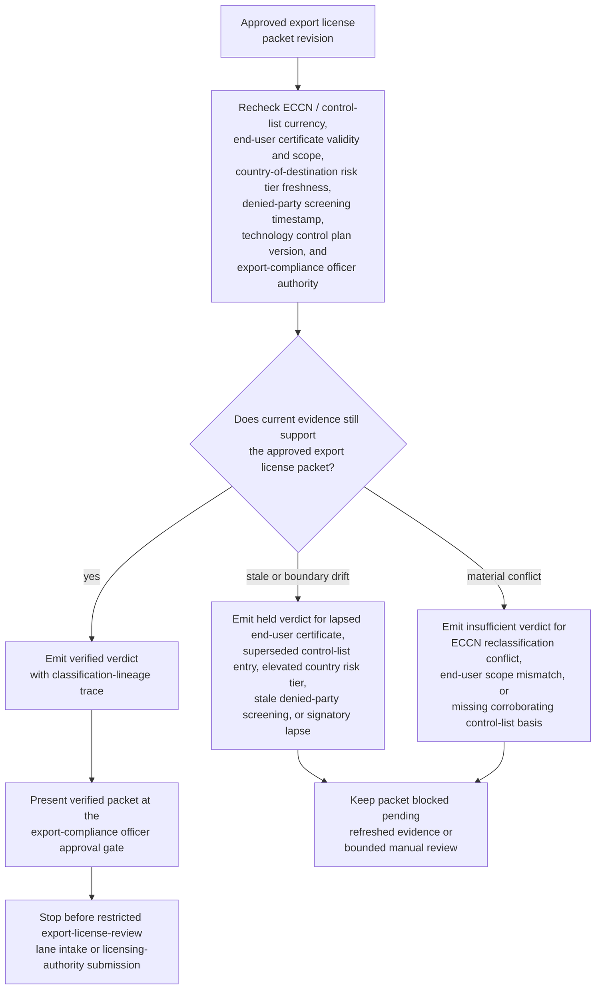
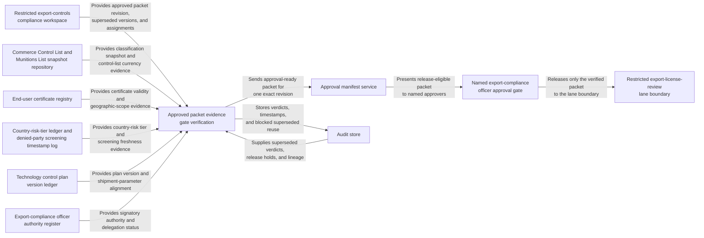

# Approved export license packet evidence gate verification

## Linked pattern(s)

- `evidence-gated-verification-for-release`

## Domain

Compliance.

## Scenario summary

An export-controls compliance team holds one approved revision of an export license packet for a controlled dual-use technology transfer. The packet has passed initial classification review and bears the internal approval of the export-compliance officer, but it cannot enter the restricted export-license-review lane — the gateway to formal licensing-authority submission — until current evidence still supports reliance on it. The workflow rechecks Export Control Classification Number and control list currency against the approved classification snapshot, end-user certificate validity and geographic-scope alignment, country-of-destination risk-tier and denied-party screening freshness, technology control plan version and shipment-parameter alignment, and export-compliance officer signatory authority against the approved packet revision. It then emits a verified, held, or insufficient verdict with explicit evidence lineage and release-hold state for named export-compliance approvers. It must not re-adjudicate the license eligibility, select an alternate end-user, communicate with a licensing authority, prepare the formal license application, initiate denied-party re-screening, revise the technology control plan, or trigger downstream filing or export execution.

## Target systems / source systems

- Restricted export-controls compliance workspace holding the approved packet revision, superseded packet versions, open classification holds, and named reviewer assignments
- Commerce Control List and Munitions List snapshot repository used to confirm ECCN and USML entry currency, end-use authorization notes, and multi-regime overlay alignment at the time the packet was approved versus the current control-list release
- End-user certificate registry and geographic-scope validation store confirming that the named end-user certificate is still within validity, covers the shipment parameters in the approved packet, and has not been superseded by a revised or revoked certificate
- Country-of-destination risk-tier ledger and denied-party screening timestamp log used to confirm that the destination risk classification has not been upgraded, embargo conditions have not changed, and the denied-party check on record still falls within the approved freshness window
- Technology control plan version ledger confirming that the shipment parameters, authorized-use clauses, and re-export restrictions in the packet revision align with the active technology control plan version and have not been invalidated by a plan amendment
- Export-compliance officer authority register and signatory-delegation records confirming which officers are currently authorized to certify the specific license class and commodity type in the packet
- Approval manifest service recording which export-compliance and trade-controls reviewers may release one exact packet revision into the restricted export-license-review lane
- Audit store preserving evidence timestamps, verified or held verdicts, classification-lineage checks, and blocked reuse of superseded packet revisions

## Why this instance matters

This grounds the pattern in an export-controls workflow where the hard problem is not deciding whether the technology is licensable, re-screening the end-user, or filing the license application. The hard problem is proving that one already approved export license packet revision is still trustworthy for downstream human reliance when the control-list classification basis, end-user certificate validity, country-of-destination risk tier, denied-party screening freshness, and technology control plan version can all drift after the packet receives internal approval. Control-list entries are periodically amended, end-user certificates carry fixed validity windows, country risk tiers change with regulatory guidance, and officer signatory authority is subject to delegation expiry. The value is a bounded evidence gate anchored to one exact packet revision so named export-compliance reviewers can see whether it remains evidence-sufficient for restricted downstream license-authority intake without reopening the classification decision, revising the packet, contacting the licensing authority, or triggering export execution.

## Likely architecture choices

- Approval-gated execution fits because the verification packet can be assembled automatically while the restricted export-license-review lane remains concretely blocked until named export-compliance officers release that exact packet revision.
- Human-in-the-loop review should remain mandatory because export-controls compliance, trade-operations, and legal owners must interpret held conditions — such as a superseded ECCN entry, a lapsed end-user certificate, or a newly elevated country risk tier — before anyone relies on the packet for a consequential licensing-authority submission handoff.
- Durable verification state should preserve superseded verdicts, repeated release holds, packet-version lineage, and classification-snapshot timestamps so later reviewers can distinguish genuine evidence refresh from resubmission of a previously blocked revision.

## Governance notes

- The verification result should show the approved packet revision identifier, ECCN and control-list snapshot timestamps, end-user certificate identifier and validity window, country-of-destination risk-tier check timestamp, denied-party screening run date, technology control plan version and amendment date, export-compliance officer signatory status, and the exact export-license-review-lane boundary directly in the approval-ready packet.
- A packet should remain held whenever the control-list entry cited by the approved packet is superseded by an amendment that affects the license determination, the end-user certificate has lapsed or no longer covers the shipment parameters in the packet, the country-of-destination risk tier has been elevated after the packet approval date, the denied-party screening timestamp on record falls outside the approved freshness window, the technology control plan referenced by the packet has been amended in a way that changes authorized-use or re-export conditions, or the named export-compliance officer's signatory authority is not confirmed current for this license class.
- A packet should be marked insufficient whenever the ECCN classification evidence in the packet conflicts with the current control-list entry or a binding commodity jurisdiction determination, the end-user scope in the certificate does not cover the commodity or destination in the packet, or a required corroborating control-list authority basis is absent.
- Human approval is required before the verified packet is handed into the restricted export-license-review lane or used to justify downstream reliance by trade-controls compliance, legal, or operations teams.
- Any re-adjudication of license eligibility, end-user re-screening, licensing-authority communication, formal license application preparation, technology control plan revision, or downstream filing or export-execution action belongs in adjacent recommendation, collaboration, transformation, or execution workflows rather than this verification gate.

## Evaluation considerations

- Percentage of approved export license packets that receive a verdict with complete ECCN lineage, end-user certificate validity, country-of-destination risk-tier, denied-party screening timestamp, technology control plan version, and export-compliance officer signatory coverage
- Rate at which superseded control-list entries, lapsed end-user certificates, elevated country risk tiers, stale denied-party screening records, or technology control plan amendments are caught before downstream reviewers rely on the packet for licensing-authority intake
- Reviewer agreement that verified, held, and insufficient outcomes reflect the intended sufficiency rules for classification-basis currency, certificate validity, country-risk freshness, and lane-boundary scope
- Reliability of repeated verification when control-list amendments, end-user certificate renewals, country risk-tier guidance updates, or technology control plan revisions arrive near the export-license-review submission window
