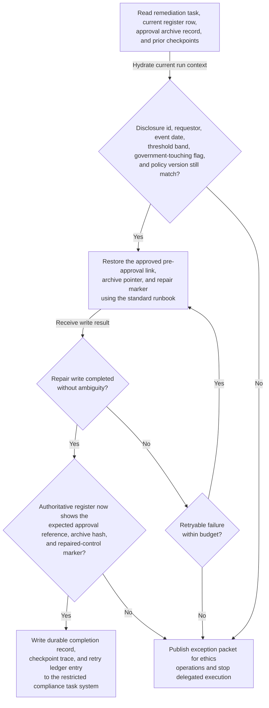
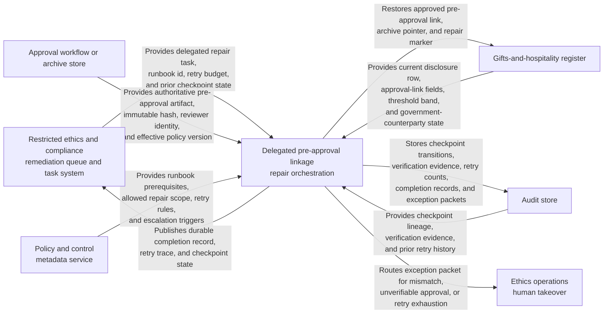

# Approved gifts-and-hospitality pre-approval linkage repair runbook execution

## Linked pattern(s)

- `exception-aware-task-execution`

## Domain

Compliance.

## Scenario summary

A restricted ethics and compliance operations queue receives a prequalified remediation task after a known integration drift caused some already-approved gifts-and-hospitality register entries involving government-touching events to lose their required pre-approval reference, archive pointer, or repair-status marker. The workflow is limited to one delegated routine runbook: re-read the remediation task, current register row, archived approval artifact, and checkpoint ledger; confirm the disclosure identifier, requestor, event date, threshold band, government-counterparty flag, and approved policy version still match; restore the missing pre-approval linkage and control-repair marker; retry only documented transient archive or register-write failures within the bounded retry budget; verify that the authoritative register now shows the correct approval reference, archive hash, and repaired state; and write one durable completion record plus one retry and checkpoint trace back to the restricted compliance task system. If the current register facts no longer match the approved artifact, the event now falls outside the delegated runbook, the approval record cannot be verified, or bounded retries are exhausted, the workflow must stop and publish an exception packet for ethics operations instead of recreating approvals, changing threshold treatment, contacting employees, or improvising broader anti-bribery remediation.

## Target systems / source systems

- Restricted ethics and compliance remediation queue holding the delegated repair task, approved runbook identifier, retry budget, and prior checkpoint state
- Gifts-and-hospitality register that stores disclosure rows, threshold status, government-counterparty flags, approval-link fields, and repair markers
- Approval workflow or archive store containing the authoritative pre-approval artifact, immutable document hash, reviewer identity, and effective policy version
- Policy and control metadata service exposing the runbook prerequisites, allowed repair scope, retry rules, and escalation triggers for anti-bribery control drift repair
- Audit store for checkpoint transitions, verification evidence, retry counts, completion records, and exception packets for human takeover

## Why this instance matters

This grounds the pattern in compliance operations where the valuable automation is routine control-drift repair, not recommendation, adjudication, or post-decision closure bookkeeping. Anti-bribery programs often accumulate operational defects when a valid pre-approval exists in the archive but the register loses the linkage needed for attestation, sampling, or audit. The example shows why execute-family delegated completion needs durable checkpoints, bounded retries, and explicit post-action verification: the common repair should finish automatically when the facts still align, but any policy mismatch, artifact ambiguity, or out-of-scope event change must halt immediately for human review.

## Likely architecture choices

- An orchestrated execution flow can separate task intake, state hydration, repair execution, authoritative verification, and escalation packaging while preserving one durable checkpoint ledger for the remediation task.
- Durable workflow state should record the current checkpoint, retry count, approval artifact hash, last register-write result, and final verified repair state so duplicate events or interrupted runs can resume safely.
- Verification should re-read the authoritative gifts-and-hospitality register after each consequential write rather than trusting the write response alone.
- Human takeover should trigger automatically when the disclosure row now reflects a different event, threshold treatment, or government-contact classification, when the archived approval artifact cannot be proven authoritative, or when the next step would require creating a new approval or interpreting anti-bribery policy.

## Governance notes

- The workflow should copy only the disclosure identifier, requestor identifier, event metadata, approval reference, archive hash, runbook version, retry state, and evidence needed for execution and escalation, not broad employee travel detail, hospitality narrative, or unrelated expense history.
- Audit traces should record each checkpoint transition, archive verification, repair write attempt, retry reason, post-action verification result, and the exact condition that caused any escalation.
- Every automated action should be idempotent or guarded by checkpoint checks so a resumed run does not attach the same approval reference twice or overwrite a newer register state after partial success.
- The automation must not issue a new pre-approval, change the threshold classification, reinterpret whether a counterparty is government-linked, request additional employee evidence, or continue after ambiguous verification.

## Evaluation considerations

- Percentage of in-scope gifts-and-hospitality linkage-repair tasks completed without manual intervention beyond documented exception checkpoints
- Rate of stale disclosure data, mismatched approval artifacts, ambiguous register-write results, or exhausted retries detected before an incorrect anti-bribery control repair is recorded as complete
- Completeness of retry ledgers and exception packets handed to ethics operations when the routine runbook cannot finish safely
- Reliability of replay-safe recovery when a transient archive or register failure occurs after one checkpoint has been written but before final verification succeeds
