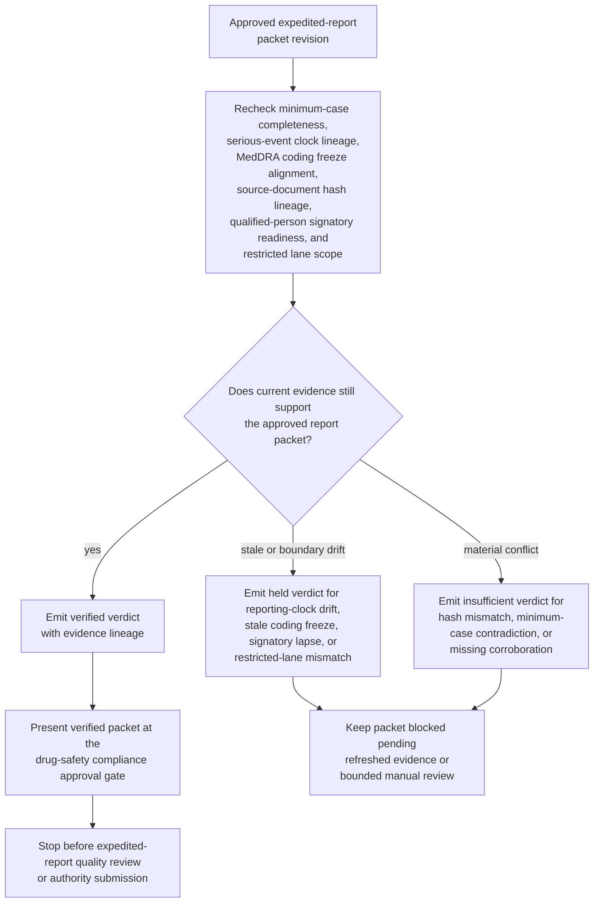

# Approved serious adverse event expedited-report packet evidence gate verification

## Linked pattern(s)

- `evidence-gated-verification-for-release`

## Domain

Compliance.

## Scenario summary

A pharmacovigilance compliance team already has one approved expedited-report packet revision for a serious adverse event involving an implanted infusion pump, but that exact packet cannot be released into the restricted expedited-report quality-review lane until current evidence still supports human reliance on it. The workflow rechecks minimum-case completeness, serious-event clock lineage, MedDRA coding freeze alignment, source-document hash lineage, qualified-person signatory readiness, and restricted lane scope against the approved packet revision, then emits a verified, held, or insufficient verdict with explicit evidence lineage and release-hold state for named drug-safety compliance approvers. It must not reassess causality, interpret reportability policy, contact regulators, revise the packet, submit the ICSR, or trigger downstream case-processing execution.

## Target systems / source systems

- Restricted pharmacovigilance compliance workspace holding the approved expedited-report packet revision, superseded packet versions, open holds, and named reviewer assignments
- Safety case-management system, source-document vault, and narrative-attachment checksum registry used to confirm minimum-case fields, protected attachments, and immutable source-document lineage
- Serious-event reporting-clock ledger, intake-timestamp audit trail, and duplicate-link register used to confirm clock start references, nullification boundaries, and whether the approved packet still matches the current expedited-report timing context
- MedDRA coding snapshot store, expectedness-reference records, and qualified-person signatory roster used to confirm that the packet's coded terms, review state, and named signatory boundary remain current without reopening medical judgment
- Approval manifest service recording which drug-safety compliance and quality reviewers may release one exact packet revision into the restricted expedited-report quality-review lane
- Audit store preserving evidence timestamps, verified or held verdicts, restricted-lane checks, and blocked reuse of superseded packet revisions

## Why this instance matters

This grounds the pattern in a compliance workflow where the hard problem is not deciding whether the serious adverse event is reportable, performing medical reassessment, or submitting anything to an authority. The hard problem is proving that one already approved expedited-report packet revision is still trustworthy for downstream human reliance when reporting clocks, duplicate linkage, coding snapshots, source-document lineage, and signatory readiness can all drift after approval. The value is a bounded evidence gate anchored to one exact packet revision so named reviewers can see whether it remains evidence-sufficient for restricted downstream quality review without drifting into packet repair, policy interpretation, regulator communication, or submission execution.

## Likely architecture choices

- Approval-gated execution fits because the verification packet can be assembled automatically while restricted expedited-report quality review remains concretely blocked until named drug-safety compliance approvers release that exact packet revision.
- Human-in-the-loop review should remain mandatory because pharmacovigilance compliance, quality, and safety-operations owners must interpret held conditions before anyone relies on the packet for a consequential review handoff.
- Durable verification state should preserve superseded verdicts, repeated release holds, packet-version lineage, and reporting-clock recalculations so later reviewers can distinguish genuine evidence refresh from duplicate checks on a previously blocked revision.

## Governance notes

- The verification result should show packet revision lineage, minimum-case completeness state, source-document hashes, reporting-clock start and pause references, MedDRA coding snapshot identifiers, qualified-person signatory status, and the approved restricted reviewer boundary directly in the approval-ready packet.
- A packet should remain held whenever the clock lineage cited by the packet no longer matches the current intake audit trail, one required source document falls outside the approved freshness or hash-validity window, the MedDRA coding freeze used by the packet is superseded, the named signatory is no longer current for the lane, or the requested downstream lane exceeds the approved expedited-report quality-review boundary.
- A packet should be marked insufficient whenever minimum-case evidence contradicts the approved packet materially, source-document hash lineage conflicts across protected stores, duplicate resolution changes the governing case identity, or one required corroborating source is missing for the expedited-report packet class.
- Human approval is required before the verified packet is handed into restricted expedited-report quality review or used to justify downstream reliance by pharmacovigilance compliance, safety quality, or regulatory-operations teams.
- Any recommendation about reportability, any medical assessment, any packet revision, any regulator communication, and any gateway submission or downstream case-processing action belongs in adjacent recommendation, collaboration, transformation, or execution workflows rather than this verification gate.

## Evaluation considerations

- Percentage of approved expedited-report packets that receive a verdict with complete clock, coding, source-document, signatory, and reviewer-boundary lineage
- Rate at which stale reporting-clock references, superseded coding snapshots, duplicate-identity drift, or source-document hash mismatches are caught before downstream reviewers rely on the packet
- Reviewer agreement that verified, held, and insufficient outcomes reflect the intended sufficiency rules for serious-event packet freshness, corroboration strength, and restricted-lane scope
- Reliability of repeated verification when follow-up documents, duplicate merges, or signatory-roster changes arrive near the expedited-report review window
