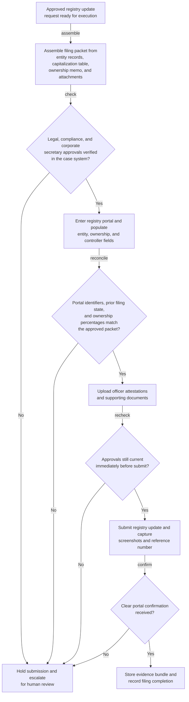
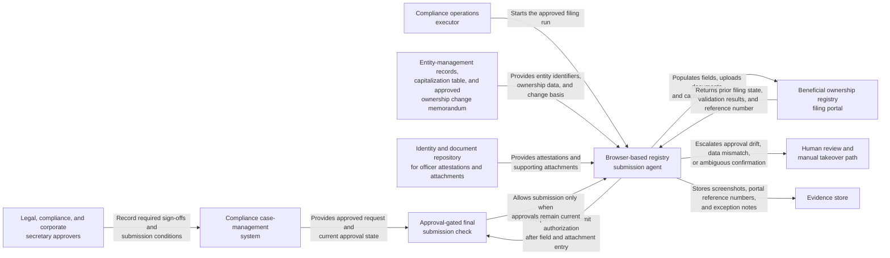

# Beneficial ownership registry update submission

## Linked pattern(s)

- `browser-based-form-completion-with-approval-gates`

## Domain

Compliance.

## Scenario summary

A corporate compliance operations team must file an updated beneficial ownership report after a private equity recapitalization changes the controlling ownership chain for a regulated subsidiary. The target government registry is browser-only, requires multi-page entry for legal entity identifiers, ownership percentages, controlling-person details, and supporting attachments, and final submission may proceed only after legal, compliance, and corporate secretary approvals are verified in the case system.

## Target systems / source systems

- Compliance case-management system holding the approved filing request and sign-offs
- Browser-only beneficial ownership or corporate transparency filing portal
- Entity-management records, capitalization table, and approved ownership change memorandum
- Identity and document repository for required officer attestations and supporting attachments
- Evidence store for screenshots, portal reference numbers, and exception or takeover notes

## Why this instance matters

This grounds the execution pattern in a compliance workflow where the browser action itself creates a regulated filing record. The value is not simple portal automation; it is controlled execution that proves the filing packet was approved, the submitted ownership data matched the authorized source documents, and the workflow stopped safely if the portal or filing state became ambiguous.

## Likely architecture choices

- Approval-gated execution should assemble the filing packet, re-verify current approvals, and prevent final submission until the required sign-offs are confirmed immediately before commit.
- A tool-using single agent can navigate the registry portal, populate owner and entity fields, upload supporting documents, and capture evidence at each gated checkpoint.
- Human-in-the-loop control is required for ownership-structure ambiguities, portal layout changes, validation mismatches, or any warning that the filing would amend a live regulated record unexpectedly.

## Governance notes

- Approval state should be checked against the authoritative case record right before submission rather than trusted from an earlier preparation step.
- The workflow should preserve a field-level trace back to the approved capitalization and control documents so reviewers can reconstruct why each ownership entry was submitted.
- If the portal shows unexpected prior filings, changed entity identifiers, or percentage totals that do not reconcile to the approved packet, the workflow should halt and escalate rather than attempt corrective interpretation.
- Personally identifiable ownership information, identity documents, and screenshots should be minimized, access-controlled, and retained only in approved audit stores.

## Evaluation considerations

- Percentage of approved registry updates submitted without regulator rejection or internal correction
- Rate of mismatched ownership data or stale approvals caught before final portal submission
- Completeness of audit evidence linking submitted fields to the approved ownership packet
- Reliability of safe escalation and human takeover when the registry UI drifts, times out, or returns ambiguous confirmation
