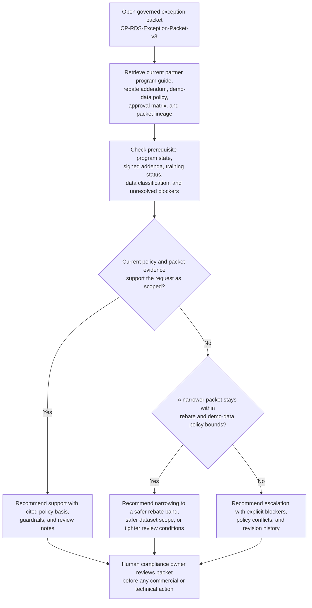
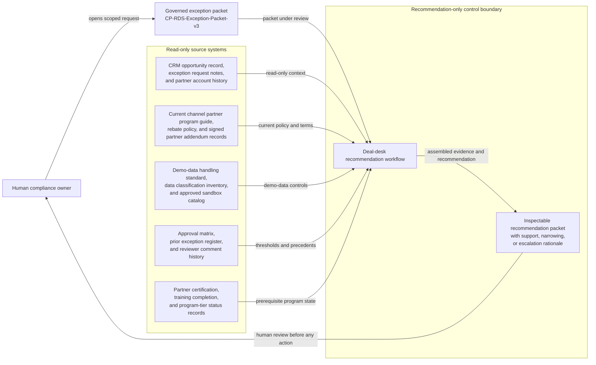

# Channel partner rebate and demo data sharing exception recommendation

## Linked pattern(s)

- `deal-desk-recommendation-support`

## Domain

Compliance.

## Scenario summary

A compliance deal-desk reviewer is evaluating one exact governed commercial-exception packet, `CP-RDS-Exception-Packet-v3`, for a channel partner that wants a higher launch rebate band and temporary access to a curated demo dataset for a joint solution roadshow. The workflow must recommend whether compliance should support the packet as scoped, narrow it to a safer combination of rebate and demo-data conditions, or escalate because current partner-program terms, demo-data handling rules, or approval thresholds do not support the requested exception set. The workflow stays inside the recommend-decide-escalate boundary: it does not approve the exception, draft final contract language, send partner communications, release rebate funds, enable data access, or carry out downstream operations.

## Target systems / source systems

- CRM opportunity record, exception request notes, and partner account history
- Current channel partner program guide, rebate policy, and signed partner addendum records
- Demo-data handling standard, data classification inventory, and approved sandbox catalog
- Approval matrix, prior exception register, and reviewer comment history
- Partner certification, training completion, and program-tier status records

## Why this instance matters

This instance grounds commercial recommendation support in a compliance-heavy partner-governance lane rather than the cross-border contract-risk lane. The hard part is not summarizing one request. It is producing a bounded recommendation for one packet revision while keeping source precedence, prerequisite program state, visible blockers, and escalation triggers explicit before anyone treats the exception as approved or starts operational follow-through.

## Likely architecture choices

- A recommendation-only workflow can assemble the current partner-program policy stack, rebate constraints, demo-data controls, and comparable exception history into one inspectable packet.
- Human-in-the-loop review remains mandatory because the workflow should advise on support, narrowing, or escalation, not approve the exception, amend partner terms, or change system entitlements.
- Read-only integration with CRM, partner-program, policy, and sandbox-governance systems is preferable so the agent cannot convert a recommendation into a commercial commitment or data-sharing action.

## Governance notes

- Source precedence should be explicit: the current fiscal-year channel rebate policy, the signed demo-data addendum, and the active demo-data handling standard outrank CRM request notes or seller commentary whenever they conflict.
- The packet should remain ineligible for support until prerequisite state is verified, including the partner's current program tier, required compliance training completion, active addendum version, and approved demo-sandbox baseline.
- Visible blockers should stay on the face of the recommendation packet, including the unresolved question of whether one requested demo extract still contains legacy customer attributes, the missing countersignature on the FY2026 rebate addendum, and an expired partner solution-architect certification tied to demo-data handling.
- Revision lineage should remain inspectable across packet updates: v1 captured the original rebate-uplift and broad demo-data request, v2 narrowed the requested dataset scope after first-pass review, and v3 added the current blocker list plus refreshed policy citations.
- One named human owner should remain accountable for the recommendation lane: Priya Natarajan, Director of Channel Compliance Programs.
- Recommendations should distinguish supportable options, narrower fallback options, and blocked paths without implying that any rebate payout, partner communication, entitlement change, or final approval has occurred.

## Evaluation considerations

- Reviewer agreement with whether the packet should be supported, narrowed, or escalated before any downstream deal or access action is taken
- Rate at which stale CRM notes are correctly subordinated to current policy artifacts and signed addenda
- Quality of evidence linking prerequisite program state, blocker visibility, and packet revision history to the recommendation
- Stability of recommendations when packet updates change rebate scope, dataset scope, or partner-program status
