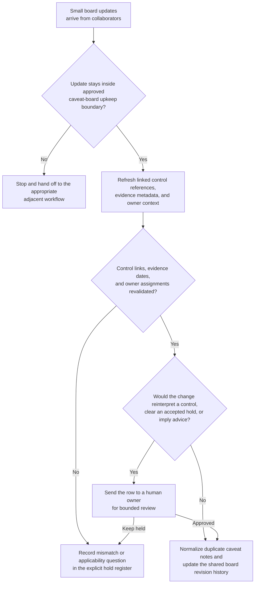
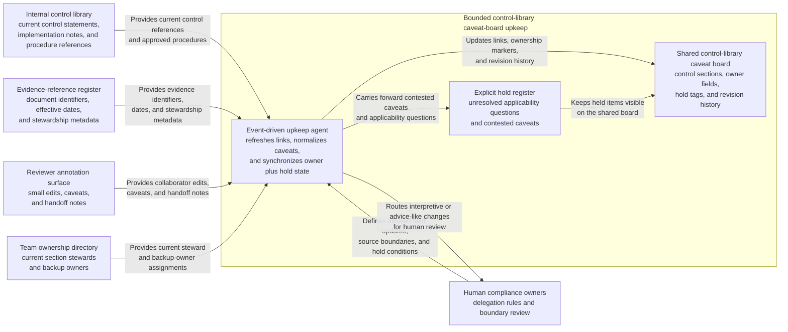

# Control-library caveat board shared workbench upkeep

## Linked pattern(s)

- `shared-workbench-orchestration`

## Domain

Compliance.

## Scenario summary

An internal compliance operations team maintains a shared control-library caveat board while policy owners, testing coordinators, and regional compliance liaisons continuously refine implementation notes tied to standard controls. Small updates arrive throughout the week: one owner links a superseding procedure reference, a testing coordinator flags a stale evidence note, a regional liaison adds one localized caveat, and another reviewer reassigns section ownership after a team change. The agent keeps that internal workbench usable by refreshing linked source references, normalizing duplicate caveat notes, preserving accepted owner assignments, and carrying unresolved applicability questions forward in an explicit hold register. Humans remain responsible for deciding what a control obligation means, whether any caveat changes compliance posture, whether an exception is acceptable, and when any material should move into separate attestation, remediation, legal review, regulator communication, or execution workflows.

## Target systems / source systems

- Shared control-library caveat board with control sections, owner fields, hold tags, and revision history
- Internal control library or policy repository containing current control statements, implementation notes, and approved procedure references
- Evidence-reference register with document identifiers, effective dates, and stewardship metadata linked from board rows
- Reviewer annotation surface where policy owners, testing coordinators, and regional liaisons add small edits, caveats, and handoff notes
- Team ownership directory tracking current section stewards and approved backup owners for the maintained workbench

## Why this instance matters

This grounds the pattern in a low-risk compliance setting where the maintained artifact is an internal caveat board rather than a legal memo, regulatory response, or control decision packet. The value is in keeping one bounded workbench current and resumable as small source and ownership changes arrive from several collaborators. That makes the workflow about internal artifact upkeep, provenance, and hold-state visibility instead of recommendation, adjudication, or downstream compliance action.

## Likely architecture choices

- Event-driven monitoring fits because upkeep should react when control-library references, evidence metadata, reviewer notes, or owner assignments change.
- A tool-using single agent can refresh source links, normalize duplicate caveat wording, and keep ownership plus hold markers synchronized inside one bounded board.
- Human-in-the-loop review remains necessary when a note would reinterpret a control requirement, clear a caveat that is still contested, or make the board sound like formal advice or sign-off.
- Bounded delegation works because compliance owners can predefine allowable field updates, source boundaries, and hold conditions without delegating attestation, exception approval, or external communication.

## Governance notes

- The board should clearly separate approved source references, reviewer proposals, unresolved applicability questions, and held caveats so upkeep never implies that a compliance judgment has already been made.
- Control-library links, evidence-reference identifiers, effective dates, and owner assignments should be revalidated before a row is marked current or a hold is cleared.
- The agent may normalize structure and merge overlapping notes, but it should not decide whether a caveat changes a control obligation, approve an exception, or remove a hold that a human owner accepted.
- If a requested update would provide legal advice, recommend a disposition, communicate with regulators, submit an attestation, or trigger control execution, the workflow should stop and hand off to the appropriate adjacent pattern.

## Evaluation considerations

- Percentage of board refreshes that preserve correct control references, owner assignments, and unresolved-question state across repeated update cycles
- Reviewer correction rate for merged caveat notes, refreshed evidence links, or automatically updated hold markers
- Rate at which advice-like, adjudicative, or execution-adjacent edits are held for human review instead of being silently folded into the internal board
- Usefulness of the maintained workbench for helping compliance collaborators resume upkeep without reconstructing stale context by hand
