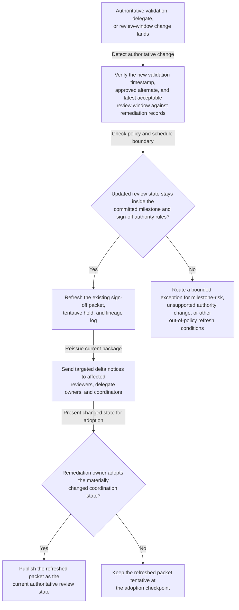
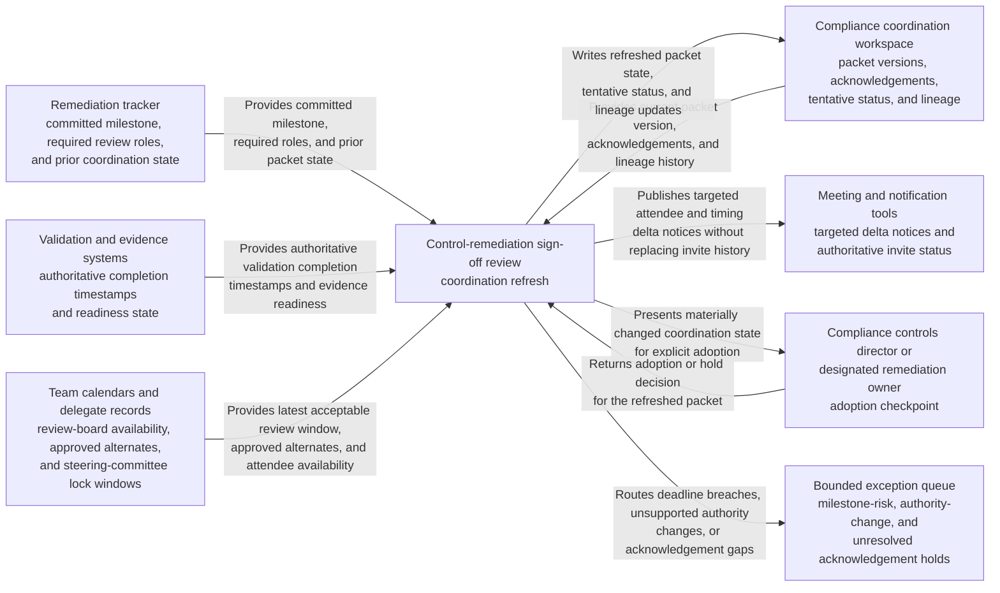

# Control-remediation sign-off review coordination refresh after validation slip

## Linked pattern(s)

- `authoritative-change-coordination-refresh`

## Domain

Compliance.

## Scenario summary

A sanctions-screening control-remediation sign-off review already has an issued coordination packet, required attendee set, regulator-committed milestone link, and tentative steering-committee review hold. After issuance, authoritative validation state changes: evidence validation completes later than expected, the internal audit liaison must hand off attendance to an approved alternate, and the remediation calendar updates the last acceptable review window before steering-committee materials lock. The workflow should refresh the existing sign-off coordination package, send targeted participant delta notices, and hold the changed state at explicit remediation-owner adoption or exception checkpoints rather than rebuilding the entire remediation plan, adjudicating whether remediation is sufficient, or submitting the attestation.

## Target systems / source systems

- Remediation tracker with the committed milestone, required review roles, and prior coordination state
- Validation and evidence systems publishing authoritative completion timestamps that determine when sign-off review can start
- Team calendars, delegate records, and review-board availability for compliance controls, internal audit, model governance, remediation management, and technology risk
- Compliance coordination workspace where packet versions, acknowledgements, and open exceptions are logged
- Meeting and notification tools capable of reissuing targeted updates while preserving authoritative invite status and audit trace

## Why this instance matters

This grounds the pattern in a compliance workflow where schedule-state freshness and explicit adoption boundaries matter because the review sits close to a regulator-visible milestone. The coordination artifact must stay synchronized with authoritative validation and attendee changes without blurring into deeper replanning or downstream attestation. The instance highlights why lineage, exception gating, and role-specific notice discipline are valuable when the cost of stale coordination is materially higher than ordinary calendar churn.

## Likely architecture choices

- Event-driven monitoring should listen only to approved remediation-calendar, validation-completion, and delegate-state changes that affect the existing sign-off packet.
- Exception-gated autonomy fits because packet refresh, targeted notice publication, and lineage updates can proceed automatically for in-policy changes while sensitive authority or deadline shifts remain gated.
- The compliance controls director or designated remediation owner should adopt materially changed schedule state before the refreshed review packet becomes authoritative.
- Exception routing should capture deadline breaches, missing approved delegates, or unresolved reviewer acknowledgements instead of hiding them inside a seemingly current packet.

## Governance notes

- Required roles, approved alternates, and regulator-visible timing boundaries should be explicit and reviewed before automatic refresh is enabled.
- Refreshed notices should carry only the timing, attendee, and checkpoint deltas needed for coordination, leaving detailed remediation evidence in governed systems.
- The workflow should preserve append-only lineage linking each authoritative validation or calendar change to the corresponding packet refresh, notice issuance, and adoption outcome.
- Automatic refresh should stop when a changed review window would miss the committed milestone or alter who holds sign-off authority without explicit approval.
- Churn-heavy refresh periods should be sampled by governance owners to ensure the system preserves trust rather than flooding reviewers with conflicting packets.

## Evaluation considerations

- Time from authoritative validation or calendar change to a refreshed sign-off packet with explicit adoption or exception status
- Rate of milestone-threatening shifts, unsupported delegate substitutions, or unresolved required-attendee acknowledgements correctly escalated before the packet becomes authoritative
- Audit usefulness of the lineage log for reconstructing which compliance events changed the review packet and what human action followed
- Participant confidence that one current sign-off packet remains authoritative during late remediation-window changes
