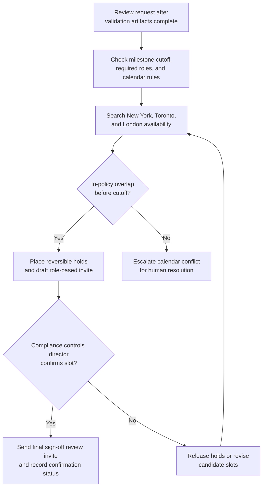

# Control-remediation sign-off review scheduling

## Linked pattern(s)

- `calendar-conflict-coordination`

## Domain

Compliance.

## Scenario summary

A compliance program coordinator needs to schedule a control-remediation sign-off review before a regulator-committed remediation milestone closes for a high-priority sanctions-screening control gap. The meeting must include the compliance controls director, the remediation workstream owner, the model governance lead, the internal audit liaison, and the accountable technology risk manager because the review sits between evidence-pack completion and formal attestation submission to the remediation steering committee. The workflow is about constructing a viable slot inside the committed review window, placing reversible holds across New York, Toronto, and London calendars, and escalating quickly when no in-policy overlap exists rather than guessing at delegates, relaxing the remediation deadline, or making the final meeting commitment without human confirmation.

## Target systems / source systems

- Remediation tracker with the committed milestone date, required sign-off roles, severity tier, and steering-committee submission cutoff
- Team calendars for compliance controls, remediation management, model governance, internal audit, and technology risk
- Compliance review calendar showing regulator-committed windows, blackout periods for quarter-close attestations, and already-booked remediation boards
- Evidence register used only to determine when the sign-off review can occur after validation artifacts are complete
- Calendar and meeting tools that support tentative holds, delegate-aware attendee metadata, and reversible invite drafts
- Compliance coordination workspace where attendee exceptions, escalation rationale, and final confirmation status are recorded

## Why this instance matters

This grounds the scheduling pattern in a compliance workflow where the main value is assembling the exact sign-off stakeholders inside a regulator-visible remediation window before any attestation can proceed. It is distinct from investigation, recommendation, or execution work because the workflow is not determining root cause, deciding whether remediation is sufficient, or filing the attestation itself. Instead, it handles bounded-delegation schedule construction so human control owners can focus on the remediation decision once the right reviewers are aligned at the right time.

## Likely architecture choices

- A tool-using single agent gathers free-busy availability, remediation-window constraints, required-attendee rules, and existing review-board bookings from approved compliance systems.
- Bounded delegation fits because the agent can rank feasible slots, place short-lived tentative holds, and draft a meeting packet linked to the remediation record, but it should not move the committed milestone, replace a required control owner silently, or confirm the final review invitation without the compliance controls director's approval.
- Human checkpoints remain necessary when no compliant overlap exists before the submission cutoff, when only after-hours options remain for a required reviewer, or when a proposed delegate would change who can speak for internal audit, model governance, or accountable technology risk.

## Governance notes

- Required attendees should be explicit and role-based before any hold is placed: compliance controls director, remediation workstream owner, model governance lead, internal audit liaison, and accountable technology risk manager.
- Calendar access should stay limited to free-busy, timezone, delegate, and policy metadata rather than exposing private event titles, examination notes, or remediation commentary.
- Tentative holds should be reversible, time-bounded, and tied to the specific remediation milestone so stale placeholders do not block other regulatory review windows.
- The workflow should minimize copied case detail in invites and coordination messages, sharing only the meeting purpose, timing window, and role requirements needed for scheduling while leaving sensitive remediation evidence in approved systems.
- The workflow should escalate instead of improvising when no in-policy slot exists before the regulator-committed deadline, when the only feasible option crosses protected after-hours boundaries, or when a substitute attendee would alter sign-off authority.
- Final commitment should stay human-owned: the compliance controls director or designated remediation lead confirms the selected slot and any approved attendee substitution before the invite becomes authoritative.

## Evaluation considerations

- Median time from remediation-review scheduling request to a viable sign-off slot covering all required compliance roles inside the committed review window
- Percentage of remediation sign-off reviews confirmed without manual back-and-forth beyond defined control-owner checkpoints
- Frequency of rescheduling caused by stale free-busy data, expired tentative holds, or missed required-attendee constraints near the steering-committee cutoff
- Audit usefulness of the coordination log for showing which slots were rejected, which reversible holds were placed, and why a human had to approve the final commitment or attendee exception
