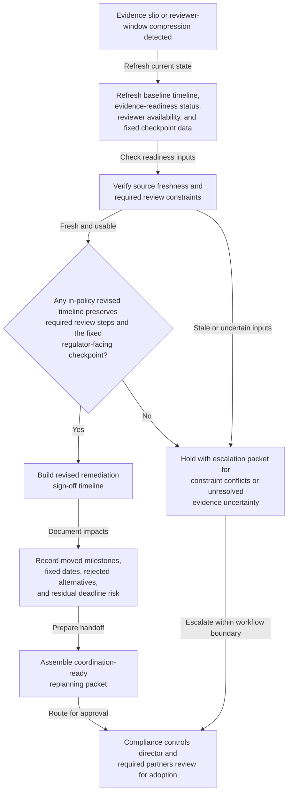
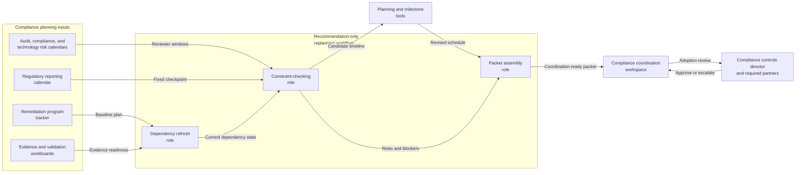

# Control-remediation sign-off timeline replanning after evidence-collection slip

## Linked pattern(s)

- `schedule-adjustment-and-replanning`

## Domain

Compliance.

## Scenario summary

A compliance remediation program already has an approved timeline that sequences evidence collection, control-validation review, internal audit walkthrough, remediation-owner sign-off review, steering-committee packet lock, and a non-waivable regulator-facing checkpoint tied to quarter-close reporting. Then the baseline plan stops being feasible: evidence collection for one control segment slips by several business days, an internal-audit reviewer window compresses, or the filing-linked checkpoint stays fixed while the original sign-off path no longer fits. The workflow should recompute a revised timeline, document which milestones can move and which must remain fixed, and prepare a coordination-ready replanning packet for the compliance controls director, remediation workstream owner, internal audit liaison, regulatory reporting coordinator, and technology risk manager rather than deciding whether the evidence is sufficient, waiving a required control review, filing anything with the regulator, or executing the remediation work itself.

## Target systems / source systems

- Remediation program tracker with the approved baseline schedule, sign-off dependencies, severity tier, quarter-close linkage, and prior timeline versions
- Evidence-collection and validation workboards showing which remediation artifacts remain incomplete, when refreshed proof is expected, and which control segments still block review readiness
- Internal audit, compliance review, and technology risk calendars capturing reviewer availability, blackout periods, and already-committed review-board windows
- Regulatory reporting calendar or milestone register showing the fixed filing-linked checkpoint, packet-lock date, and non-waivable timing constraints that the replanned schedule must preserve
- Planning and milestone tools that can model dependency shifts, critical-path impacts, blocked alternatives, and versioned schedule packets for handoff
- Compliance coordination workspace where the rationale ledger, unresolved blockers, stakeholder acknowledgements, and adoption status of the revised plan are recorded

## Why this instance matters

This grounds the replanning pattern in a compliance workflow where timing pressure comes from late evidence readiness and fixed external checkpoints rather than from simple meeting-slot coordination. The valuable output is a revised schedule, an explicit rationale and impact ledger, and a coordination-ready handoff packet that helps human owners decide how to proceed. The workflow stays inside the planning family boundary by avoiding judgments about remediation sufficiency, waiver decisions, filing action, or operational execution.

## Likely architecture choices

- An orchestrated multi-agent workflow fits because one role can refresh current dependency state from evidence and validation systems, another can test candidate timelines against fixed compliance and reviewer constraints, and another can package the accepted replanning proposal with downstream impacts and unresolved blockers.
- Human-in-the-loop adoption remains necessary because the compliance controls director, remediation owner, or regulatory reporting lead must approve any material movement of sign-off sequencing, review compression, or communication timing before the revised schedule becomes authoritative.
- Recommendation-only autonomy is the right ceiling: the workflow can propose a feasible updated sequence and identify deadline risks, but it should not declare the control remediated, waive internal-audit participation, alter the fixed regulator checkpoint, or trigger filing or remediation actions.

## Governance notes

- Hard constraints should remain explicit throughout replanning: the non-waivable regulator-facing checkpoint, steering-committee packet-lock timing, required evidence-validation completion, internal-audit participation rules, and any minimum review lead times.
- The rationale and impact ledger should preserve lineage from the baseline timeline to the revised proposal, including which milestones moved, which remained fixed, what alternatives were rejected, and what deadline risk still remains.
- Source freshness matters because a revised schedule built on stale evidence-readiness or reviewer-availability data can create false confidence and force another late replanning cycle.
- The coordination-ready handoff packet should share only role-relevant timing, dependency, blocker, and acknowledgement detail rather than copying sensitive remediation evidence, examination commentary, or draft filing content into broad scheduling channels.
- The workflow should escalate instead of improvising when no in-policy timeline can preserve both the required review steps and the fixed regulator checkpoint, when a proposed change would effectively waive a control-governance requirement, or when unresolved evidence uncertainty makes any revised plan misleading.

## Evaluation considerations

- Time from evidence-delay or reviewer-window compression trigger to a revised remediation timeline with explicit dependency impacts and adoption-ready handoff
- Rate of replanning events resolved with an accepted revised schedule without forcing a full manual rebuild of the sign-off path
- Frequency of adopted revised timelines that still miss hard review or filing-linked checkpoints because constraint interactions were not surfaced early enough
- Audit usefulness of the rationale ledger for reconstructing what changed, what stayed fixed, why the revised sequence was selected, and what human approvals or escalations followed
