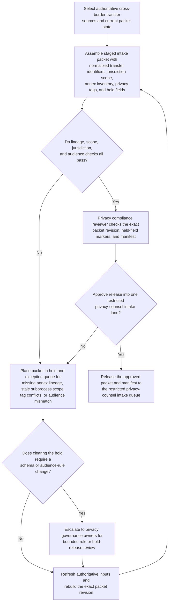
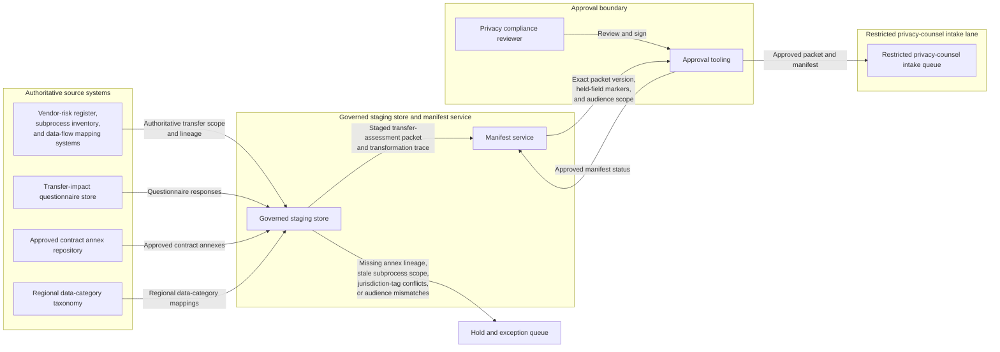

# Cross-border transfer assessment packet approved for restricted privacy counsel intake

## Linked pattern(s)

- `approval-gated-transformation-release`

## Domain

Compliance.

## Scenario summary

A privacy compliance team is preparing a transfer-assessment packet for a new analytics subprocess that would route employee telemetry into a vendor environment with cross-border access. The authoritative source state spans the vendor data-flow inventory, subprocess register, transfer-impact questionnaire responses, approved contract annexes, regional data-category mappings, and prior exception history. The downstream restricted intake lane expects one transformed packet with normalized transfer identifiers, jurisdiction scope, annex inventory, privacy tags, held-field markers, and an approval manifest authorizing handoff into that single privacy-counsel intake queue. The workflow must stop once that exact packet revision is approved for intake, without deciding whether the transfer is permissible, issuing legal advice, contacting the vendor, or launching any regulator notification or remediation action.

## Target systems / source systems

- Vendor-risk register, subprocess inventory, and data-flow mapping systems holding the authoritative transfer scope and system lineage
- Transfer-impact questionnaire store, approved contract annex repository, and regional data-category taxonomy used to normalize packet fields
- Governed staging store and manifest service that assemble the transfer-assessment intake packet, preserve lineage, and record held annexes
- Approval tooling used by privacy compliance reviewers to sign the exact packet version, audience scope, and restricted intake boundary
- Hold and exception queue for missing annex lineage, stale subprocess scope, jurisdiction-tag conflicts, or audience-scope mismatches before any privacy-counsel workflow receives the packet

## Why this instance matters

This grounds the pattern in compliance work where the key output is one downstream-ready transformed packet revision rather than a legal judgment or remediation plan. Privacy teams often need to reshape scattered transfer inputs into a governed intake artifact that counsel can review without reopening every source system, while still keeping unresolved annex or scope issues explicit. The instance shows how approval-gated transformation release stays in-family when it centers on packet assembly, hold state, lineage, and manifest-bound handoff rather than recommendation, adjudication, filing, or live compliance action.

## Likely architecture choices

- Approval-gated execution fits because the transfer-assessment packet may be technically complete for one restricted counsel-intake lane while remaining blocked until a privacy compliance reviewer approves the exact version and audience scope in the manifest.
- Human-in-the-loop governance is required because accountable reviewers must confirm jurisdiction tags, held annexes, and the single downstream intake boundary before release.
- The workflow should emit only the transformed transfer-assessment packet, transformation trace, hold register, and approval manifest rather than a permissibility recommendation, legal conclusion, vendor instruction, or regulator-submission package.
- Approved reference data may normalize subprocess identifiers, jurisdiction labels, annex classes, and data-category codes, but unsupported inference about transfer legality, supplementary-measure sufficiency, or notification obligations should force a hold.

## Governance notes

- Every consequential field, especially subprocess scope, jurisdiction mapping, annex reference, transfer mechanism identifier, data-category inventory, and intake-lane scope, should retain lineage to authoritative source records and the exact packet version approved for intake.
- The manifest should bind one exact packet revision, one restricted privacy-counsel intake lane, signer identities, privacy scope, and any held annexes so downstream reviewers cannot inherit stale or broader approval.
- The workflow should hold release when an annex lacks traceable lineage, subprocess scope changed after packet assembly began, the packet exposes detail beyond the approved audience, or jurisdiction tags no longer match the authoritative transfer inventory.
- Privacy compliance governance owners must approve packet-schema changes, audience-scope rules, and hold-release criteria; the workflow ends before legal adjudication, external filing, vendor outreach, or remediation execution.

## Evaluation considerations

- Percentage of approved transfer-assessment packets accepted by the restricted privacy-counsel intake lane without manual packet rebuilding or source-system reopening
- Rate of post-approval corrections caused by subprocess-version drift, hidden holds, or privacy-scope mismatches
- Completeness of manifest binding between the approved packet revision, signer set, held annexes, and the single restricted intake boundary
- Reliability of supersession behavior when updated annexes arrive late, subprocess scope changes, or one held lineage issue is cleared during approval review
