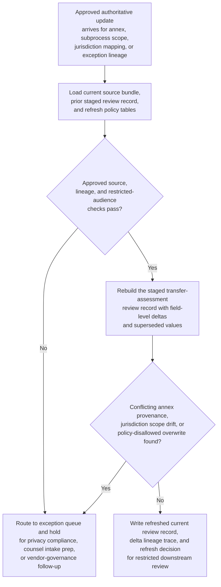
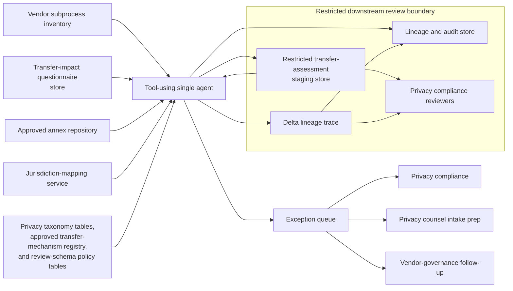

# Cross-border transfer assessment review record refresh after annex update

## Linked pattern(s)

- `change-triggered-representation-refresh`

## Domain

Compliance.

## Scenario summary

A privacy compliance program already maintains a restricted staged transfer-assessment review record for an in-flight vendor telemetry review so privacy reviewers can inspect one current package instead of reopening the subprocess inventory, transfer-impact questionnaire, annex repository, jurisdiction mapping tables, and prior exception log every time source state changes. After that review record is issued, authoritative updates still arrive: a signed annex supersedes a draft transfer mechanism attachment, the vendor subprocess inventory narrows the employee telemetry fields in scope, a jurisdiction mapping is corrected for a new support-access region, or exception lineage is updated to show that one prior annex reference was withdrawn. Each approved source change should trigger refresh of the staged transfer-assessment review record, preserving field-level delta lineage, explicit current-versus-superseded values, and exception routing whenever conflicting annex provenance, unresolved jurisdiction scope drift, or policy-disallowed overwrite logic would make the refreshed packet unsafe for downstream restricted privacy review.

## Target systems / source systems

- Restricted transfer-assessment staging store holding the already-issued structured review record used by privacy compliance reviewers
- Vendor subprocess inventory, transfer-impact questionnaire store, approved annex repository, and jurisdiction-mapping service publishing authoritative transfer-source updates
- Privacy taxonomy tables, approved transfer-mechanism registry, and review-schema policy tables used only to normalize identifiers, audience scope, and overwrite rules
- Lineage and audit store tracking prior staged-record versions, superseded field values, trigger ids, and refresh decisions
- Exception queue for privacy compliance, privacy counsel intake prep, or vendor-governance follow-up before the refreshed record is treated as current

## Why this instance matters

This grounds the pattern in compliance work where the valuable artifact is one current staged transfer-assessment review record, not a legal permissibility judgment, remediation recommendation, or vendor instruction. Cross-border transfer reviews often receive annex, subprocess, and jurisdiction corrections after a packet is already in use, and a stale or silently overwritten record can mislead restricted reviewers about what transfer mechanism, scope, or exception history is actually current. The instance shows how transform-family refresh remains family-safe when it re-materializes a governed staged representation with explicit supersession and lineage instead of drifting into legal adjudication, approval gating, collaboration, filing, or downstream execution.

## Likely architecture choices

- Event-driven monitoring should listen only to approved annex, subprocess-inventory, jurisdiction-mapping, and exception-lineage updates that are authorized to refresh the staged transfer-assessment review record.
- A tool-using single agent can re-read the changed transfer bundle, compare the current authoritative source state against the prior staged version, rebuild the structured review record, and emit a delta trace plus supersession markers.
- Automatic refresh should stay bounded to approved overwrite rules for staged transfer-review fields; conflicting annex versions, privacy-scope changes, missing source lineage, or schema-breaking questionnaire updates should route to exceptions instead of forcing a new current record.
- The workflow should stop at the refreshed staged review record, lineage trace, and exception handling rather than issuing transfer permissibility advice, filing regulator notices, contacting the vendor, or launching remediation work.

## Governance notes

- Every consequential field, especially transfer-assessment identifier, subprocess scope, jurisdiction mapping, transfer mechanism reference, annex lineage, exception-state markers, and restricted audience markers, should retain prior and current source references across refreshes.
- Refresh should mark superseded staged values explicitly rather than silently replacing prior annex or jurisdiction facts, so reviewers can see which authoritative update changed the record and which values were carried forward.
- The workflow should halt when annex material arrives through an unapproved source, when subprocess scope and jurisdiction mappings conflict, when the changed source would expose transfer detail beyond the restricted audience, or when lineage is too weak to support overwrite.
- Privacy governance owners should approve any expansion of trigger sources, field precedence rules, or schema revisions; the workflow ends before legal review adjudication, external filing, vendor outreach, or remediation execution.

## Evaluation considerations

- Percentage of authoritative transfer-review source changes that produce one current staged review record with complete delta lineage and explicit supersession markers
- Rate of conflicting annex updates, incomplete provenance, or jurisdiction-scope mismatches correctly routed to exception review before restricted downstream use
- Reviewer ability to understand what changed between staged record versions without reopening the full transfer questionnaire, annex set, or exception history manually
- Reliability of idempotent refresh behavior when signed annexes arrive after draft attachments, subprocess scope changes land out of order, or the restricted review schema adds a new required field
