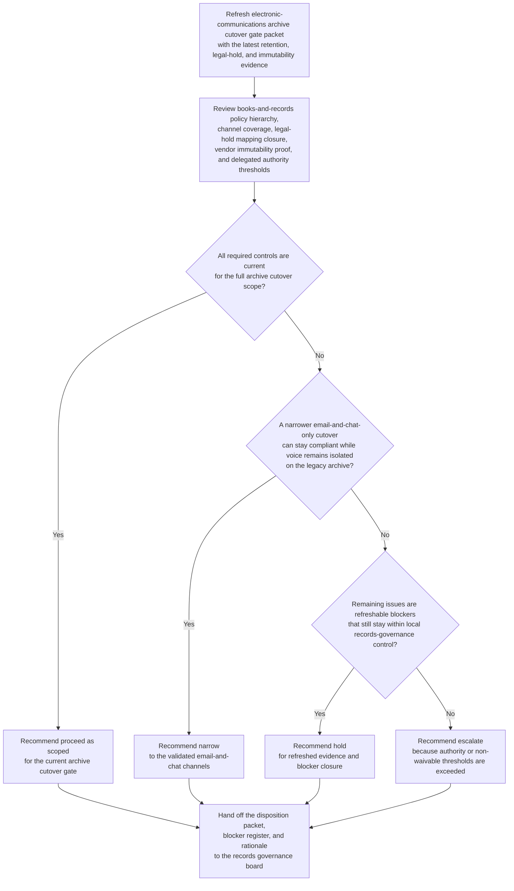
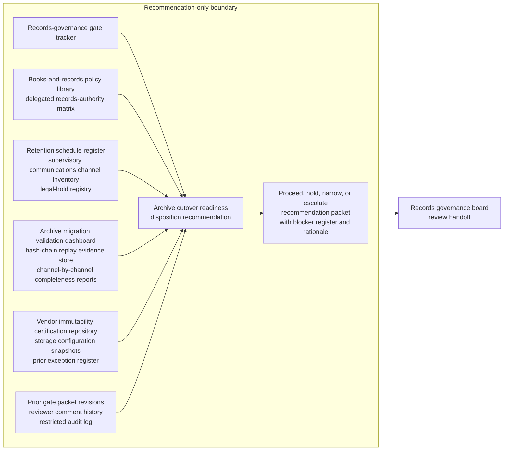

# Electronic communications archive cutover readiness gate disposition recommendation

## Linked pattern(s)

- `readiness-gate-disposition-recommendation`

## Domain

Compliance.

## Scenario summary

A broker-dealer records governance board is re-evaluating whether the governed packet `ECA-Cutover-Gate-v4` is ready to pass its immutable-journal cutover gate before the legacy electronic-communications archive reaches its contracted retirement window. Since the previous packet revision, one London fixed-income voice-capture hash replay remains incomplete, legal-hold alias mapping for two custodial mailboxes still lacks records-counsel closure, and the newest vendor immutability attestation covers email and chat retention but not turret-transcription export handling. The workflow must recommend whether compliance should proceed with the archive cutover as scoped, hold for refreshed evidence, narrow the gate to the validated email-and-chat channels, or escalate because books-and-records coverage gaps, legal-hold coupling, or delegated records-governance thresholds no longer fit local authority before any archive-of-record switch, retention attestation, supervisor notice, or production migration step occurs.

## Target systems / source systems

- Records-governance gate tracker, books-and-records policy library, and delegated records-authority matrix
- Retention schedule register, supervisory communications channel inventory, and legal-hold registry for in-scope custodians and mailbox aliases
- Archive migration validation dashboard, hash-chain replay evidence store, and channel-by-channel completeness reports for email, chat, voice, and turret transcription
- Vendor immutability certification repository, storage configuration snapshots, and prior exception register for unsupported capture modes
- Prior gate packet revisions, reviewer comment history, and restricted audit log preserving packet lineage and accepted narrowing paths

## Why this instance matters

This instance grounds the pattern in compliance through a records-governed archive cutover that is structurally distinct from attestation, change-digest, protected-collaboration, evidence-verification, and commercial-exception lanes already present in the repository. The hard problem is refreshing one governed readiness judgment as retention evidence, legal-hold state, and channel-coverage proof change, while keeping the workflow bounded at a proceed, hold, narrow, or escalate recommendation for a single cutover gate packet.

## Likely architecture choices

- Event-driven monitoring fits because legal-hold mapping closure, replay-validation results, vendor attestation updates, and retirement-window pressure should trigger a refreshed gate recommendation as soon as the packet context materially changes.
- Human-in-the-loop review is mandatory because the workflow should advise on the gate disposition, not approve the archive-of-record switch, waive books-and-records obligations, notify supervisors, or start the migration.
- Read-only integration with records, legal-hold, validation, and policy systems is preferable so the agent cannot silently convert a readiness recommendation into a live retention-system cutover.

## Governance notes

- The workflow should stay centered on one inspectable archive cutover gate packet, `ECA-Cutover-Gate-v4`, owned by Director of Electronic Communications Records Governance Monica Reyes, with each recommendation revision tied to one exact gate review checkpoint.
- Source precedence should be explicit: the approved books-and-records policy baseline, active legal-hold registry, and authoritative retention schedule register outrank migration standup notes, vendor success commentary, and informal supervisor chat; conflicts should remain visible as blockers rather than being normalized away.
- Prerequisite policy and operating state should remain visible in the packet, including retention schedule freeze status, legal-hold population completeness for in-scope custodians, approved channel inventory for the desks in scope, and confirmation that the immutable-storage control baseline is the currently signed standard.
- Open blockers and unresolved items should remain explicit, including the incomplete London voice-capture hash replay, the unclosed mailbox-alias hold mapping, and the missing immutability coverage for turret-transcription export, with any narrowed recommendation showing exactly which channels and desks remain out of scope.
- Revision lineage should preserve prior gate packet revisions, reviewer comments, accepted and rejected narrowing proposals, and the evidence delta that changed the recommendation so later reviewers can reconstruct why the packet moved between proceed, hold, narrow, or escalate.
- The boundary must remain clear: the workflow does not approve the cutover, communicate with regulators or supervisors, certify final retention compliance, migrate archive data, or execute fallback or rollback steps.

## Evaluation considerations

- Reviewer agreement with the recommended proceed, hold, narrow, or escalate disposition before any archive-of-record switch or retention attestation is authorized
- Rate at which stale immutability proof, unresolved legal-hold mappings, or channel-coverage gaps are surfaced before the governed cutover gate meets
- Quality of traceability linking source-precedence rules, prerequisite policy and operating state, blocker visibility, and reviewer-lineage evidence to the disposition recommendation
- Stability of recommendations when hold mapping closure, replay evidence, or channel-scope exceptions change during the final cutover window
