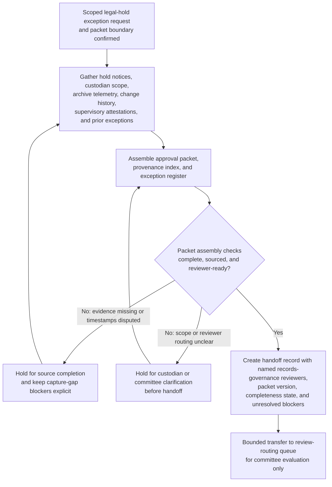
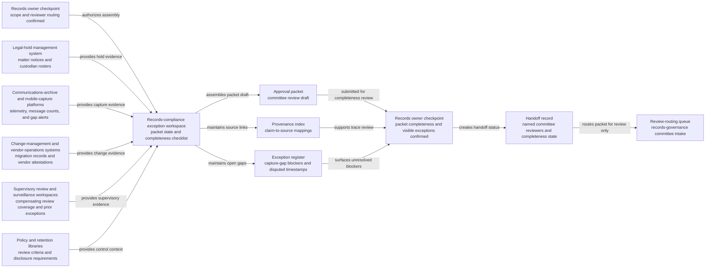

# Electronic communications legal-hold capture-gap approval packet for records-governance committee review

## Linked pattern(s)

- `approval-packet-generation`

## Domain

Compliance.

## Scenario summary

A records-compliance lead must assemble a decision-ready approval packet because a broker-dealer's archived trader-messaging environment shows a possible legal-hold capture gap after a journaling connector migration left uncertainty about whether all in-scope mobile and desktop communications for several custodians were preserved during a seven-day window. The workflow gathers the scoped exception request, matter hold notices, custodian rosters, archive-ingestion telemetry, connector change records, supervisory attestations, prior exception history, and proposed compensating review steps into one governed packet for records-governance committee review. Agents help map packet claims to source evidence, build a reviewer-visible provenance index, keep unresolved issues such as unreconciled custodian mappings, missing mobile-capture logs, or disputed gap timestamps in an explicit exception register, and prepare the handoff record showing the named committee reviewers and current completeness status. The workflow stops at packet generation and handoff; it does not recommend whether the temporary exception should be accepted, adjudicate legal-hold sufficiency, notify outside counsel or regulators, direct remediation execution, or close any matter.

## Target systems / source systems

- Records-compliance exception workspace holding the scoped request, packet draft, completeness checklist, and handoff status
- Legal-hold management system with matter notices, custodian rosters, preservation acknowledgments, and escalation history
- Communications-archive and mobile-capture platforms containing ingestion telemetry, journaling connector status, message counts, and gap-detection alerts
- Change-management and vendor-operations systems storing migration tickets, connector deployment records, incident timelines, and vendor attestations
- Supervisory review and surveillance workspaces documenting compensating review coverage, desk-specific channel usage, and prior archive-gap exceptions
- Policy and retention libraries containing books-and-records obligations, legal-hold requirements, committee review criteria, and mandatory disclosure expectations

## Why this instance matters

This grounds `approval-packet-generation` in a compliance workflow where the hard part is assembling a trustworthy approval packet from distributed legal-hold, archive, operations, and supervision evidence without allowing preservation uncertainty to disappear behind a clean narrative. Records-governance reviews often span matter scope, custodian mappings, archive telemetry, migration history, and pending reviewer questions, so committee members need one inspectable packet that preserves provenance and visible exceptions before they decide whether the request is ready for their review lane. The example stays inside the gather-family boundary because the primary outputs are the packet, evidence index, exception register, and handoff record rather than a recommendation, approval outcome, remediation plan, or external communication.

## Likely architecture choices

- Orchestrated multi-agent retrieval and synthesis fit because legal-hold notices, archive telemetry, migration records, and supervisory evidence often live in separate systems and require coordinated packet assembly.
- Human-in-the-loop checkpoints should remain mandatory so an accountable records owner can confirm matter scope, required reviewers, and whether unresolved evidence gaps are acceptable to surface in the packet before handoff.
- Agents may reconcile custodian identifiers, align timeline fragments, and draft packet sections, but they should not decide whether preservation remains legally sufficient, extend any exception window, or trigger downstream counsel, regulator, or remediation actions.

## Governance notes

- Every consequential claim about matter scope, custodian coverage, affected channels, capture-gap duration, compensating review coverage, or committee routing should link to inspectable source evidence in the provenance index.
- The exception register should keep unreconciled custodian populations, missing mobile-capture logs, disputed gap start or end timestamps, and any unclear vendor attestation visible so the packet cannot appear cleaner than the underlying preservation state.
- The handoff record should name the intended records-governance reviewers, packet version, completeness state, unresolved blockers, and the explicit boundary where packet generation ends and human approval review begins.
- Sensitive message metadata, litigation-related matter identifiers, and privileged escalation notes should remain access-controlled, minimally excerpted, and fully auditable across packet assembly and handoff.
- If new evidence shows spoliation risk outside the approved scope, broader archive corruption, or an active incident requiring containment, the workflow should stop and escalate into investigation or incident handling rather than continue packet assembly.

## Evaluation considerations

- Percentage of records-governance committee intakes accepted without missing mandatory evidence, routing corrections, or hidden preservation exceptions
- Reviewer correction rate for packet sections where agent-assisted synthesis overstated custodian coverage, underreported channel scope, or implied review readiness without sufficient support
- Time required for reviewers to trace a challenged packet claim back to the exact hold notice, archive telemetry record, migration ticket, or supervisory attestation in the provenance index
- Bounce rate from committee review caused by stale evidence, incomplete exception visibility, or unclear handoff ownership
