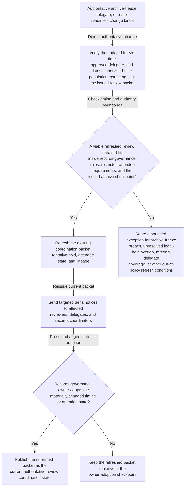
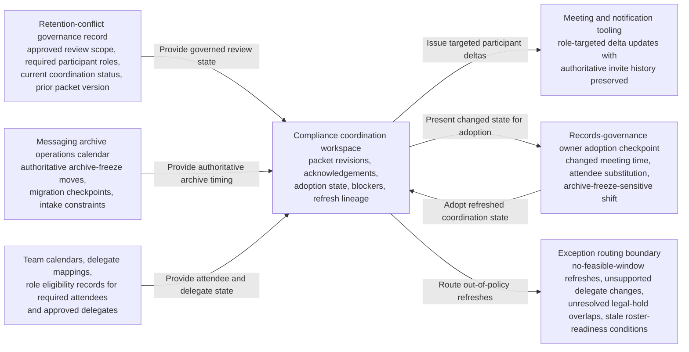

# Electronic communications retention exception review coordination refresh after archive-freeze shift

## Linked pattern(s)

- `authoritative-change-coordination-refresh`

## Domain

Compliance.

## Scenario summary

An electronic communications retention exception review already has an issued coordination packet, `Comm-Retention-Exception-Review-Coordination-Packet-v4`, with a required-attendee matrix, tentative restricted records-governance hold, and archive-freeze checkpoint tied to the governing retention-conflict case. After that packet is issued, authoritative review conditions change: messaging archive operations moves the protected archive-freeze earlier because a storage-tier migration enters the same control window, the deputy records officer assigns an approved delegate because of regulator exam testimony, and the final supervised-user population delta extract posts later than the packet assumed. Visible blockers include a stale population extract for one broker-dealer desk, an unresolved legal-hold overlap on two shared mailboxes, and pending confirmation that the approved delegate still satisfies the restricted-attendee rule for EU communications compliance. The workflow should refresh the existing coordination package, send participant-specific delta notices, and hold the changed state at an explicit records-governance owner adoption or exception checkpoint rather than adjudicating whether the retention exception should be granted, rewriting retention policy, or executing archive, purge, or preservation actions.

## Target systems / source systems

- Retention-conflict governance record with the approved review scope, required participant roles, current coordination status, and prior packet version for the communications exception case
- Messaging archive operations calendar and migration change ledger publishing authoritative archive-freeze moves, storage-tier cutover checkpoints, and intake constraints
- Team calendars, delegate mappings, and role eligibility records for records governance, surveillance compliance, legal hold administration, messaging platform operations, and regional communications compliance
- Supervised-user roster and mailbox-population systems publishing authoritative readiness timestamps and desk-scope corrections that determine when the review can validly occur
- Compliance coordination workspace where packet revisions, acknowledgements, adoption state, blockers, and refresh lineage are maintained
- Meeting and notification tooling capable of issuing role-targeted updates without silently replacing the authoritative invite history

## Why this instance matters

This grounds the pattern in a records-governance workflow where one already-issued exception-review coordination packet must stay synchronized with authoritative archive timing, participant eligibility, and roster-readiness changes. The value comes from preserving one current packet, one visible blocker set, and explicit human adoption of consequential shifts so reviewers examine the same governed review state before an archive-freeze boundary closes. It stays within coordination-refresh scope because the workflow updates timing, attendee state, blocker visibility, and checkpoint lineage only; it does not decide whether the exception is acceptable, change retention controls, or carry out preservation or purge actions.

## Likely architecture choices

- Event-driven monitoring should react only to approved archive-freeze updates, supervised-user roster readiness changes, legal-hold overlap status changes, and governed delegate-state changes that affect the issued review packet.
- Exception-gated autonomy fits because the workflow can refresh the packet, revise the tentative hold, carry forward visible blockers, and issue targeted participant notices automatically when changes remain inside records-governance and restricted-attendee guardrails.
- The records-governance owner should adopt any changed meeting time, required-attendee substitution, or archive-freeze-sensitive shift before the refreshed packet becomes authoritative.
- Exception handling should route no-feasible-window cases, unsupported delegate changes, unresolved legal-hold overlaps, or stale roster-readiness conditions instead of publishing a misleading current coordination state.

## Governance notes

- Required roles and approved delegates should be explicit and auditable for records governance, surveillance compliance, legal hold administration, messaging platform operations, and regional communications compliance before automatic refresh is enabled.
- Refreshed notices should include only the timing, attendee, blocker, and roster-readiness deltas needed for coordination rather than message content, surveillance findings, or broader litigation commentary.
- The workflow should preserve append-only lineage connecting each authoritative archive-freeze, delegate, legal-hold overlap, or roster-readiness change to the resulting packet refresh, targeted notices, and records-governance-owner adoption outcome.
- Automatic refresh should stop when the changed slot crosses a protected archive-freeze or legal-hold preservation boundary, the trigger comes from an unofficial mailbox request, or a required role loses approved restricted-attendee coverage.
- Churn-heavy refresh periods near the archive-freeze checkpoint should be monitored so participants can still identify one current packet without sifting through conflicting revisions.

## Evaluation considerations

- Time from authoritative archive-freeze, delegate, or roster-readiness change to a refreshed exception-review packet with explicit adoption or exception status
- Rate of archive-boundary breaches, unresolved legal-hold overlaps, stale supervised-user roster dependencies, or unsupported delegate substitutions correctly escalated before the packet becomes authoritative
- Participant ability to tell what changed between the prior and current coordination packet without reconstructing the full records-governance thread manually
- Notification-deduplication performance when multiple archive-operations or roster-readiness updates arrive near the protected archive-freeze boundary
