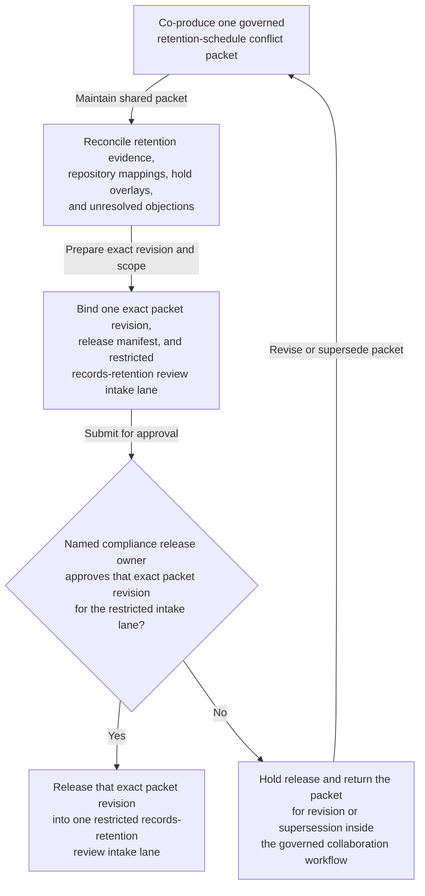
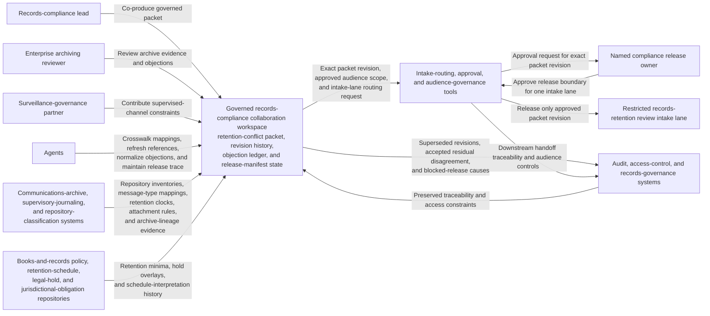

# Electronic communications retention-schedule conflict packet approved for restricted records-retention review intake

## Linked pattern(s)

- `approval-gated-collaborative-artifact-release`

## Domain

Compliance.

## Scenario summary

A records-compliance lead, an enterprise archiving reviewer, and a surveillance-governance partner are co-producing one governed retention-schedule conflict packet because a broker-dealer's supervised electronic-communications estate now stores trader chats, AI-generated conversation summaries, and attachment previews across multiple archives whose retention clocks, legal-hold overlays, and category mappings are still partially contested. Agents help reconcile books-and-records obligations, channel taxonomy mappings, retention-table excerpts, legal-hold carve-outs, backup immutability caveats, and unresolved reviewer objections into the shared packet while preserving which repository-specific concerns remain open and which residual objections the human release owner accepted explicitly. The workflow ends only when the named compliance release owner approves that exact packet revision for one bounded records-retention review intake lane, where downstream reviewers may decide whether the packet supports a formal retention determination or needs narrower scoping and fresher evidence. It does not set the retention period, authorize deletion or preservation changes, contact regulators, or execute archive reconfiguration.

## Target systems / source systems

- Governed records-compliance collaboration workspace holding the retention-schedule conflict packet, revision history, objection ledger, and release-manifest state
- Communications-archive, supervisory-journaling, and repository-classification systems providing repository inventories, message-type mappings, retention clocks, attachment handling rules, and archive-lineage evidence
- Books-and-records policy, retention-schedule, legal-hold, and jurisdictional-obligation repositories supplying applicable retention minima, hold overlays, and schedule-interpretation history
- Intake-routing, approval, and audience-governance tools defining required signers, approved packet audience, and the single downstream records-retention review lane
- Audit, access-control, and records-governance systems preserving superseded packet revisions, accepted residual disagreement, blocked-release causes, and downstream handoff traceability

## Why this instance matters

This grounds the pattern in compliance work focused on collaborative stewardship of one governed retention-conflict artifact rather than policy issuance, deletion approval, or legal adjudication. The reusable challenge is keeping one packet current while repository mappings, legal-hold overlays, backup limitations, and jurisdiction-specific retention clocks remain visibly disputed, then approving release of that exact revision into one restricted records-retention intake lane only. The example stays inside the pattern boundary because retention adjudication, purge scheduling, regulator communication, and archive-configuration execution remain separate downstream workflows.

## Likely architecture choices

- Approval-gated execution fits because the retention-conflict packet can become collaboration-ready while still blocked from records-retention intake until the human release owner approves the exact revision.
- Human-in-the-loop control is required because only accountable compliance leaders may accept residual schedule disagreement, confirm audience scope, and authorize the packet's release boundary.
- Agents may crosswalk repository identifiers, refresh retention-source references, normalize objection wording, and maintain the release trace, but they must not decide the authoritative retention schedule, approve deletion or preservation action, or trigger external dissemination.

## Governance notes

- The release manifest should bind one exact packet revision, the named records-retention review-intake lane, signer identities, the covered repository and channel scope, and any residual objections the human release owner accepted explicitly.
- Record-category mapping disputes, legal-hold overlap caveats, jurisdiction-specific retention-clock conflicts, backup-immutability carve-outs, and archive-lineage ambiguity should remain visible in the packet or boundary ledger rather than being normalized away before release.
- Audience scope should stay limited to the approved records-retention review-intake lane; reuse of the packet for regulator response, deletion scheduling, policy publication, or archive-reconfiguration instructions should require separate downstream approval.
- If new legal holds, archive onboarding changes, or fresh books-and-records guidance alter the retention picture materially during approval review, the workflow should hold release and supersede the prior packet revision rather than letting stale approval carry forward.

## Evaluation considerations

- Rate at which records-retention intake accepts the released packet without discovering hidden repository-scope drift, stale retention evidence, or audience-boundary mistakes
- Time required to keep one collaborative retention-conflict packet synchronized as schedule references, reviewer objections, and signer state evolve
- Reliability of binding between the released artifact revision, accepted residual disagreement, repository and channel scope, and the bounded records-retention review-intake lane
- Frequency with which humans reject agent-assisted edits because they drifted into retention adjudication, regulator communication, deletion authorization, or downstream archive execution
