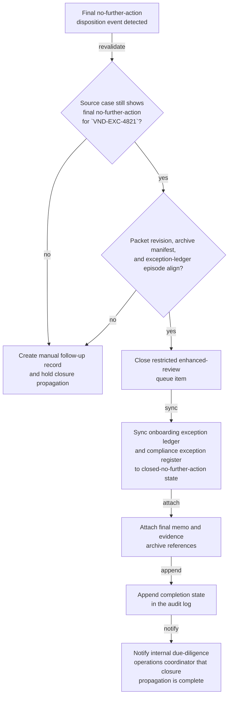
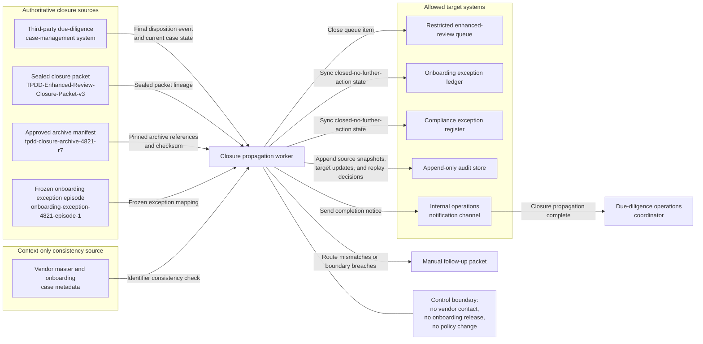

# Finalized third-party due-diligence enhanced-review no-further-action closure and exception-ledger synchronization

## Linked pattern(s)

- `workflow-hand-off-and-completion`

## Domain

Compliance.

## Scenario summary

A third-party due-diligence enhanced-review program has already recorded a final no-further-action disposition for vendor onboarding exception `VND-EXC-4821` in the authoritative compliance case system, with governed closure artifact `TPDD-Enhanced-Review-Closure-Packet-v3` sealed after reviewer sign-off. That disposition is final for this workflow and must not be reopened, reinterpreted, or extended into vendor outreach, new evidence collection, onboarding policy changes, release of the onboarding hold, or downstream onboarding execution. The remaining execute step is limited to low-risk closure propagation: detect the final-disposition event, recheck that the case id, disposition revision, packet revision, and archive manifest still match the source record, close the restricted enhanced-review queue item, sync the onboarding exception ledger and compliance exception register to the recorded closed-no-further-action state, attach the final archive references, append completion state in the audit log, and notify the internal due-diligence operations coordinator that closure propagation is complete. If the case was reopened, the disposition revision changed, the exception ledger points to a different onboarding episode, or a requested next step would release the vendor into onboarding flow, the workflow should stop and route manual follow-up instead of guessing.

**Prerequisite state that must be confirmed before closure propagation may continue:**
- `TPDD-Enhanced-Review-Closure-Packet-v3` is sealed read-only and still references case `TPDD-Case-4821`, exception `VND-EXC-4821`, and vendor master id `VM-009184`.
- The authoritative case record still shows final no-further-action disposition revision `rev7` with no reopen marker, pending reviewer amendment, or superseding exception episode.
- Exception-ledger episode `onboarding-exception-4821-episode-1` is frozen to the same vendor, exception, and packet revision so a later vendor merge cannot silently redirect closure writes.
- Archive manifest `tpdd-closure-archive-4821-r7` and its checksum are pinned to the final disposition memo, evidence bundle, and approval timestamps referenced by packet `v3`.
- Allowed target systems remain bounded to the restricted enhanced-review queue, onboarding exception ledger, compliance exception register, append-only audit store, and internal operations notification channel.

**Visible blockers that must stay explicit if present:**
- The current case record shows a reopened or superseding enhanced-review disposition after packet `v3` was sealed.
- The onboarding exception ledger now maps `VND-EXC-4821` to a different vendor master or onboarding episode.
- The archive manifest checksum or final memo reference no longer matches the packet-approved closure bundle.
- Any downstream request asks the workflow to contact the vendor, alter onboarding policy, release the onboarding hold, or trigger onboarding tasks.

## Target systems / source systems

**Authoritative (highest precedence):**
- The third-party due-diligence case-management system that records the final no-further-action disposition, packet revision, reopen state, and source event id for `TPDD-Case-4821`
- `TPDD-Enhanced-Review-Closure-Packet-v3`, prior packet revisions `v1` and `v2`, and the approved archive manifest `tpdd-closure-archive-4821-r7`
- The onboarding exception ledger and compliance exception register entries keyed to `VND-EXC-4821` and `onboarding-exception-4821-episode-1`
- The append-only audit store that records authoritative source snapshots, target updates, and replay decisions

**Operational and contextual (secondary precedence):**
- Restricted enhanced-review queue state, coordinator workbench views, and internal exception dashboards that show whether low-risk closure bookkeeping is still pending
- Vendor master and onboarding case metadata used only to confirm identifier consistency, not to decide whether onboarding may proceed
- Internal operations notes that explain why a manual follow-up packet was raised after a mismatch or blocked boundary condition

**Excluded from authoritative use without explicit promotion:**
- Procurement emails, buyer chat threads, or vendor account-manager notes claiming the vendor is "cleared" without matching case-system closure state
- Draft onboarding checklists, supplier activation tickets, or workflow comments requesting release into onboarding execution
- Proposed policy edits, due-diligence playbook revisions, or vendor communications prepared for separate human processes

## Why this instance matters

Third-party due-diligence programs often close an enhanced review in the authoritative case system but leave the onboarding exception ledger, restricted queue, or archive linkage in an inconsistent state. That drift creates repeat manual work and can tempt teams to treat bookkeeping gaps as implied approval to move onboarding forward. This example shows how `workflow-hand-off-and-completion` can keep closure propagation replay-safe and audit-ready while staying strictly bounded away from adjudication, outreach, policy change, or onboarding execution.

## Likely architecture choices

- An event-driven completion worker can subscribe to final no-further-action disposition events and start only when the source event corresponds to an approved post-decision state.
- The worker should re-read the current case record and closure packet before writing anywhere so stale events, vendor-master merges, or superseding packet revisions are caught before propagation.
- Durable completion state should track queue closure, ledger sync, archive linkage, notification delivery, and skipped idempotent actions because duplicate events and partial retries are normal.
- Human follow-up should trigger when packet lineage is superseded, archive references drift, exception-ledger mapping is ambiguous, or a requested action would cross into vendor contact, onboarding release, or policy change.

## Governance notes

- Source precedence must remain explicit: the authoritative case record, sealed closure packet, approved archive manifest, and append-only audit history outrank dashboards, coordinator notes, procurement requests, or any operational pressure to "just clear the vendor."
- Prerequisite frozen state must stay visible in the workflow record, including the sealed packet revision, pinned archive manifest checksum, frozen exception-ledger episode, and bounded list of allowed target systems for closure-only propagation.
- Visible blockers should remain concrete and named in the follow-up packet, including reopened case state, superseding disposition revision, mismapped onboarding episode, archive checksum drift, or any request that would release the vendor into onboarding flow.
- Revision-aware lineage should be append-only: preserve packet history from `TPDD-Enhanced-Review-Closure-Packet-v1` through `v3`, record the verified `rev7` disposition snapshot, and append superseding completion or follow-up entries rather than overwriting prior closure evidence.
- Mira Sethi, Third-Party Due Diligence Operations Manager, is the named owner accountable for closure integrity, audit completeness, and blocker visibility; she is not the adjudicator of vendor risk and does not authorize onboarding release or downstream execution through this workflow.
- The automation must not reopen the enhanced review, reassess vendor risk, contact the vendor, modify onboarding policy, remove onboarding holds, or create onboarding tasks.

## Evaluation considerations

- Percentage of finalized enhanced-review no-further-action dispositions that reach queue closure, exception-ledger synchronization, archive linkage, and coordinator notification without manual bookkeeping repair
- Rate of stale, duplicate, or mismapped final-disposition events detected before incorrect closure state is propagated across compliance and onboarding exception records
- Completeness of append-only audit traces linking the authoritative disposition event, packet revision, archive manifest, and every downstream closure update
- Reliability of replay-safe recovery when one target is already updated or temporarily unavailable while other bounded closure steps remain pending
