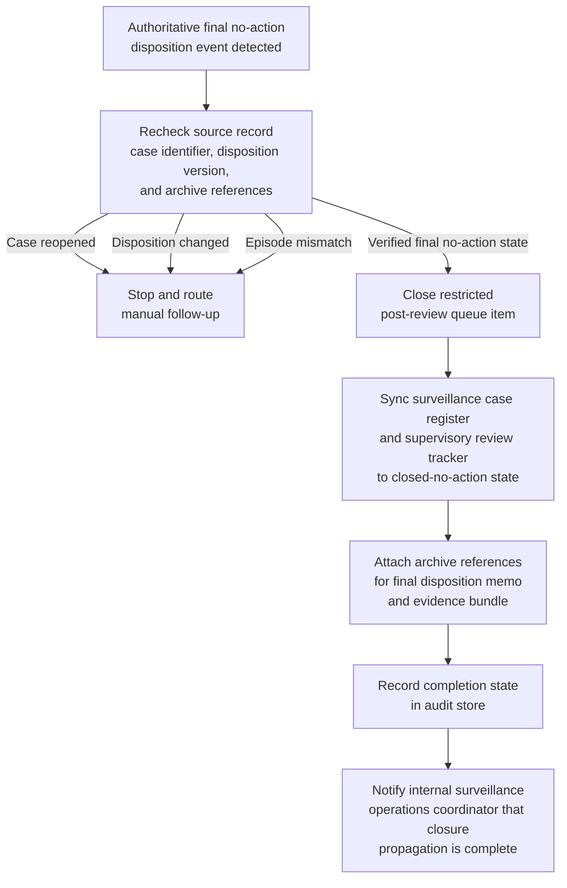

# Finalized trade-surveillance no-action disposition closure and case-register synchronization

## Linked pattern(s)

- `workflow-hand-off-and-completion`

## Domain

Compliance.

## Scenario summary

A restricted trade-surveillance review team has already recorded a final no-action disposition for an employee trading-alert case in the authoritative surveillance case-management system after the review, evidence assessment, and supervisory sign-off are complete. That disposition is final for this workflow and must not be reopened, reinterpreted, or extended into employee outreach, desk supervision directives, trading restrictions, regulator communication, or renewed investigation. The remaining execute step is limited to low-risk closure bookkeeping: detect the final-disposition event, recheck that the surveillance case identifier, disposition version, and approved archive references still match the source record, close the restricted post-review queue item, sync the surveillance case register and supervisory review tracker to the recorded closed-no-action state, attach archive references for the final disposition memo and evidence bundle, record completion state in the audit store, and notify the internal surveillance operations coordinator that closure propagation is complete. If the case was reopened, the disposition changed, or the target register points to a different surveillance-review episode, the workflow should stop and route manual follow-up instead of guessing.

## Target systems / source systems

- Restricted trade-surveillance case-management system that records the final no-action disposition and emits the authoritative state-change event
- Surveillance case register or supervisory review tracker that needs the closed-no-action status reflected
- Restricted post-review queue holding the surveillance case until closure bookkeeping finishes
- Archive or evidence store containing the final disposition memo, approved evidence bundle, and linked record references
- Internal surveillance operations notification channel plus audit store for completion traces, idempotency markers, and manual follow-up records

## Why this instance matters

This grounds the pattern in a compliance workflow that is materially different from sanctions-alert closure because the governing decision concerns an internal trade-surveillance review rather than sanctions screening or counterparty disposition. Surveillance programs often accumulate drift when a case is definitively closed in the review system but still appears open in the surveillance register, remains in a restricted follow-up queue, or lacks linked archival references needed for later exam or internal-audit reconstruction. The example shows why execute-automate is useful for authoritative post-decision closure, replay-safe synchronization, and explicit auditability while keeping employee interviews, supervisory action, trading restrictions, escalation decisions, and regulator-facing communication outside scope.

## Likely architecture choices

- An event-driven completion worker can subscribe to final no-action disposition events from the surveillance case system and start the closure sequence only for approved post-decision states.
- The worker should re-read the current source record before writing anywhere so a reopened surveillance case, superseded disposition, or changed archive reference is not propagated from a stale event.
- Durable completion state should track queue closure, register synchronization, archive linkage, notification delivery, and skipped idempotent actions because duplicate events or partial retries are normal operational conditions.
- Human follow-up should trigger when the surveillance-review-episode mapping is missing, the archive reference no longer matches the finalized disposition memo, or a requested next step would cross into employee outreach, supervisory escalation, regulator handling, or renewed investigation.

## Governance notes

- The workflow should copy only the surveillance case identifiers, final closure state, archive references, and timestamps needed for internal record synchronization rather than employee communications, trading history, reviewer commentary, or sensitive investigative notes.
- Audit traces should record the source event id, verified disposition version, queue item closed, register records updated, archive references attached, notification target, and whether any step was skipped because it had already completed.
- Every automatic update should be reversible and idempotent so replay does not create duplicate queue cleanup, conflicting closure timestamps, or repeated archive attachments.
- The automation must not contact the employee, issue supervision instructions, impose or lift trading restrictions, reopen the surveillance review, initiate new evidence collection, or prepare any regulator-facing submission.

## Evaluation considerations

- Percentage of finalized trade-surveillance no-action dispositions that reach queue closure, register synchronization, archive linkage, and coordinator notification without manual bookkeeping repair
- Rate of stale, duplicate, or mismapped final-disposition events detected before incorrect closure state is propagated across restricted compliance systems
- Completeness of audit traces linking the authoritative disposition event to queue, register, archive, and notification updates
- Reliability of replay-safe recovery when one target is already updated or temporarily unavailable while other closure steps remain pending
