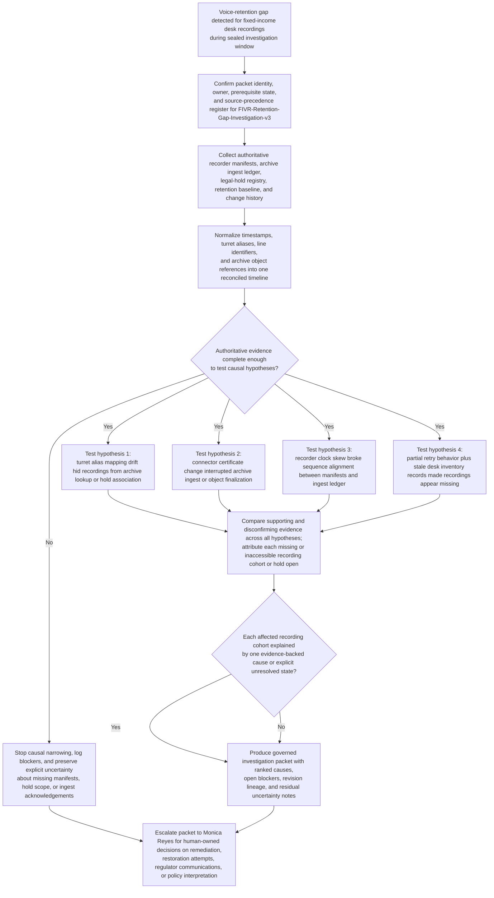
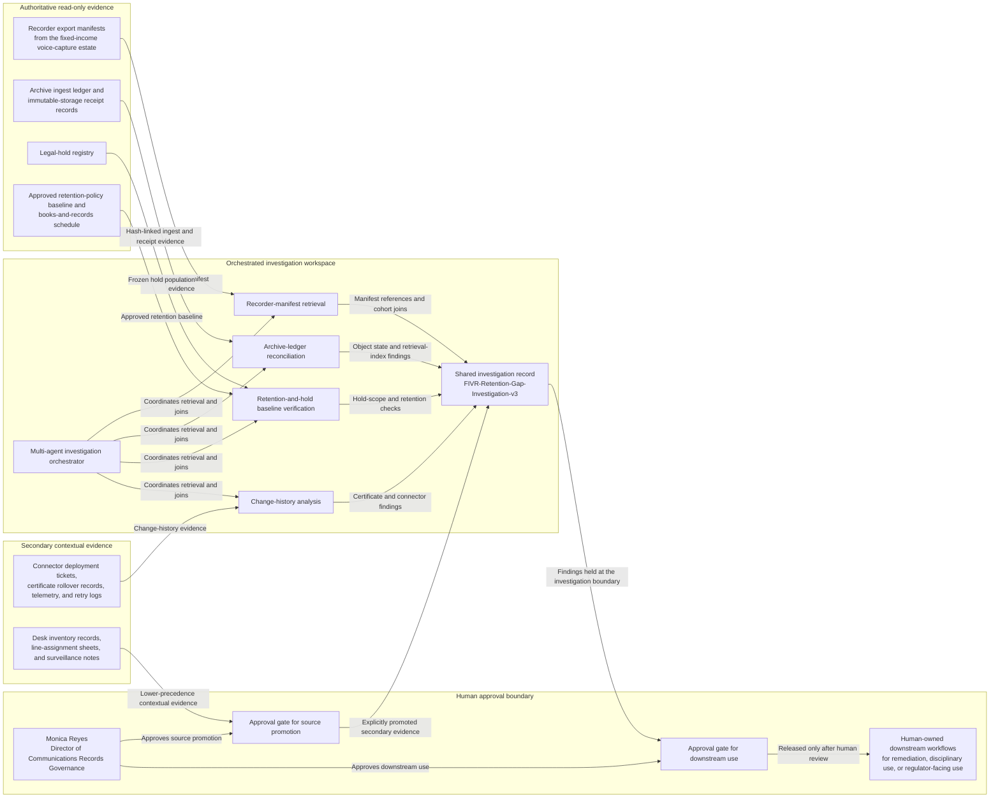

# Fixed-income voice-capture retention gap root-cause investigation

## Linked pattern(s)

- `incident-root-cause-analysis`

## Domain

Compliance.

## Scenario summary

A books-and-records surveillance alert identifies that a bounded set of fixed-income trading desk voice recordings from 2026-02-11 through 2026-02-13 is missing or inaccessible in the archive of record even though desk activity, order blotter references, and supervisor review notes indicate the calls occurred. This instance is bounded to one governed investigation packet, `FIVR-Retention-Gap-Investigation-v3`, owned by Monica Reyes, Director of Communications Records Governance. The investigation reconciles recorder export manifests, archive ingest state, legal-hold population, retention-control baselines, connector and certificate change history, and lower-precedence desk notes into an evidence-backed explanation of why the recordings were unavailable, which causal hypotheses remain unresolved, and what uncertainty must stay visible before any human decides on remediation, policy interpretation, regulator response, or records-restoration action.

**Prerequisite state that must be confirmed before narrowing hypotheses:**
- The affected date range, desk scope, and line or turret population are sealed for `FIVR-Retention-Gap-Investigation-v3`; any newly discovered recordings must be logged as scope amendments rather than silently absorbed.
- The legal-hold population for the impacted fixed-income rates and credit desks is frozen and exported so the investigation does not confuse hold-scope gaps with archive-ingest failures.
- An inventory snapshot of recorder appliances, turret aliases, soft-turret endpoints, and archive connectors has been exported and timestamped for the incident window.
- Certificate rollover history, connector deployment history, and recorder clock-synchronization evidence for the affected period have been captured in read-only form.
- The current retention-policy baseline and books-and-records schedule version applicable to fixed-income voice capture during the incident window are identified and fixed for the packet.

## Target systems / source systems

**Authoritative (highest precedence):**
- Recorder export manifests from the fixed-income turret and voice-capture estate for the sealed incident window, including channel identifiers, start and stop timestamps, file hashes, recorder node IDs, and export-completion status.
- Archive ingest ledger and immutable-storage receipt records showing object creation, checksum validation, retention-class assignment, ingest retry outcomes, and retrieval-index state for the same recordings.
- Legal-hold registry entries governing the affected traders, supervisors, shared desk lines, and turret aliases during the incident window.
- Approved retention-policy baseline and books-and-records schedule in force for fixed-income voice capture during the relevant period, including any desk-specific retention exceptions already approved before the gap.

**Secondary and contextual (lower precedence unless promoted):**
- Connector deployment tickets, certificate rollover records, recorder health telemetry, retry logs, and queue-monitoring extracts that may explain ingest interruption or delayed object finalization.
- Desk inventory records, supervised line-assignment sheets, and desk notes that help map trader identity, turret alias, and shared-line usage when authoritative identifiers are incomplete.
- Surveillance case notes and supervisor review annotations that show which communications were expected to be retrievable and when the gap was first noticed.

**Excluded from authoritative use without explicit promotion by the named owner:**
- Informal trader or supervisor chat recollections about whether a particular call was recorded.
- Reconstructed call lists from order blotters, CRM notes, or personal calendars that are not tied back to a recorder manifest or archive object reference.
- Vendor verbal assurances about connector health that are not backed by retained ticket evidence, certificate records, or system telemetry.

## Visible blockers / unresolved items

- Turret alias mapping drift across two shared fixed-income sales banks means several recorder channel IDs do not cleanly join to the current desk inventory snapshot.
- Recorder clock skew of up to 94 seconds on one London capture node weakens direct timestamp matching between export manifests and archive ingest ledger events.
- Partial retry logs exist for the archive connector queue, but one retry shard for 2026-02-12 03:00-05:00 UTC is missing final acknowledgement records.
- Desk inventory records for two decommissioned soft-turret profiles appear stale, so presence or absence of expected recordings for those profiles remains uncertain.

## Revision lineage

- `v1` established the sealed investigation scope, initial list of missing or inaccessible recordings, and the first hypothesis set covering ingest failure, retention misclassification, and lookup mismatch.
- `v2` added the frozen legal-hold population, recorder inventory snapshot, and change-ticket timeline for the certificate rollover and connector deployment sequence.
- `v3` is the governed packet for review: it adds explicit source precedence, hash-linked recorder manifest references, blocker visibility, and a reconciled explanation ledger that distinguishes evidenced causes from unresolved cohorts.

## Why this instance matters

Fixed-income voice-capture gaps sit at the intersection of communications surveillance, books-and-records retention, legal hold, and infrastructure control evidence. The hard problem is not deciding how to repair the archive or what to tell a regulator; it is determining, under audit pressure, whether recordings were never captured, captured but not ingested, ingested but not retrievable, or incorrectly excluded from hold and retention paths. This instance makes the family boundary explicit by ending at one inspectable investigation packet with source precedence, visible blockers, named ownership, and revision-aware uncertainty rather than a remediation plan, policy rewrite, disciplinary assessment, or external filing decision.

## Likely architecture choices

- An orchestrated multi-agent design can separate recorder-manifest retrieval, archive-ledger reconciliation, retention-and-hold baseline verification, and change-history analysis while preserving one shared investigation record.
- Shared case memory should preserve cohort-level hypotheses, manifest-to-object joins, timestamp-normalization decisions, blocker status, and rejected explanations so later reviewers can inspect how the packet evolved from `v1` to `v3`.
- Human-in-the-loop review is required before promoting any secondary evidence to authoritative use, declaring the primary root cause for all affected cohorts, or using the findings in remediation, disciplinary, or regulator-facing workflows.
- Evidence collection paths should remain read-only and hash-linked where possible so the packet can survive later audit or litigation scrutiny.

## Governance notes

- Preserve immutable references to recorder manifests, archive-ingest entries, legal-hold exports, and retention baselines; do not restate values without citing the underlying artifact and timestamp.
- Distinguish observed states from inferred causes: an inaccessible archive object is not automatically evidence of failed capture, and a missing hold association is not automatically evidence of policy noncompliance without source-backed confirmation.
- If blocker resolution would require promotion of desk notes, chat fragments, or vendor commentary, Monica Reyes must approve that promotion explicitly inside the packet rather than allowing silent source-precedence drift.
- The workflow must stop at the investigation boundary. Archive replay, retention reclassification, regulator notification, policy edits, employee guidance, and remediation prioritization remain human-owned downstream actions.
- Access to raw voice-recording references, hold populations, and desk attribution evidence should remain restricted to authorized communications-records governance, surveillance investigations, and legal reviewers.
- Residual uncertainty must remain visible if clock skew, missing retry acknowledgements, or alias drift prevent a single-cause conclusion for one or more recording cohorts.

## Evaluation considerations

- Time to first evidence-backed explanation for the largest missing or inaccessible recording cohort, with cited recorder manifest and archive-ledger references.
- Percentage of affected recording cohorts that can be attributed to capture absence, ingest interruption, retrieval-index mismatch, or explicitly unresolved state without collapsing uncertainty.
- Completeness of the reconciled timeline across recorder export, archive ingest, legal-hold scope, retention controls, and certificate or connector changes.
- Whether source precedence is preserved under pressure, especially when desk notes or supervisor recollections appear to contradict authoritative manifests.
- Whether the packet gives Monica Reyes enough inspected evidence and visible blockers to decide what human-led follow-up is required without the agent making that downstream decision.
