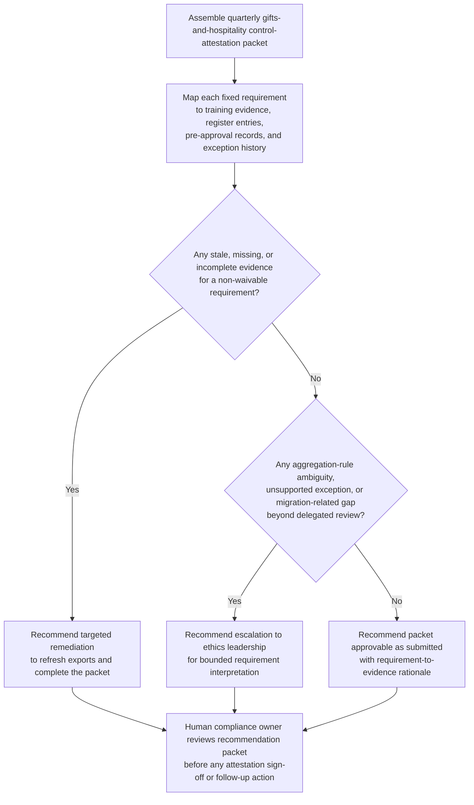
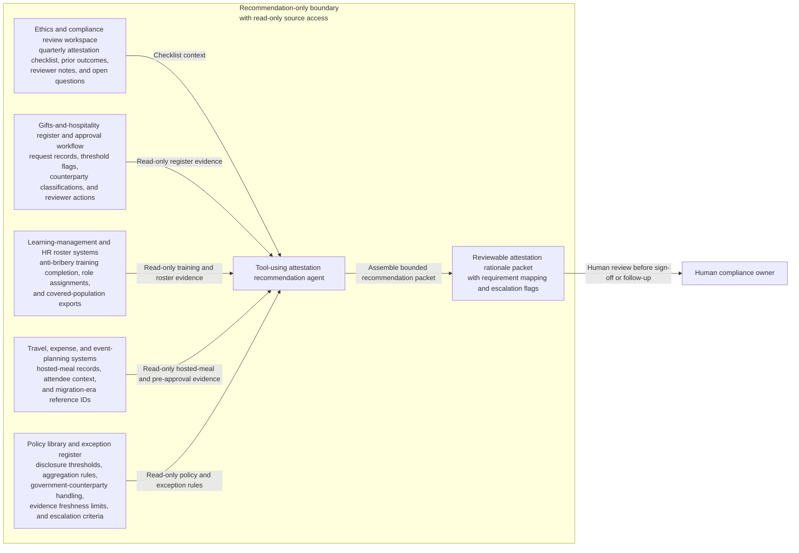

# Gifts and hospitality threshold-control attestation recommendation

## Linked pattern(s)

- `control-requirement-attestation-recommendation`

## Domain

Compliance.

## Scenario summary

An ethics and compliance manager is preparing the quarterly internal attestation for the gifts-and-hospitality control program covering employee training completion, register completeness, threshold-based disclosures, government-counterparty pre-approvals, and documented exception use for bundled event hospitality. The requirement set is fixed: every in-scope business unit must have current anti-bribery training evidence for covered requestors and reviewers, all above-threshold gifts or hospitality entries must appear in the register, government-touching events must show pre-approval records, monthly register reviews must be complete, and any aggregation or event-bundle exception must remain explicitly approved and time-bounded. The evidence packet is close, but one training export predates a recent sales-leadership roster change, one conference hospitality pre-approval record is missing after a travel-workflow migration, and a prior exception for bundled hosted meals may no longer fit the current aggregation rule. The workflow must recommend whether the packet is approvable as-is, needs targeted remediation, or should escalate to ethics leadership because the requirement fit is no longer routine before any human signs the quarterly attestation or changes compliance program records.

## Target systems / source systems

- Ethics and compliance review workspace holding the quarterly attestation checklist, prior outcomes, reviewer notes, and open questions
- Gifts-and-hospitality register and approval workflow with request records, threshold flags, counterparty classifications, and reviewer actions
- Learning-management and HR roster systems containing anti-bribery training completion, role assignments, and current covered-population exports
- Travel, expense, and event-planning systems with hosted-meal records, attendee context, and migration-era reference IDs used to reconcile pre-approval evidence
- Policy library and exception register defining disclosure thresholds, aggregation rules, government-counterparty handling, evidence freshness limits, and escalation criteria

## Why this instance matters

This grounds the pattern in compliance with a scenario that is materially different from vendor privacy or telemetry review while still staying inside the same low-risk recommendation boundary. The useful work is deciding whether a known gifts-and-hospitality attestation packet satisfies explicit control requirements, with visible evidence gaps and a reviewable rationale packet, not granting approvals, issuing legal advice, contacting regulators, or changing program records. It also shows why conservative escalation matters even in a bounded internal review: a clean-looking packet can still hide training drift, missing pre-approval evidence, or an exception that no longer fits policy.

## Likely architecture choices

- A tool-using single agent can retrieve the current requirement set, align register entries with training and pre-approval evidence, compare exception scope against current aggregation rules, and assemble one reviewable rationale packet.
- Human-in-the-loop review is required because ethics or compliance leadership must decide whether partial evidence is acceptable, whether exception scope still fits policy, or whether the case needs escalation.
- Read-only integration with compliance, learning, HR, travel, and register systems is preferable so the workflow cannot alter disclosures, refresh approvals, approve the attestation, or change live control records.

## Governance notes

- The packet should preserve requirement-by-requirement status as satisfied, partial, stale, missing, or exception-backed, with direct links to the exact training export, register entry, pre-approval artifact, monthly review record, or exception note used.
- Missing migration-linked pre-approvals, stale covered-population exports, or an event-bundle exception stretched beyond the current aggregation rule should trigger explicit remediation or escalation instead of being normalized into a green summary.
- Employee identities, counterparty details, and hospitality records should remain visible only to authorized ethics, compliance, internal audit, and control reviewers under normal need-to-know access.
- The boundary between recommendation and action must stay explicit: signing the attestation, approving a new exception, altering disclosures, or updating compliance systems remains outside this workflow.

## Evaluation considerations

- Reviewer agreement with the recommended approve, remediate, or escalate posture without major requirement-mapping corrections
- Rate at which stale training evidence, missing pre-approval records, or unsupported aggregation exceptions are surfaced before quarterly attestation sign-off
- Quality of traceability from each gifts-and-hospitality requirement to current compliance, learning, HR, travel, and register evidence
- Stability of recommendations when covered-population rosters, disclosure thresholds, or exception posture change during the review window
