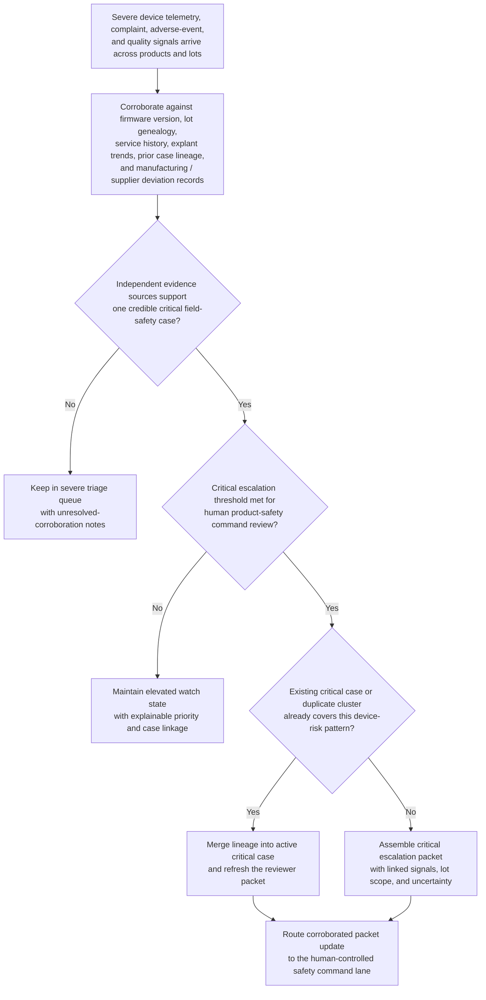

# Implantable cardiac device field-failure critical corroboration triage

## Linked pattern(s)

- `critical-signal-corroboration-triage`

## Domain

Compliance.

## Scenario summary

A medical-device safety and compliance team watches for severe field-risk signals affecting implantable cardiac devices: unexpected battery-depletion telemetry, complaint narratives describing syncope or loss-of-therapy episodes, adverse-event intake that may require rapid medical-device reporting, explant-and-replacement requests, and manufacturing or supplier nonconformance records tied to one firmware build or lot family. The workflow must determine whether these signals corroborate one potentially critical field-safety case, preserve duplicate-aware linkage across complaints and open quality records, assemble an escalation packet with the linked evidence and unresolved uncertainty, and route that packet into a human-controlled product-safety command lane. It stops before deciding root cause, field correction or recall, regulator notification, physician communication, CAPA launch, or any live patient-risk response.

## Target systems / source systems

- Device telemetry and remote-monitoring systems capturing battery-depletion anomalies, therapy interruptions, firmware resets, and population-level failure-rate spikes
- Complaint-intake, medical-information, and adverse-event systems holding patient, clinician, and distributor reports plus serious-event coding and reporting-clock references
- Service, explant, and replacement-order systems exposing device returns, replacement urgency, serial-number linkage, and field-service history
- Manufacturing execution, supplier quality, and nonconformance systems covering lot genealogy, component deviations, process excursions, and corrective-action references
- Safety-case management and escalation-routing tooling used to preserve duplicate-aware lineage, case state, packet revisions, and human-controlled handoff to product-safety leadership

## Why this instance matters

This grounds the pattern in a compliance setting where the risk is neither one noisy complaint nor an already-prepared packet waiting for release, but a fast-moving convergence of severe post-market safety signals that may indicate a critical device problem. The instance makes the family boundary concrete by focusing on multi-source corroboration, duplicate-aware case aggregation, packet assembly, and governed routing into human product-safety review rather than on failure analysis, recall decisions, regulator contact, clinician outreach, or field execution.

## Likely architecture choices

- Event-driven monitoring fits because telemetry spikes, complaint narratives, adverse-event follow-up, and quality deviations can arrive asynchronously and materially change corroboration within hours.
- Orchestrated multi-agent or staged service roles fit because telemetry review, complaint linkage, lot-and-firmware genealogy checks, duplicate handling, and escalation-packet assembly are specialized tasks that need one shared critical-case state.
- Human-in-the-loop review remains necessary because even a recommendation-only critical packet can rapidly influence consequential downstream recall, reporting, and patient-safety decisions.

## Governance notes

- The escalation packet should show which telemetry, complaint, adverse-event, explant, and manufacturing signals were fused, what independent evidence linked them, and what uncertainty still prevents a definitive failure conclusion.
- Duplicate handling must preserve lineage across serial numbers, lot families, firmware builds, complaint clusters, and open quality records so reviewers can distinguish one expanding field issue from coincidental but unrelated events.
- Policy thresholds for critical escalation, field-population scope, and watch-state retention should be versioned and reviewable because overtuned logic can either miss a true patient-safety crisis or flood the safety command lane with false criticals.
- Broad queue views should minimize patient identifiers, clinician details, and sensitive complaint narratives while preserving controlled references back to the authoritative safety and quality records.
- The workflow must end at corroborated triage, packet assembly, and human-controlled routing rather than implying MDR submission, recall initiation, physician notification, product hold, or CAPA approval.

## Evaluation considerations

- Recall of historically critical device-safety clusters that should have reached human-controlled product-safety escalation
- Median time from first severe multi-source signal burst to a corroborated packet ready for safety-command review
- Accuracy of duplicate merging and lineage preservation when complaints, telemetry anomalies, and quality deviations partially overlap across adjacent lots or firmware versions
- Reviewer agreement that the packet distinguishes genuine cross-source corroboration from coincidental co-occurrence in noisy post-market safety data
- Reliability of uncertainty escalation when evidence conflicts, such as strong complaint severity with weak lot linkage or strong telemetry correlation with sparse adverse-event detail
