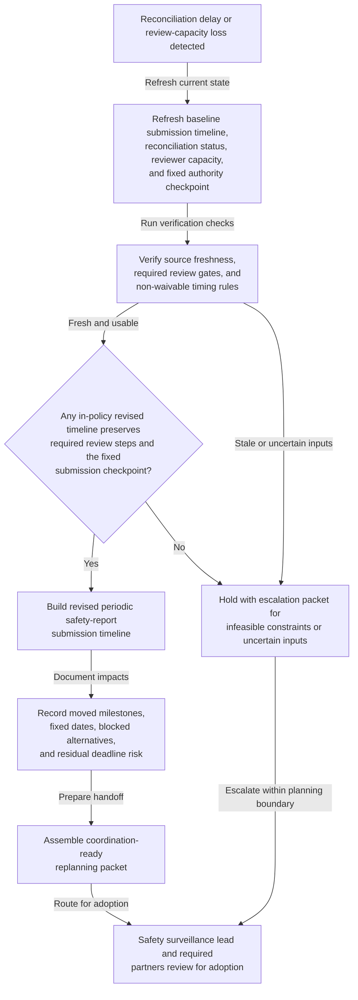
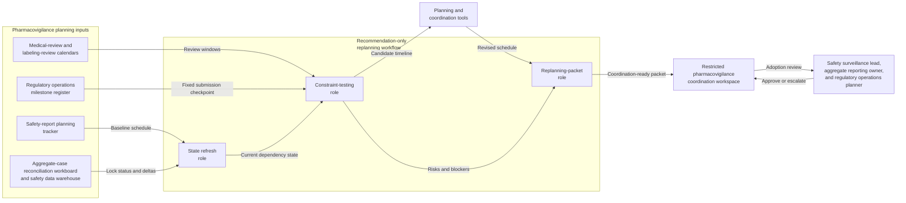

# Periodic safety-report submission timeline replanning after aggregate-case reconciliation delay or medical-review capacity loss

## Linked pattern(s)

- `schedule-adjustment-and-replanning`

## Domain

Compliance.

## Scenario summary

A pharmacovigilance compliance team already has an approved periodic safety-report timeline that sequences aggregate-case reconciliation lock, interval-dataset quality checks, aggregate summary drafting, medical-review sign-off, labeling-consistency review, final package assembly, and a fixed regulator submission checkpoint. Then the baseline path stops being feasible: aggregate-case reconciliation for one reporting interval finishes late, temporary medical-review capacity loss removes a planned sign-off window, or labeling-review compression leaves too little time before the non-waivable authority deadline. The workflow should recompute a revised submission timeline, document which milestones can move and which checkpoints must stay fixed, and prepare a coordination-ready replanning packet for the safety surveillance lead, aggregate reporting manager, medical safety reviewer, labeling lead, and regulatory operations planner rather than assessing individual cases, making medical judgments, communicating with the regulator, submitting the report, or executing the revised workplan itself.

## Target systems / source systems

- Safety-report planning tracker with the approved baseline submission schedule, reporting interval scope, review dependencies, fixed authority due date, and prior schedule versions
- Aggregate-case reconciliation workboard and safety data warehouse showing interval lock status, outstanding reconciliation deltas, dataset refresh timing, and blocked summary inputs
- Medical-review and labeling-review calendars capturing reviewer availability, blackout periods, mandatory review lead times, and already-committed sign-off windows
- Regulatory operations milestone register showing package assembly checkpoints, submission-format readiness dependencies, and the non-waivable submission deadline the revised plan must preserve
- Planning and coordination tools that can model dependency shifts, critical-path changes, rejected alternatives, and versioned replanning packets for handoff
- Restricted pharmacovigilance coordination workspace where the rationale ledger, unresolved blockers, stakeholder acknowledgements, and adoption status of the revised plan are recorded

## Why this instance matters

This grounds the replanning pattern in a thinner compliance slice where the main problem is restoring a feasible periodic safety-report timeline after upstream reconciliation or review-capacity changes invalidate the original submission path. The valuable output is a revised schedule, an explicit rationale and impact ledger, and a coordination-ready handoff packet for human adoption. The workflow stays inside the planning family boundary by stopping before aggregate-case adjudication, medical judgment, authority communication, report submission, or downstream pharmacovigilance operations.

## Likely architecture choices

- An orchestrated multi-agent workflow fits because one role can refresh reconciliation, review-capacity, and milestone state, another can test candidate timelines against fixed submission and review constraints, and another can package the accepted replanning proposal with downstream impacts and unresolved blockers.
- Human-in-the-loop adoption remains necessary because the safety surveillance lead, aggregate reporting owner, or regulatory operations planner must approve any material movement of review sequencing, schedule compression, or handoff timing before the revised plan becomes authoritative.
- Recommendation-only autonomy is the right ceiling: the workflow can propose a feasible updated submission timeline and identify deadline risk, but it should not assess cases, waive required medical or labeling review, alter the authority deadline, communicate externally, or trigger submission activity.

## Governance notes

- Hard constraints should remain explicit throughout replanning: the fixed regulator submission checkpoint, required aggregate-case reconciliation lock, minimum medical-review lead time, mandatory labeling-consistency review, and any non-waivable package assembly cutoff.
- The rationale and impact ledger should preserve lineage from the baseline submission plan to the revised proposal, including which milestones moved, which checkpoints remained fixed, what alternatives were rejected, and what residual deadline risk still remains.
- Source freshness matters because a revised schedule built on stale reconciliation status, reviewer availability, or package-readiness assumptions can create false confidence and trigger another avoidable replanning cycle.
- The coordination-ready handoff packet should share only role-relevant timing, dependency, blocker, and adoption detail rather than patient-level case content, detailed medical narratives, draft authority correspondence, or submission payload material.
- The workflow should escalate instead of improvising when no in-policy timeline can preserve both the required review steps and the fixed submission checkpoint, when a proposed revision would effectively waive a safety-governance requirement, or when unresolved reconciliation uncertainty makes any revised plan misleading.

## Evaluation considerations

- Time from reconciliation-delay or review-capacity trigger to a revised periodic safety-report timeline with explicit dependency impacts and adoption-ready handoff
- Rate of replanning events resolved with an accepted revised schedule without forcing a full manual rebuild of the submission path
- Frequency of adopted revised timelines that still miss review or submission checkpoints because constraint interactions were not surfaced early enough
- Audit usefulness of the rationale ledger for reconstructing which milestones moved, which checkpoints stayed fixed, what residual deadline risk remained, and why human owners accepted or escalated the revised plan
