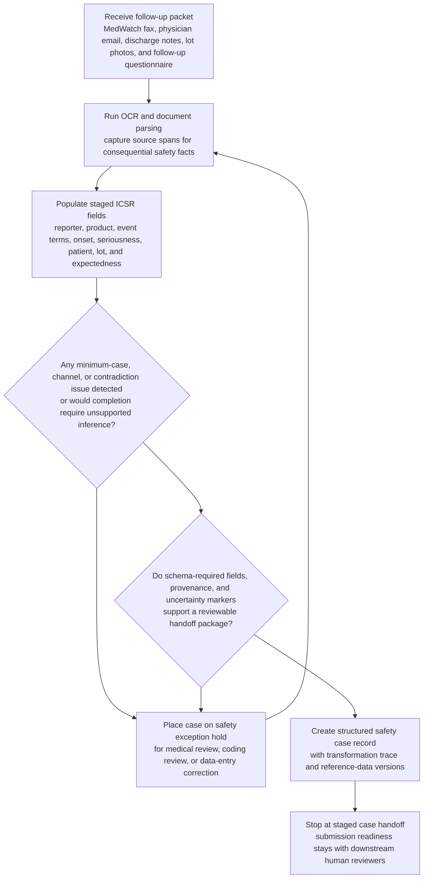
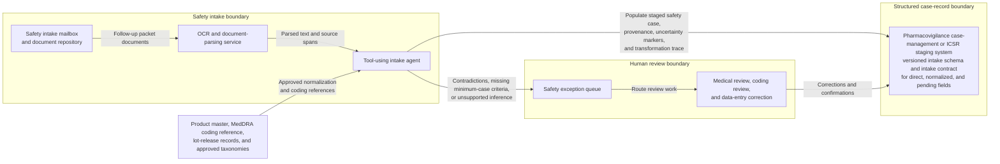

# Pharmacovigilance follow-up packet to safety case record handoff

## Linked pattern(s)

- `document-to-structured-data-handoff`

## Domain

Compliance.

## Scenario summary

A drug safety operations team receives a follow-up packet for a serious adverse event involving a hospital patient who was re-admitted after using an infusion therapy. The source packet includes a faxed MedWatch form, an email from the treating physician, scanned discharge notes, product lot photographs, and an internal follow-up questionnaire completed by the field safety specialist. Before any regulator gateway submission can be prepared, the intake workflow must transform the packet into a structured safety case record with the required ICSR staging fields for reporter type, suspect product, event terms, onset dates, seriousness criteria, patient attributes, lot references, and expectedness flags while preserving provenance, uncertainty, and unresolved contradictions.

## Target systems / source systems

- Pharmacovigilance case-management or ICSR staging system with a versioned intake schema for required safety fields
- Safety intake mailbox and document repository holding fax images, emails, scanned clinical notes, and follow-up forms
- OCR and document-parsing service tuned for handwritten medical forms and semi-structured hospital documents
- Product master, MedDRA coding reference, lot-release records, and approved country or seriousness taxonomies
- Safety exception queue for medical review, coding review, and data-entry correction before any external transmission workflow begins

## Why this instance matters

This grounds the transform pattern in a regulated compliance workflow where the key handoff is not a filing action but the creation of a trustworthy structured case record that downstream safety reviewers and submission tooling can rely on. A schema-valid record is not sufficient if it obscures whether an event term came from a physician note, a handwritten form, or an inferred normalization step. The instance shows why explicit field contracts, provenance, and disciplined exception routing are necessary before a pharmacovigilance team can decide whether the case is complete enough for coding, assessment, and later reporting.

## Likely architecture choices

- A tool-using single agent can coordinate OCR, source segmentation, field extraction, MedDRA candidate lookup, schema validation, and packaging of the staged safety case plus transformation trace.
- The target handoff should use an explicit intake contract that distinguishes directly extracted values, normalized values, and fields still awaiting human coding or confirmation.
- Approved reference data may normalize product names, lot formats, reporter categories, and seriousness criteria, but the workflow should refuse unsupported inference for missing onset dates, patient age, or causality indicators.
- Human review remains mandatory for conflicting seriousness evidence, ambiguous event coding, missing minimum case criteria, or document sets that imply follow-up is incomplete.

## Governance notes

- Every consequential case field should carry a source pointer or excerpt reference, including the exact document and span supporting event narrative, suspect product, reporter identity, onset timing, and seriousness classification.
- The workflow should route exceptions instead of handing off when the packet fails minimum pharmacovigilance intake criteria, when two documents disagree on core facts such as event date or product lot, or when protected health information is present outside approved intake channels.
- Provenance should include the schema version, coding reference versions, normalization actions, and any lossy mapping from free-text clinical language into controlled safety fields.
- Human medical review, not the transformation workflow, should decide final event coding, seriousness adjudication, and readiness for regulator submission; the handoff stops at a reviewable staged case record.

## Evaluation considerations

- Percentage of staged safety cases accepted by downstream pharmacovigilance review without manual reconstruction of source facts
- Rate of incomplete or contradictory follow-up packets correctly diverted to exception review before coding or submission preparation
- Completeness of field-level provenance for serious-event, product, and patient-attribute fields during audit or case reconciliation
- Stability of the handoff when fax quality drops, clinical documents arrive out of order, or the intake schema adds a new mandatory field
