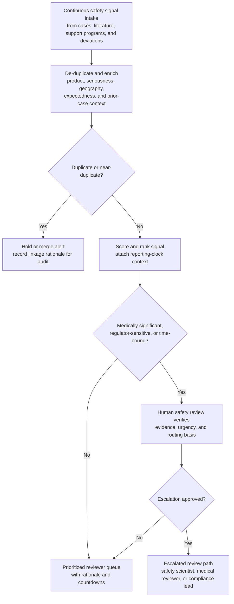
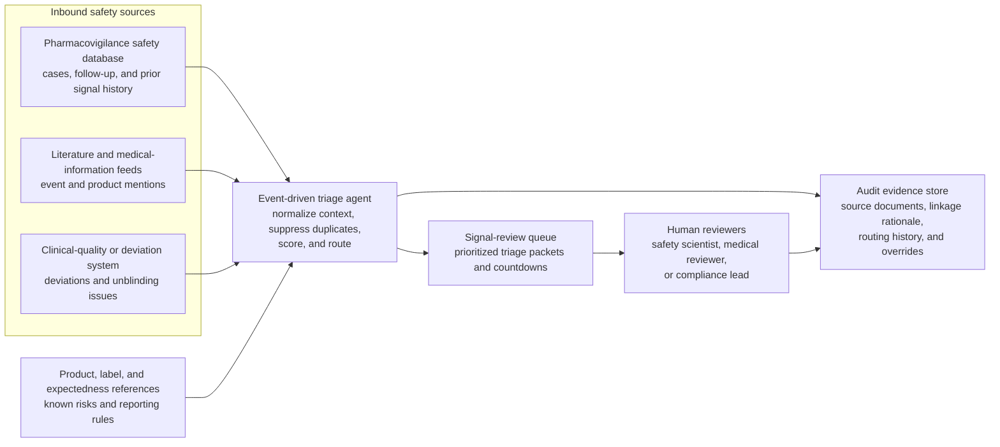

# Pharmacovigilance safety signal alert triage

## Linked pattern(s)

- `risk-alert-triage`

## Domain

Compliance.

## Scenario summary

A drug-safety operations team receives a continuous stream of potential safety signals from spontaneous adverse-event intake, literature surveillance, patient-support programs, and protocol-deviation feeds tied to marketed and late-stage investigational products. The workflow must de-duplicate near-identical alerts, enrich each signal with product, seriousness, geography, expectedness, and prior-case context, and then prioritize which items should move first into human safety review. The goal is not to determine causality or write the final safety assessment, but to convert noisy inbound signals into an explainable reviewer queue with explicit escalation triggers for medically significant, regulator-sensitive, or time-bound cases.

## Target systems / source systems

- Pharmacovigilance safety database with incoming adverse-event cases, follow-up status, seriousness coding, and prior signal history
- Literature-monitoring and medical-information intake feeds that surface newly reported events, product mentions, and case references
- Clinical-quality or protocol-deviation system showing site deviations, unblinding events, and product-handling issues that may alter safety posture
- Product, label, and expectedness reference sources covering approved indications, known risks, country-specific reporting rules, and current safety topics
- Case-management or signal-review queue used by safety scientists, drug-safety physicians, and compliance operations reviewers
- Audit-grade evidence store for source documents, duplicate-linkage rationale, alert-routing history, and reviewer overrides

## Why this instance matters

This grounds the pattern in a regulated compliance setting where alert triage has to balance patient-safety urgency, reporting timeliness, and reviewer capacity without pretending that initial signals are already understood. A simplistic workflow would either flood safety reviewers with duplicate or low-value noise or suppress weak signals so aggressively that a real emerging risk is noticed too late. The instance makes the family boundary legible because the agentic work is continuous watching, context assembly, noise suppression, and governed routing into human review rather than medical judgment, aggregate signal detection conclusions, or regulator-facing action.

## Likely architecture choices

- Event-driven monitoring should ingest inbound safety and deviation signals continuously, then re-score alerts as new follow-up facts, duplicate links, or label changes arrive.
- Human-in-the-loop review should remain central because seriousness interpretation, expectedness edge cases, and any escalation that could affect regulatory reporting or product-risk posture require accountable clinical or safety reviewers.
- A tool-using single agent can normalize source metadata, attach prior-case and product context, suppress obvious duplicates under controlled rules, and publish a prioritized queue with rationale and countdowns for reporting windows.
- Escalation outputs should stay approval-gated so the workflow can recommend routing to a safety scientist, medical reviewer, or compliance lead, but cannot independently close signals, submit regulatory reports, or redefine reporting thresholds.

## Governance notes

- Duplicate suppression logic should record which source identifiers, narrative overlaps, product attributes, and prior cases justified merging or deferring an alert so auditors can reconstruct why a signal did not surface separately.
- Alerts involving fatal, life-threatening, pediatric, pregnancy, or unexpected-event patterns should carry protected escalation rules that resist suppression even when confidence is imperfect.
- Privacy controls should minimize patient identifiers, reporter details, and site-level sensitive information in triage packets while preserving traceable links back to the controlled safety record.
- Reporting-clock assumptions, expectedness references, and country-specific routing rules should be versioned and auditable because a policy change can alter which reviewer queue receives a case and how urgently it must be handled.
- Reversibility should be explicit: queue order, duplicate-linkage decisions, and severity labels can be recalculated, but a missed escalation window for a true safety signal may be only partially recoverable, so low-confidence cases should bias toward human review rather than silent suppression.

## Evaluation considerations

- Recall of historically material safety signals or regulator-sensitive cases that should have reached expedited human review
- Reduction in reviewer time spent on duplicate or low-value alerts without lowering capture of serious or unexpected event patterns
- Median time from signal arrival to an evidence-backed triage packet with severity rationale, routing basis, and reporting-clock context
- Agreement rate between triage recommendations and human safety-review disposition, especially for ambiguous seriousness, expectedness, or duplicate-linkage cases
- Auditability of suppression, merge, and escalation history during mock inspection replay or internal quality review
