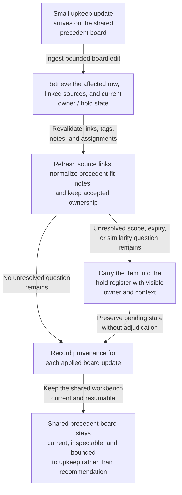
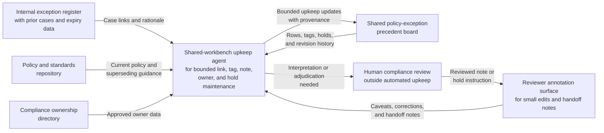

# Policy-exception precedent board shared workbench upkeep

## Linked pattern(s)

- `shared-workbench-orchestration`

## Domain

Compliance.

## Scenario summary

An internal compliance operations team maintains a shared policy-exception precedent board while exception program leads, regional compliance partners, records stewards, and risk reviewers continuously refine notes attached to previously decided internal exception cases. Small updates arrive throughout the week: one steward links a superseding exception memo, a regional partner flags a stale jurisdiction tag, a reviewer adds a caveat that one precedent only applied under a retired compensating control, and a program lead reassigns ownership of an unresolved similarity question. The agent keeps that internal workbench usable by refreshing linked source references, normalizing duplicate precedent-fit notes, preserving accepted owner assignments, and carrying unresolved scope or expiry questions forward in an explicit hold register. Humans remain responsible for deciding what a precedent means, whether a live request is materially similar, whether an exception is acceptable, and when any material should move into separate recommendation, approval, legal review, regulator communication, or execution workflows.

## Target systems / source systems

- Shared policy-exception precedent board with precedent rows, scope tags, owner fields, hold tags, and revision history
- Internal exception register containing previously decided cases, decision dates, expiry conditions, and approved rationale summaries referenced by board rows
- Policy and standards repository containing current policy text, compensating-control references, and superseding guidance linked from precedent notes
- Reviewer annotation surface where exception program leads, regional partners, and records stewards add small edits, caveats, and handoff notes
- Compliance ownership directory tracking current board stewards, backup reviewers, and approved custodians for precedent categories

## Why this instance matters

This grounds the pattern in a compliance setting that is materially different from control-library upkeep because the maintained artifact is an internal precedent board for past exception cases rather than a caveat board attached to standard controls. The useful work is keeping one bounded workbench current, inspectable, and resumable as case references, scope tags, and ownership details change across many small edits. That makes the workflow about internal precedent-board upkeep, provenance, and hold-state visibility instead of recommendation, adjudication, or downstream exception handling.

## Likely architecture choices

- Event-driven monitoring fits because upkeep should react when exception-register entries, policy references, reviewer notes, or board fields change.
- A tool-using single agent can refresh source links, normalize duplicate precedent caveats, and keep ownership plus hold markers synchronized inside one bounded board.
- Human-in-the-loop review remains necessary when a note would reinterpret a precedent, clear a contested scope limitation, or make the board sound like a live exception recommendation.
- Bounded delegation works because compliance owners can predefine allowable field updates, source boundaries, and hold conditions without delegating exception adjudication, legal interpretation, or external communication.

## Governance notes

- The board should clearly separate approved precedent references, reviewer proposals, unresolved similarity questions, and held or expired precedents so upkeep never implies that a new exception has already been judged.
- Exception-register links, policy references, decision dates, expiry conditions, scope tags, and owner assignments should be revalidated before a row is marked current or a hold is cleared.
- The agent may normalize structure and merge overlapping caveat notes, but it should not decide whether one case is a valid precedent for another, approve an exception, or remove a hold that a human owner accepted.
- If a requested update would rank options for a live request, recommend an approval path, communicate with regulators, submit a filing, or trigger operational execution, the workflow should stop and hand off to the appropriate adjacent pattern.

## Evaluation considerations

- Percentage of board refreshes that preserve correct precedent links, scope tags, expiry conditions, owner assignments, and unresolved-question state across repeated update cycles
- Reviewer correction rate for merged precedent caveats, refreshed source references, or automatically updated hold markers
- Rate at which interpretation-heavy or adjudication-adjacent edits are held for human review instead of being silently folded into the internal board
- Usefulness of the maintained workbench for helping compliance collaborators resume precedent-board upkeep without reconstructing stale context by hand
