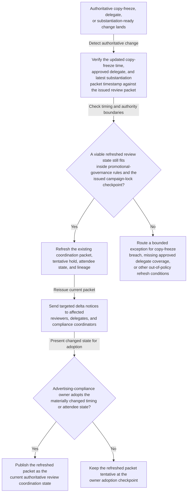

# Promotional claims review committee coordination refresh after copy-freeze shift

## Linked pattern(s)

- `authoritative-change-coordination-refresh`

## Domain

Compliance.

## Scenario summary

A consumer-health promotional claims review already has an issued coordination packet, required attendee set, campaign copy-freeze checkpoint, and tentative review-committee hold tied to the governing claim-substantiation record. After that packet is issued, authoritative review conditions change: brand operations moves the final copy-freeze earlier, the medical signatory assigns an approved delegate because of congress travel, and the latest approved substantiation packet posts later than the original review start assumed. The workflow should refresh the existing coordination package, send participant-specific delta notices, and hold the changed state at an explicit advertising-compliance owner adoption or exception checkpoint rather than rewriting campaign language, deciding whether the claims are acceptable, or releasing promotional assets.

## Target systems / source systems

- Promotional-review governance record with the approved review scope, required participant roles, current coordination status, and prior packet version
- Brand operations and medical-legal-regulatory calendars publishing authoritative committee-slot moves, copy-freeze deadlines, and campaign-lock constraints
- Team calendars, delegate mappings, and role eligibility records for advertising compliance, medical review, regulatory affairs, brand marketing, and legal counsel
- Claim-substantiation repository publishing authoritative packet-ready timestamps and evidence-freeze state that constrain when the review can validly occur
- Compliance coordination workspace where packet revisions, acknowledgements, adoption state, and refresh lineage are maintained
- Notification or meeting tooling capable of issuing role-targeted updates without silently replacing the authoritative invite history

## Why this instance matters

This grounds the pattern in a compliance governance workflow where one already-issued promotional-review packet has to stay synchronized with authoritative copy-freeze, attendee, and substantiation-readiness changes. The value comes from preserving one current packet, one clear delta trail, and explicit human adoption of consequential shifts so reviewers evaluate the same governed review state without confusion near a campaign lock. It stays within coordination-refresh scope because the workflow updates review timing, attendee state, and checkpoint lineage only; it does not revise claim language, adjudicate whether the claims are permissible, or publish the promotional material.

## Likely architecture choices

- Event-driven monitoring should react only to approved copy-freeze updates, authoritative substantiation-ready changes, and governed delegate-state changes that affect the issued review packet.
- Exception-gated autonomy fits because the workflow can refresh the packet, revise the tentative hold, and issue targeted participant notices automatically when changes remain inside promotional-governance and authority guardrails.
- The advertising-compliance owner should adopt any changed meeting time, required-attendee substitution, or copy-freeze-sensitive shift before the refreshed packet becomes authoritative.
- Exception handling should route no-feasible-window cases, unsupported delegate changes, or campaign-lock boundary violations instead of publishing a misleading current coordination state.

## Governance notes

- Required roles and approved delegates should be explicit and auditable for advertising compliance, medical review, regulatory affairs, brand marketing, and legal counsel before automatic refresh is enabled.
- Refreshed notices should include only the timing, attendee, and substantiation-readiness deltas needed for coordination rather than full promotional copy, health-claim rationale, or campaign strategy commentary.
- The workflow should preserve append-only lineage connecting each authoritative copy-freeze or substantiation-ready change to the resulting packet refresh, targeted notices, and advertising-compliance-owner adoption outcome.
- Automatic refresh should stop when the changed slot crosses a protected campaign-lock boundary, the trigger comes from an unofficial email thread, or a required role loses approved delegate coverage.
- Churn-heavy refresh periods near copy freeze should be monitored so participants can still identify one current packet without sifting through conflicting revisions.

## Evaluation considerations

- Time from authoritative copy-freeze or substantiation-ready change to a refreshed promotional-review packet with explicit adoption or exception status
- Rate of campaign-lock-threatening shifts, unsupported delegate substitutions, or unresolved required-attendee changes correctly escalated before the packet becomes authoritative
- Participant ability to tell what changed between the prior and current coordination packet without reconstructing the full promotional-governance thread manually
- Notification-deduplication performance when multiple copy-freeze or substantiation-readiness updates arrive near the protected campaign-lock boundary
