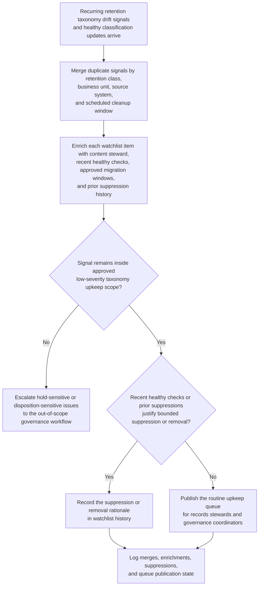
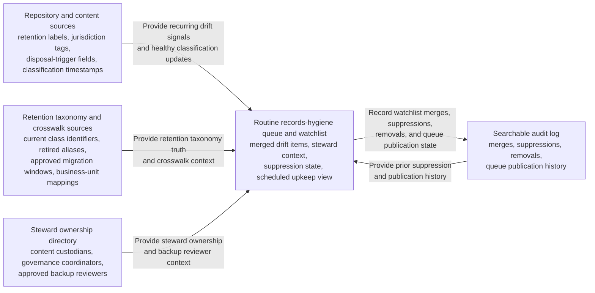

# Records-retention taxonomy drift watchlist upkeep

## Linked pattern(s)

- `explainable-watchlist-maintenance`

## Domain

Compliance.

## Scenario summary

A records-governance operations team monitors recurring low-severity retention taxonomy hygiene signals across enterprise content repositories, records catalogs, collaboration spaces, and classification crosswalk tables: repeated use of retired retention labels, missing disposal-trigger tags, stale jurisdiction qualifiers, and inconsistent business-unit mappings that do not yet affect a live legal hold, regulatory inquiry, or disposition event. The workflow must merge duplicate signals by retention class, business unit, source system, and scheduled cleanup window, enrich each watchlist item with content steward, recent healthy classification checks, approved migration windows, and prior suppression history, and then publish a routine upkeep queue for records stewards and information-governance coordinators. The goal is to keep persistent taxonomy drift visible long enough for scheduled metadata hygiene work before it turns into audit friction, retention-schedule confusion, or downstream disposition-control debt, not to reinterpret retention rules, decide whether a record belongs on hold, route an escalation, or execute relabeling changes automatically.

## Target systems / source systems

- Enterprise content repositories, records catalogs, and archive platforms with retention labels, jurisdiction tags, disposal-trigger fields, and classification timestamps
- Retention taxonomy and crosswalk sources defining current class identifiers, retired aliases, approved migration windows, and business-unit mappings
- Records-steward ownership directory with content custodians, governance coordinators, and approved backup reviewers
- Routine records-hygiene queue or watchlist used for scheduled metadata maintenance cycles
- Searchable audit log preserving watchlist merges, suppressions, removals, and routine queue publication history

## Why this instance matters

This grounds `explainable-watchlist-maintenance` in compliance work where recurring metadata drift is important enough to preserve visibility but usually too weak for anomaly review, legal interpretation, or immediate escalation. Records-governance teams often need an explainable low-risk watchlist so small classification inconsistencies do not accumulate silently across repositories between scheduled stewardship cycles. The instance stays inside monitor/detect/triage because the workflow ends at recurring-signal grouping, bounded suppression, and routine queue publication rather than retention-law analysis, legal-hold management, disposition approval, or operational execution.

## Likely architecture choices

- Event-driven monitoring fits because the watchlist should refresh as new classification scans, taxonomy updates, and healthy-state checks arrive across repositories.
- A tool-using single agent can merge repeated taxonomy-drift signals, retrieve bounded ownership and migration-window context, and maintain one explainable records-hygiene watchlist.
- Exception-gated autonomy is appropriate because routine low-stakes watchlist upkeep can run automatically, while signals touching active legal holds, imminent disposition windows, or unresolved policy-boundary questions should escalate out of scope.
- Decisions about changing the retention taxonomy, interpreting regulatory obligations, contacting custodians about potential violations, or applying metadata fixes should remain human-owned workflows.

## Governance notes

- Watchlist entries should clearly separate routine taxonomy hygiene drift from signals that may affect legal holds, regulatory preservation obligations, or imminent destruction controls so low-risk upkeep does not hide higher-governance issues.
- Queue views should expose only the minimum repository, retention-class, and steward identifiers needed for routine cleanup, avoiding broad distribution of document titles or sensitive record content.
- Reversibility should remain explicit: watchlist entries, merges, suppressions, and removals can be recomputed from classification scans and taxonomy history, but missed escalation near a hold or disposition deadline may be only partially recoverable.
- Audit logs should preserve source signal references, recurrence thresholds, migration-window context, suppression rationale, manual overrides, and queue publication history so records-governance leads can inspect whether the watchlist stayed useful and properly bounded.

## Evaluation considerations

- Percentage of recurring retention taxonomy drift signals surfaced before scheduled records-hygiene or retention-review cycles without creating alert-style noise
- Reduction in duplicate upkeep items through merged watchlist entries by retention class, business unit, and source system
- Median time from a recurring retired-label or missing-tag signal to an explainable watchlist item with steward, age, and suppression context
- Rate at which watchlist items that later intersected hold-sensitive or disposition-sensitive workflows were escalated before they aged out invisibly
- Records-steward override rate for items that were retained too long, suppressed too aggressively, or explained too weakly for routine maintenance review
