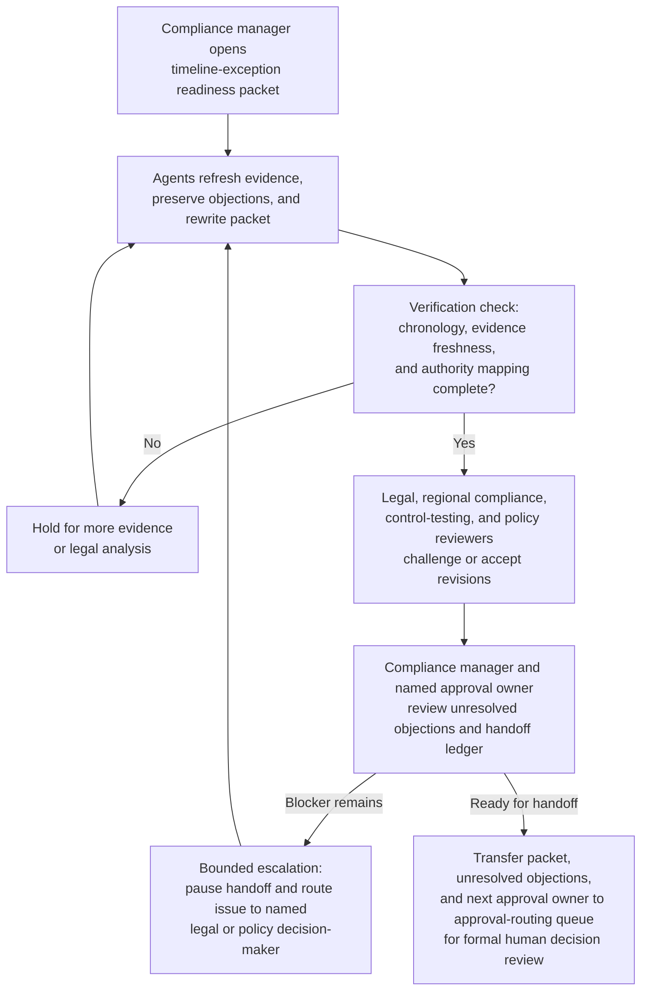
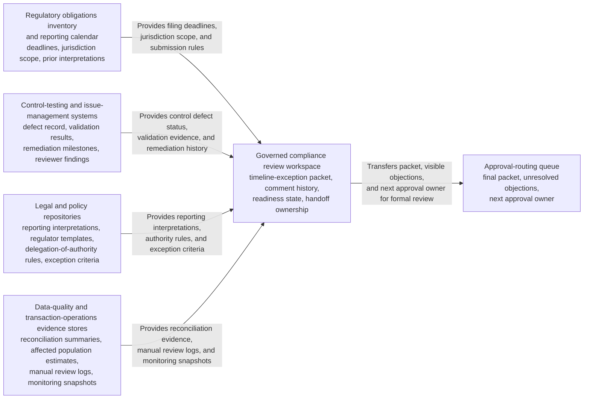

# Regulator reporting timeline exception package readiness loop

## Linked pattern(s)

- `approval-centered-collaboration`

## Domain

Compliance.

## Scenario summary

A regulatory compliance manager is coordinating a formal exception package because a business line cannot meet a near-term regulator reporting timeline after discovering that a required transaction-aggregation control was not fully operational in one jurisdiction. In a governed approval-collaboration workspace, the manager and agent support iterate on the readiness packet as legal, regional compliance, control-testing, and policy-office reviewers challenge whether the factual chronology is complete, whether the proposed temporary reporting approach is defensible, whether compensating controls are evidenced clearly enough, and whether the package properly states what remains unresolved. The agents help preserve reviewer objections, refresh source evidence, rewrite sections to reflect accepted edits and contested issues, and maintain an explicit handoff ledger showing who owns the next approval-readiness checkpoint. The human compliance manager and named approval owner remain responsible for deciding whether the packet is ready for formal approval review, whether any objection should block handoff, and whether the request should pause for more evidence or legal analysis rather than move toward adjudication.

## Target systems / source systems

- Governed compliance review workspace with the draft timeline-exception packet, comment history, readiness state, and named handoff ownership
- Regulatory obligations inventory and reporting-calendar records showing the applicable filing deadlines, jurisdictional scope, prior interpretations, and non-waivable submission rules
- Control-testing and issue-management systems containing the aggregation-control defect record, validation results, remediation milestones, and prior reviewer findings
- Legal and policy repositories with reporting-standard interpretations, regulator-communication templates, delegation-of-authority rules, and exception criteria
- Data-quality and transaction-operations evidence stores containing reconciliation summaries, affected population estimates, manual review logs, and control-monitoring snapshots
- Approval-routing queue where the final human-approved packet, unresolved objections, and next approval owner are transferred for formal decision review

## Why this instance matters

This grounds the pattern in a compliance workflow where the difficult work is negotiating whether a regulator-facing timing exception package is approval-ready without implying that the organization has been excused from the underlying obligation. The scenario is distinct from a sanctions closure copilot loop because the center of gravity is repeated readiness collaboration across legal, compliance, and control reviewers rather than open-ended response drafting. It shows why agents are useful for evidence negotiation, objection preservation, and handoff clarity while still stopping short of deciding whether the exception should be granted or what final position the institution will formally take.

## Likely architecture choices

- Human-in-the-loop collaboration should remain primary because legal posture, regulator-exposure framing, and residual reporting-risk acceptance require accountable compliance and legal ownership.
- An orchestrated multi-agent setup fits when separate agent roles refresh obligation evidence, reconcile reviewer objections, verify authority mappings, and maintain the shared handoff ledger across multiple revision rounds.
- Agents may prepare revised packet sections, evidence-response tables, and readiness summaries, but final approval routing, regulator outreach decisions, and any acceptance of a reporting breach or extension request should remain explicitly human-controlled.

## Governance notes

- The packet should clearly distinguish raw reporting facts, quoted legal or policy requirements, reviewer objections, agent-drafted revision proposals, and human-accepted language so the next approver can see what remains contested.
- Every material claim about deadline impact, affected records, temporary controls, jurisdictional interpretation, or remediation timing should link to inspectable evidence such as obligation entries, control-test results, reconciliation workpapers, or policy sections; stale support should block readiness.
- Objections from legal, policy, regional compliance, or control-testing reviewers should remain visible in the packet and handoff ledger unless a named human reviewer explicitly accepts the residual risk of carrying them into formal approval.
- The handoff ledger should record the current approval owner, mandatory reviewers, unresolved blockers, and the exact boundary where approval-readiness collaboration ends and formal human approval begins, preventing the packet from being mistaken for an approved reporting exception.
- Sensitive jurisdictional findings, customer or counterparty data, and draft regulator-language should remain restricted to role-appropriate reviewers with audit logging for every retrieval, excerpt, or ownership change.

## Evaluation considerations

- Time to produce an internal-review-ready reporting-timeline exception packet that preserves reviewer disagreement, evidence lineage, and explicit ownership of the next approval handoff
- Reviewer correction rate for sections where agent-assisted revisions overstated legal defensibility, minimized unresolved control gaps, or implied the package was approval-ready before required evidence was complete
- Reliability of the handoff ledger, including whether approval owner, pending reviewers, unresolved issues, and accepted residual risks stay synchronized with the latest packet version
- Rate at which formal approval review returns the packet because the collaboration loop hid objections, lost evidence traceability, or blurred the boundary between readiness and approval
