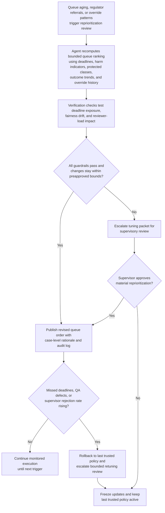

# Regulatory consumer complaint response queue reprioritization

## Linked pattern(s)

- `queue-prioritization-optimization`

## Domain

Compliance.

## Scenario summary

A retail-bank compliance operations manager is overseeing a backlog of open consumer complaints that require regulator-facing response packages, remediation recommendations, or formal closure review before statutory and consent-order deadlines expire. The queue mixes allegations about unauthorized fees, credit-reporting disputes, fair-lending concerns, servicing errors, and complaints routed in from a consumer-protection regulator portal. Recent handling data shows that analysts have been pulling easier documentation-only complaints forward while complex cases involving vulnerable customers, discrimination allegations, or regulator-referred matters age dangerously close to deadline. The optimization workflow must reprioritize the review queue within bounded limits so imminent deadlines, potential consumer harm, and protected-priority complaint classes rise appropriately without allowing low-balance customers, non-English submissions, or harder-to-investigate allegations to be systematically pushed back.

## Target systems / source systems

- Compliance case-management system with complaint intake records, due dates, allegation tags, case owner assignments, and current queue order
- Regulatory complaint portal and correspondence tracker showing regulator-referred cases, acknowledgement clocks, and required response milestones
- Customer remediation and servicing systems with refund history, dispute outcomes, hardship indicators, language-preference flags, and prior complaint linkage
- Historical QA and outcome store with reopened complaints, missed deadlines, supervisor overrides, restitution errors, and downstream exam findings
- Queue governance dashboard used by complaint-program supervisors to review proposed ranking changes, freeze tuning, and roll back to the last trusted policy

## Why this instance matters

This grounds the optimization pattern in a compliance workflow where queue order affects statutory timeliness, consumer fairness, and exam exposure rather than generic service throughput. A naive optimizer could favor cases that are easiest to close, leaving vulnerable-customer complaints, discrimination allegations, or regulator-referred items to age until the institution incurs deadline breaches or inconsistent remediation. The example makes the adaptation loop concrete: the system can learn from reopen patterns, quality-review findings, and override behavior, but only inside explicit deadline, fairness, and audit boundaries.

## Likely architecture choices

- Event-driven monitoring should trigger queue reevaluation when complaint volumes spike, statutory response windows narrow, protected-priority allegations enter the queue, or supervisors repeatedly override the current ordering.
- A tool-using single agent can recompute bounded prioritization weights, simulate the effect on deadline exposure and reviewer load, and publish a revised ranked queue with case-level rationale for supervisory inspection.
- Exception-gated autonomy fits because in-policy tuning can adjust ordering automatically within preapproved ranges, but larger changes to deadline buffers, fairness weights, or protected-priority handling should require supervisory review before activation.
- Human complaint-program leads should remain able to freeze optimization updates, restore the prior trusted ranking policy, and manually pin cases when external exam pressure or emerging legal guidance makes recent feedback unreliable.

## Governance notes

- Regulator-referred complaints, allegations involving discrimination or unfair treatment, matters with imminent statutory deadlines, and complaints tied to vulnerable-customer harm should remain protected classes that cannot be demoted for closure-speed reasons.
- Fairness checks should test for repeated deferral of lower-balance customers, non-English complaints, or cases from protected groups instead of letting historical ease-of-resolution signals become a proxy for priority.
- Every reprioritization should log the due-date pressure, harm indicators, outcome trends, override history, and guardrail checks that justified the ranking change so internal audit and exam teams can reconstruct why a case moved.
- Rollback behavior should be explicit: if missed deadlines increase, QA defect rates rise, or supervisors reject the new ranking at an unusual rate, the workflow should revert to the last trusted policy and escalate the tuning packet for review.
- Material reprioritization changes should be sampled in supervisory review to confirm the optimizer is improving compliant handling order rather than burying complex or sensitive complaints behind faster wins.

## Evaluation considerations

- Reduction in statutory deadline breaches, regulator escalations, and reopened complaint files after tuned queue ordering is applied
- Change in aging distribution for protected-priority complaints versus routine complaints, including whether fairness rules prevent systematic delay for vulnerable or low-balance customers
- Frequency and pattern of supervisor overrides that show the optimized ranking conflicted with policy, fairness, or consumer-harm expectations
- Speed and clarity of rollback when updated tuning degrades complaint quality, produces audit concerns, or conflicts with new regulatory guidance
