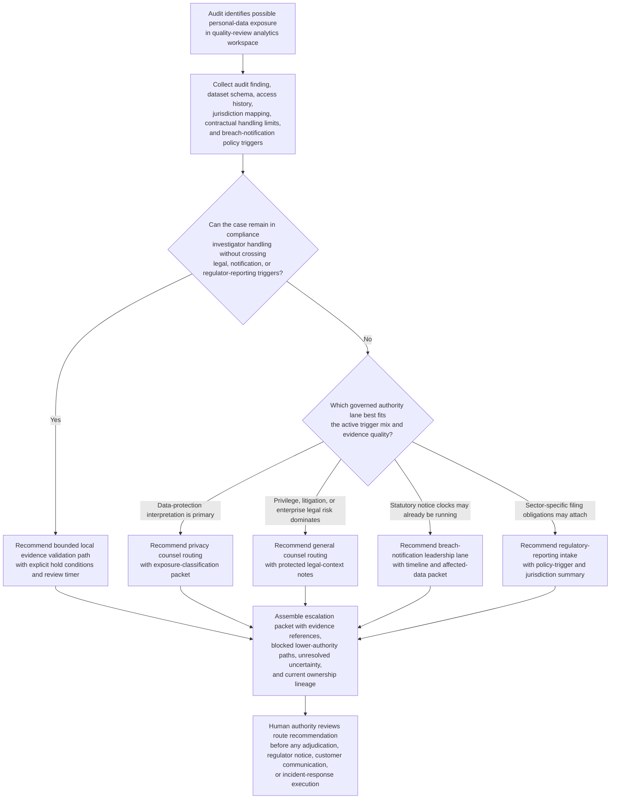

# Regulatory incident breach-notification escalation routing

## Linked pattern(s)

- `policy-constrained-escalation-routing`

## Domain

Compliance.

## Scenario summary

A compliance incident investigator is reviewing audit findings after a quarterly controls assessment surfaces evidence that a customer-support quality-review export may have exposed unredacted names, email addresses, support case identifiers, and limited complaint narrative fields in an internal analytics workspace that included contractors outside the originally approved review group. The investigator can verify the affected dataset, trace who accessed the workspace, and document which jurisdictions and retention windows may be implicated, but cannot decide legal privilege posture, determine whether the event qualifies for breach-notification obligations, choose whether regulatory-reporting lanes must open, or authorize any customer, regulator, or incident-response communication. The workflow must recommend the governed escalation route - such as privacy counsel first when data-protection interpretation is still the gating question, general counsel when litigation or privilege posture changes who should own the review, breach-notification leadership when statutory notice clocks are plausibly triggered, and regulatory-reporting intake when sector-specific filing obligations may attach - assemble the supporting evidence and policy packet, keep blocked lower-authority paths visible, and stop before adjudication, notification, communications, or response execution.

## Target systems / source systems

- Audit issue-management workspace with the original finding, control-test notes, sampled records, and investigator ownership state
- Data inventory, record-of-processing, and schema repositories showing data classes, subject categories, approved uses, and jurisdiction tags for the exposed export
- Access, DLP, and workspace-sharing logs covering contractor visibility, download history, retention windows, and any prior containment actions already taken
- Breach-notification, outside-counsel, legal-privilege, and regulatory-reporting policy library defining notification thresholds, jurisdiction clocks, protected-review requirements, and mandatory escalation routes
- Prior privacy-incident cases, regulator-reporting precedents, and escalation logs showing how similar exposure patterns were routed and what evidence packets were required

## Why this instance matters

This grounds the pattern in compliance through a case where the main value is governed authority routing under overlapping privacy, legal, and reporting obligations rather than deciding whether a breach occurred. The difficult step is determining when an audit-discovered exposure must leave investigator handling because policy triggers, privilege considerations, notice clocks, or sector-reporting rules move the case into a different authority lane before anyone communicates externally or starts a broader incident response.

## Likely architecture choices

- A recommendation-only workflow can combine audit evidence, data classification, access history, jurisdiction mapping, and escalation-policy triggers into one ranked routing recommendation.
- Human-in-the-loop review is mandatory because privacy counsel, general counsel, breach-notification leaders, and regulatory-reporting owners must decide whether to accept the recommended lane and what downstream action is legally authorized.
- Read-only integration with audit, data-governance, access-log, and policy systems is preferable so the workflow cannot send notices, open regulator filings, instruct containment work, or change legal-case records on its own.

## Governance notes

- The output should distinguish the preferred escalation destination, alternate governed routes, and blocked lower-authority paths such as investigator-only closure, informal business-unit review, direct regulator outreach, customer messaging, or incident-bridge activation without legal acceptance.
- Any recommendation should show which policy triggers fired, including exposed-data category, subject-jurisdiction mix, likely unauthorized-recipient class, privilege requirements, statutory notice timing, and sector-specific reporting thresholds.
- Personal-data samples, contractor identity details, legal-analysis notes, and precedent comparisons should remain minimized and visible only to authorized compliance and legal reviewers under normal need-to-know, retention, and privilege controls.
- The packet should preserve source evidence, blocked-path rationale, unresolved uncertainty, and ownership lineage so later audit can reconstruct why one authority lane was recommended and why local handling was no longer allowed.
- The boundary between routing and execution must stay explicit: deciding breach status, notifying regulators, notifying customers, launching incident command, or directing remediation remains outside this workflow.

## Evaluation considerations

- Reviewer agreement that the recommended escalation destination matched the eventual correct authority lane without avoidable rerouting between privacy counsel, general counsel, breach-notification, and regulatory-reporting teams
- Time from audit qualification of possible personal-data exposure to delivery of a complete escalation packet to the authorized reviewer
- Rate at which blocked lower-authority paths and mandatory notification or reporting triggers are surfaced before anyone attempts external communication or downstream incident execution
- Stability of routing recommendations when access-log completeness, jurisdiction evidence, exposed-field classification, or privilege posture changes during the same investigation
