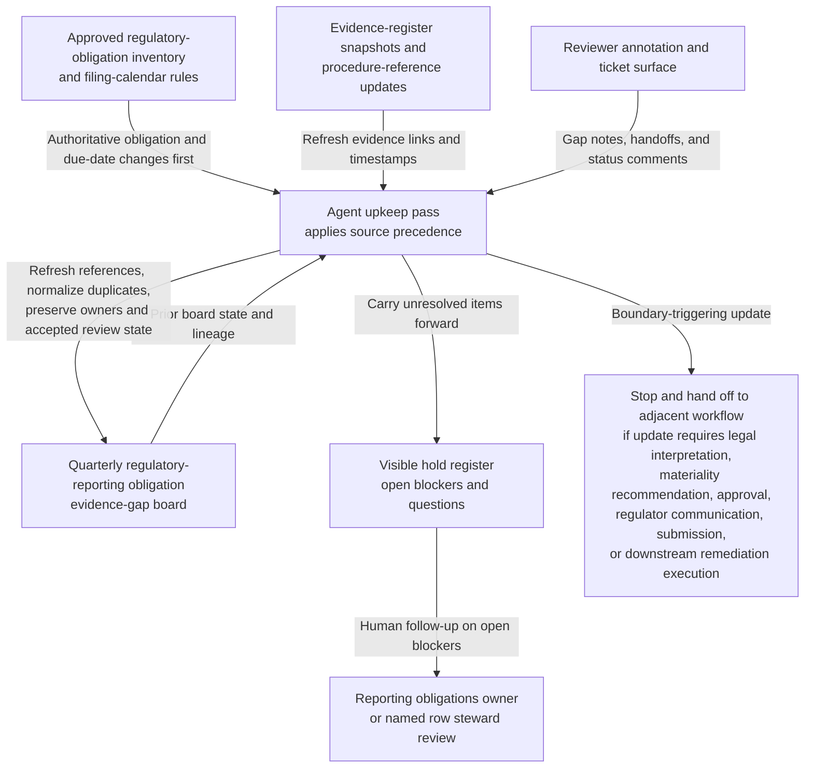

# Regulatory-reporting obligation evidence-gap board shared workbench upkeep

## Linked pattern(s)

- `shared-workbench-orchestration`

## Domain

Compliance.

## Scenario summary

An internal regulatory reporting compliance team maintains one governed internal artifact, the `Quarterly-Regulatory-Reporting-Obligation-Evidence-Gap-Board`, while reporting stewards, evidence owners, records coordinators, and regional compliance partners continuously refine notes attached to recurring reporting obligations. Each row already carries prerequisite state: the current obligation id, jurisdiction tag, reporting cadence, current filing-window milestone, latest evidence-bundle link, prior human review reference, explicit blocker fields, unresolved scope tags, accepted owner assignment, and append-only revision lineage. As small updates arrive, the agent keeps that bounded workbench synchronized by applying explicit source precedence from the approved regulatory-obligation inventory and filing-calendar rules before evidence-register snapshots, procedure references, ticket comments, and reviewer annotations, refreshing source links, normalizing duplicate evidence-gap notes, preserving accepted review-state markers, and carrying unresolved scope, evidence-freshness, or mapping conflicts forward in a visible hold register. Humans remain responsible for deciding what an obligation requires, whether available evidence is sufficient, whether any gap is material, whether a filing posture should change, whether legal interpretation is needed, whether regulators should be contacted, and whether any downstream remediation or submission work should begin.

## Target systems / source systems

- Shared reporting-obligation evidence-gap board with obligation rows, prerequisite-state columns, blocker tags, source-precedence markers, ownership fields, review-state markers, and append-only revision history
- Approved regulatory-obligation inventory and filing-calendar repository containing authoritative obligation ids, jurisdiction scope, recurrence rules, due dates, evidence requirements, and superseding internal guidance
- Evidence-link register tracking current evidence bundle ids, collection timestamps, steward metadata, and supporting control or procedure references linked from board rows
- Reporting procedure repository defining internal evidence categories, review-state meanings, and approved handoff checkpoints used to contextualize board upkeep without overriding the obligation inventory
- Reviewer annotation and ticket surface where reporting stewards, records coordinators, and regional compliance partners add small edits, evidence-gap notes, ownership handoffs, and follow-up comments

## Why this instance matters

This grounds the pattern in a compliance governance surface where the maintained artifact is one internal obligation-tracking workbench rather than a control caveat board, an exception precedent board, a filing recommendation, or a regulator-ready package. The useful work is keeping prerequisite state, source precedence, evidence-gap visibility, review-state markers, and ownership synchronized as many small updates arrive from obligation, calendar, evidence, and reviewer channels. That keeps the collaboration centered on one inspectable internal board and preserves a clean boundary before legal interpretation, materiality judgment, filing recommendation, regulator communication, submission, or remediation work begins.

## Likely architecture choices

- Event-driven monitoring fits because upkeep should react when approved obligation metadata, filing-calendar milestones, evidence-register timestamps, or reviewer notes change.
- A tool-using single agent can refresh source links, reconcile row metadata, normalize duplicate evidence-gap wording, and keep review-state plus hold markers synchronized inside one bounded board.
- Human-in-the-loop review remains necessary when an update would reinterpret an obligation, clear a blocker tied to missing evidence, or make a row sound like a filing recommendation or legal position.
- Bounded delegation works because compliance owners can predefine allowable field updates, source-precedence rules, review-state markers, and hold conditions without delegating legal interpretation, submission authority, regulator communication, or remediation execution.

## Governance notes

- The board should clearly separate authoritative obligation-inventory and filing-calendar facts from lower-precedence evidence-register snapshots, procedure references, ticket comments, and reviewer annotations so routine upkeep never implies that a comment overrides approved obligation scope or due-date rules.
- Each row should retain inspectable provenance for the obligation id, jurisdiction tag, current filing window, latest evidence-bundle timestamp, accepted owner assignment, prior human review reference, and previous revision links before a blocker is cleared or a review-state marker changes.
- Explicit holds should remain visible for stale evidence timestamps, missing required evidence links, unresolved jurisdiction mapping, disputed procedure-to-obligation alignment, ownership handoff uncertainty, and reporting-window mismatches rather than being normalized away during board cleanup.
- The agent may normalize structure, merge duplicate evidence-gap notes, refresh links, and update confirmed owner or review-state fields, but it should not decide whether evidence is sufficient, interpret legal obligations, recommend filing posture, approve a gap disposition, contact regulators, submit a report, or remove a hold that a human owner still considers open.
- If a requested update would draft filing language, recommend whether a gap is material, approve a remediation path, communicate with a regulator, launch downstream evidence collection, or trigger any submission or execution step, the workflow should stop and hand off to the appropriate adjacent pattern.

## Evaluation considerations

- Percentage of board refreshes that preserve correct obligation-inventory and filing-calendar precedence, prerequisite-state fields, review-state markers, named owner assignments, and unresolved-blocker visibility across repeated upkeep cycles
- Reviewer correction rate for normalized evidence-gap text, refreshed evidence links, ownership handoff updates, or automatically maintained hold markers
- Rate at which interpretation-heavy, recommendation-like, approval-like, regulator-facing, or submission-adjacent edits are held for human review instead of being silently folded into the internal evidence-gap board
- Usefulness of the maintained workbench for helping compliance collaborators resume obligation-board upkeep without reconstructing stale lineage, review-state context, or blocker history by hand
