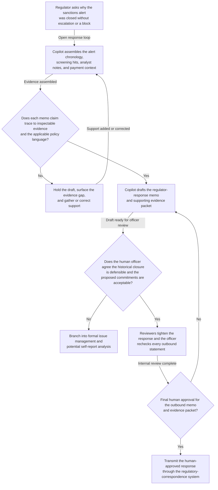
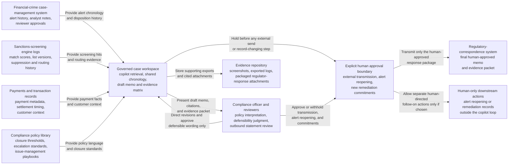

# Sanctions-alert closure regulator response copilot loop

## Linked pattern(s)

- `analyst-copilot-loop`

## Domain

Compliance.

## Scenario summary

A financial-crime compliance officer receives an examination inquiry from a banking regulator asking why a high-value cross-border payment alert generated by the sanctions-screening program was closed without filing a formal escalation or blocking the transaction. The officer uses a copilot inside the case workspace to iteratively assemble the alert chronology, pull the specific screening hits and analyst notes that drove the closure, draft a regulator-facing exception memo and supporting evidence packet, and rewrite policy-grounded explanations as reviewers tighten the response. The human officer remains responsible for interpreting policy, deciding whether the historical closure was defensible, choosing what commitments the institution will make in the response, and approving every outbound statement before anything is sent to the regulator.

## Target systems / source systems

- Financial-crime case-management system with alert history, analyst disposition notes, and reviewer approvals
- Sanctions-screening engine logs showing match scores, list versions, suppression rules, and alert-routing history
- Core payments or transaction-monitoring records with payment metadata, settlement timing, and customer context
- Compliance policy library containing sanctions-screening procedures, closure thresholds, escalation standards, and issue-management playbooks
- Evidence repository for screenshots, exported logs, cited procedures, and packaged regulator-response attachments
- Secure regulatory-correspondence or examination-tracking system where the final human-approved memo and evidence packet are transmitted

## Why this instance matters

This grounds the collaboration pattern in a compliance workflow where the regulated artifact is not a recommendation or a portal submission, but a defensible regulator-response package that must connect facts, policy language, and accountability boundaries. The hard part is mixed-initiative drafting under scrutiny: the copilot can speed up chronology building, evidence curation, and policy citation, but an ungoverned draft could blur what the records actually show, overstate why the alert was closed, or imply remediation commitments the human owner never approved.

## Likely architecture choices

- Human-in-the-loop collaboration should remain primary because policy interpretation, exam-response posture, and any concession about control weakness require an accountable compliance officer.
- A tool-using single agent can retrieve alert evidence, maintain a citation-backed issue list, draft memo sections, and update the shared evidence matrix inside one governed workbench.
- The copilot may prepare the response packet and internal review draft, but sending anything to the regulator, reopening the original alert, or recording new remediation commitments should remain explicitly human-gated.

## Governance notes

- The shared artifact should distinguish raw case facts, quoted policy language, agent-drafted paraphrases, and human-approved conclusions so reviewers can see where interpretation entered the record.
- Every material statement in the memo should link to inspectable evidence such as alert ids, screening snapshots, approval timestamps, or policy section references; unsupported narrative should be blocked from the outbound packet.
- The human owner must approve any characterization of control effectiveness, root cause, compensating controls, or future remediation because those statements can create regulatory commitments beyond the historical facts.
- Sensitive customer, counterparty, and sanctions-screening data should be minimized in the copilot context and retained only in approved audit stores with role-based access.
- If the evidence suggests the alert was closed improperly or policy was bypassed, the workflow should branch into formal issue management and potential self-report analysis rather than letting the copilot finalize a purely defensive memo.

## Evaluation considerations

- Time to produce an internal-review-ready regulator response that preserves evidence lineage, policy citations, and explicit human ownership of conclusions
- Reviewer correction rate for memo sections where the copilot misstated closure rationale, cited the wrong policy version, or implied unapproved remediation promises
- Completeness of the evidence packet, including whether each regulator-facing claim can be traced back to case records, screening logs, and authoritative procedures
- Reliability of governance checkpoints that prevent agent-authored drafts from being transmitted externally without human approval and legal or compliance review where required
