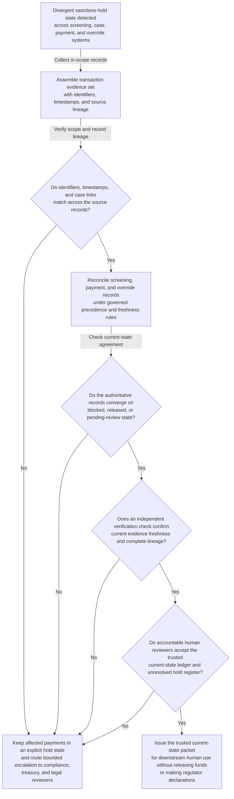

# Sanctions hold state truth restoration

## Linked pattern(s)

- `critical-authoritative-state-restoration`

## Domain

Compliance.

## Scenario summary

After a regulator-sensitive escalation, the sanctions response team finds that payment-hold status has diverged across the screening engine, case-management queue, payment-rail release ledger, and regional override records. Some transactions appear blocked in one system and released in another, while a subset are marked as pending manual review even though the linked payment messages show contradictory routing outcomes. Before compliance leadership, treasury, and legal teams can make any declaration about exposure scope or release posture, the workflow must restore the trusted current state of which payments are actually blocked, released, or unresolved and preserve explicit holds for every conflict that cannot be settled inside governed truth-restoration rules.

## Target systems / source systems

- Sanctions-screening engine state, case queues, and match-explanation records for the affected transactions
- Payment-rail hold and release ledgers, SWIFT or gateway message traces, and settlement-status feeds
- Regional override logs, emergency control decisions, and reviewer adjudication notes
- Counterparty reference data, transaction identifiers, and regulator-response workbench records
- Audit, hold-manifest, and authoritative-state acceptance tooling used by compliance leadership

## Why this instance matters

This shows the family at critical risk in a compliance setting where the immediate need is a trusted current-state picture, not a causal narrative about how the discrepancy started or a recommendation about what to do next. When blocked-versus-released state diverges during a regulator-sensitive period, people can create severe harm by assuming a payment is controlled when it is not, or by overstating exposure based on stale status. The instance belongs in investigate/reconcile/verify because it centers on authoritative truth restoration with visible uncertainty and stops before reporting, retrospective lookback expansion, or transactional intervention.

## Likely architecture choices

- An orchestrated multi-agent workflow can divide screening-state retrieval, payment-ledger comparison, override interpretation, and hold-register assembly while preserving one shared sanctions-state ledger.
- Human reviewers should stay embedded to confirm emergency precedence rules, adjudicate protected conflicts, and accept the trusted blocked/released picture before it is used downstream.
- The workflow should output only the reconciled current-state ledger, unresolved hold register, and compliance handoff packet rather than filing reports, releasing funds, or directing investigative action.
- Shared case memory should track superseded state claims, repeated transaction mismatches, and reviewer-visible rationale for every authoritative-state acceptance or hold.

## Governance notes

- Every blocked, released, pending-review, and unresolved transaction state should retain lineage to the exact screening, payment, or override record that supports it.
- The workflow must preserve explicit unresolved status when screening and payment systems disagree, rather than forcing one system to win without governed precedence and reviewer visibility.
- Human compliance, legal, and treasury owners must approve any downstream use of the trusted-state packet for regulator communication, customer statements, or funds-control decisions.
- Protected transaction and counterparty detail should be minimized in broad handoff packets while remaining available in restricted evidence views for reviewers with the right authority.

## Evaluation considerations

- Time to first authoritative sanctions-hold ledger with complete evidence lineage and explicit unresolved-state handling
- Agreement between the workflow's trusted blocked or released state and the final human-accepted current-state picture
- Rate at which materially conflicting transactions remain visible in the hold register until human adjudication
- Reliability of the workflow when regional overrides, payment-rail updates, or reviewer decisions arrive out of order during the critical window
