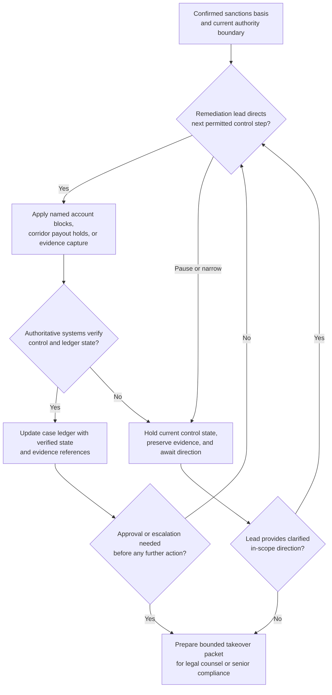

# Sanctions remediation human-directed procedural execution

## Linked pattern(s)

- `human-directed-task-orchestration`

## Domain

Compliance.

## Scenario summary

A sanctions remediation lead is directing urgent procedural execution after investigators confirm that a newly designated entity may have received outbound payments through a stale screening alias in a regional payouts stack. The agent may execute only the significant steps the lead calls: place named counterparty and account blocks, pause queued payouts in specific corridors, preserve evidence from the screening and payment systems, update the case ledger with verified control state, and prepare a bounded takeover packet for legal counsel before any regulator-facing action occurs. Because each next step depends on what the previous controls actually changed and because the workflow must not expand into legal interpretation or regulator communication, it needs durable state, post-step verification, and strict safe-handoff discipline whenever the remediation lead redirects or narrows the branch.

## Target systems / source systems

- Sanctions case-management system, remediation ledger, and investigation notes with explicit authority boundaries
- Payment operations controls for account blocks, queue holds, corridor pauses, and release-prevention checks
- Screening engine, alias-history, and watchlist evidence needed to verify the remediation basis and preserve audit state
- Legal-escalation boundary rules, jurisdiction-specific control requirements, and named human ownership for downstream regulator decisions
- Approved audit store for action traces, state snapshots, evidence hashes, and takeover packets

## Why this instance matters

This grounds the pattern in compliance work where the main artifact is real procedural execution under human direction: controls are applied, payments are halted, evidence is preserved, and the case state is updated. The workflow is not deciding sanctions policy and not collaboratively drafting a response. It is carrying out live remediation safely while the human lead keeps authority over the consequential branches.

## Likely architecture choices

- A tool-using single agent can execute the directed block and hold actions, query verification signals, capture evidence references, and update the case ledger after each approved step.
- Human-in-the-loop control remains mandatory because the sanctions lead decides which accounts, entities, and corridors fall inside scope and when legal counsel must take over a branch.
- The workflow should emit takeover packets whenever unresolved match quality, jurisdictional limits, or regulator-facing consequences mean the next step cannot remain inside directed procedural execution.

## Governance notes

- Every significant control action should be traceable to an explicit current instruction from the remediation lead rather than inferred from earlier investigative context.
- Post-step verification should confirm that blocks, queue holds, and evidence-preservation actions actually landed in the authoritative systems before any further directed control move proceeds.
- Sensitive counterparty data, watchlist details, and legal theories should remain in approved restricted stores; broad workflow traces should carry only the minimum needed operational context.
- If account state, match confidence, or jurisdictional scope becomes ambiguous, the workflow should stop and package the branch for counsel or senior compliance takeover rather than widening sanctions controls on its own.
- Handoff material should preserve the precise current block state, held payment population, evidence references, and blocked next actions so successor responders do not create duplicate or conflicting control changes.

## Evaluation considerations

- Percentage of human-directed sanctions remediation runs completed or safely handed off without unauthorized scope expansion, missed payment holds, or duplicate account-control actions
- Rate of stale case state, conflicting block signals, or jurisdiction-boundary violations caught before the next directed remediation step
- Completeness of audit traces linking each human instruction to the resulting control action, verification snapshot, and preserved evidence state
- Reliability of takeover packets when legal counsel or a senior sanctions authority assumes control of a constrained remediation branch
