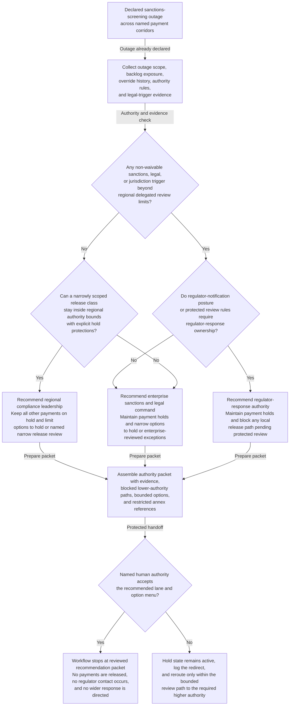

# Sanctions-screening outage authority recommendation

## Linked pattern(s)

- `critical-escalation-authority-recommendation`

## Domain

Compliance.

## Scenario summary

A severe sanctions-screening outage has already been declared after screening coverage degrades for several cross-border payment corridors during a regulator-sensitive period. Regional compliance teams have partial backlog views, legal is assessing notification implications, and operations wants guidance on whether any narrowly scoped release path can stay local. The workflow must recommend whether the decision belongs with regional compliance leadership, enterprise sanctions and legal command, or a regulator-response authority, while narrowing the allowed hold-versus-release options and packaging the supporting rationale without releasing payments, contacting regulators, or directing the wider response.

## Target systems / source systems

- Critical compliance workspace with the declared outage scope, prior packets, and active holds
- Screening-engine status, backlog queues, payment-hold ledgers, override records, and corridor-level exposure summaries
- Enterprise and regional authority matrix covering sanctions decision rights, legal review triggers, and regulator-response ownership
- Applicable regulator-notification policy, protected legal-privilege guidance, and non-waivable release restrictions
- Prior outage or escalation cases, audit logs, and restricted annex tooling for sensitive counterparty or jurisdiction detail

## Why this instance matters

This grounds the pattern in compliance where the main artifact is neither a crisis brief nor a truth-restoration ledger. The difficult step is selecting the right human authority and bounded decision menu under regulatory, legal, and operational pressure while making sure no one mistakes the recommendation packet for permission to release payments or communicate externally.

## Likely architecture choices

- An orchestrated multi-agent workflow can separate screening-state retrieval, legal-trigger checking, authority-lane comparison, and decision-packet assembly while preserving one shared severe-case view.
- Human-in-the-loop review is mandatory because the workflow should recommend the correct sanctions decision owner and bounded hold-versus-release options, not adjudicate transactions or send regulator notifications.
- Human-directed autonomy fits because enterprise sanctions, legal, and regulator-response leaders must explicitly accept the packet before any consequential decision proceeds.

## Governance notes

- The output should make non-waivable legal and sanctions triggers explicit and block lower-authority handling when outage scope, jurisdiction, or release risk exceeds delegated review limits.
- Any narrowed option set should keep protected-channel requirements, regulator-notification implications, and irreversibility notes visible rather than flattening them into one operationally convenient path.
- Sensitive counterparty, jurisdiction, and legal-analysis detail should be minimized in shared packets, with restricted annexes used for reviewers who need raw evidence.
- Recommendation packets should preserve source evidence, delegation state, blocked routes, and human redirects so later audit can reconstruct why one authority lane was chosen during the outage.

## Evaluation considerations

- Time from declared screening outage to a reviewed authority packet naming the correct human decision owner and bounded release or hold options
- Reviewer agreement that lower-authority routes were blocked appropriately before any payment release or regulator communication was considered
- Quality of evidence linking outage scope, legal triggers, authority rules, and protected-channel constraints to the recommendation
- Stability of recommendations when backlog scope, legal interpretation, or regulator-response posture changes during the critical window
