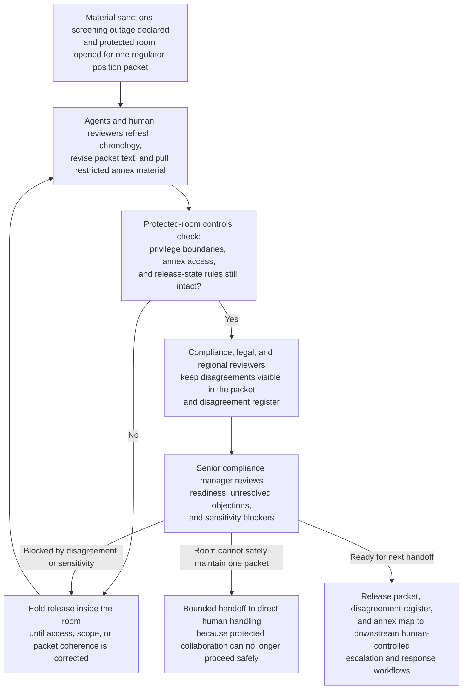
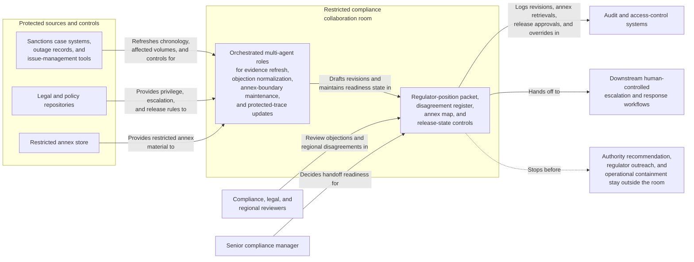

# Sanctions screening outage protected regulator-position packet collaboration room

## Linked pattern(s)

- `critical-protected-artifact-collaboration`

## Domain

Compliance.

## Scenario summary

Once a material sanctions-screening outage is declared, compliance and legal open a protected collaboration room for one regulator-position packet that will later support human-controlled escalation and response. A senior compliance manager owns the packet while agents help reconcile outage chronology updates, legal objections, regional-compliance disagreements, and restricted annex material about affected customers, transactions, and temporary controls. The room remains centered on the shared artifact: humans and agents jointly revise the packet, preserve disputed language about exposure and remediation readiness, and keep annex boundaries and release conditions explicit. The human artifact owner remains responsible for deciding whether the packet is ready for the next handoff and whether disagreement or sensitivity still blocks release, while authority recommendation, regulator outreach, and operational containment choices stay in downstream workflows.

## Target systems / source systems

- Restricted compliance collaboration room with the main regulator-position packet, disagreement register, annex map, and release-state controls
- Sanctions case systems, outage records, and issue-management tools containing chronology, affected volumes, temporary controls, and remediation status
- Legal and policy repositories with escalation triggers, regulator-communication boundaries, privilege guidance, and protected-review rules
- Restricted annex store holding sensitive counterparty detail, jurisdiction-specific exposure tables, and privileged legal analysis
- Audit and access-control systems logging packet revisions, annex retrievals, release approvals, and manual overrides

## Why this instance matters

This grounds the pattern in a compliance setting where the reusable shape is severe protected co-authoring, not crisis briefing alone and not deciding which authority should act. The packet is repeatedly refined under legal privilege and regional disagreement, making visible dissent and annex scoping more important than simply summarizing evidence. It shows why the family boundary matters: the workflow ends with a human-owned packet handoff, not with a regulator decision, escalation choice, or operational execution.

## Likely architecture choices

- Human-in-the-loop collaboration should remain primary because privilege handling, release timing, and tolerance for unresolved exposure language require accountable legal and compliance ownership.
- An orchestrated multi-agent setup fits when separate agent roles refresh outage evidence, normalize reviewer objections, maintain annex boundaries, and preserve the protected trace across revisions.
- Agents may draft revisions, reconcile chronology updates, and maintain readiness state, but selecting the escalation authority, contacting regulators, or directing operational holds should remain outside the room and explicitly human-controlled.

## Governance notes

- The packet should distinguish verified outage facts, privileged legal framing, contested compliance language, and restricted annex references so later reviewers can see exactly what remains unsettled.
- Every material claim about affected population, temporary controls, regulator exposure, or remediation timing should link to inspectable evidence or be labeled as disputed.
- Customer, transaction, and jurisdiction detail that exceeds the main audience need should stay in annexes with privilege-aware access logging and explicit promotion controls.
- The readiness record should name the human artifact owner, unresolved blockers, accepted residual disagreement, and the downstream handoff boundary between the room and formal escalation or response workflows.
- If the room cannot maintain safe privilege boundaries or one coherent packet version, the workflow should hold release and escalate for direct human handling instead of normalizing the conflict away.

## Evaluation considerations

- Time to maintain a protected regulator-position packet that keeps legal privilege, disagreement visibility, and release ownership intact
- Rate at which downstream legal or executive reviewers find hidden objections, stale chronology, or incorrect annex exposure after the room signals handoff readiness
- Reliability of the disagreement register and annex map as outage facts and regional positions continue to shift
- Frequency with which humans reject agent-assisted revisions because they drifted into escalation choice, regulator messaging approval, or operational action
