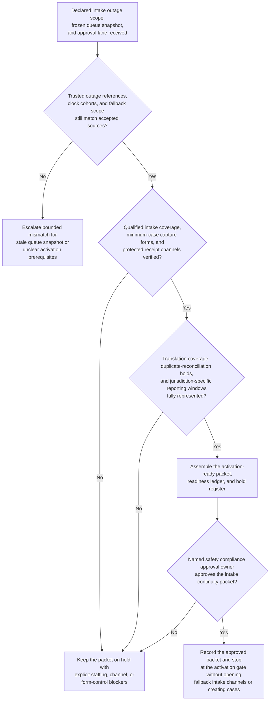

# Serious adverse event manual intake continuity activation gate

## Linked pattern(s)

- `contingency-plan-activation-gate`

## Domain

Compliance.

## Scenario summary

After a pharmacovigilance intake-portal outage is declared, safety compliance leadership has already identified the bounded fallback path and the accountable approval owner: a manual continuity intake for serious and expedited-reportable adverse-event reports arriving from affiliates, investigators, medical-information teams, and patient-support channels while the primary case-ingestion path remains unavailable. Upstream truth-restoration and authority-routing work has already established the trusted outage scope, frozen intake queue snapshot, reporting-clock cohorts, and approval lane. The planning workflow now has to prepare one activation-ready packet showing qualified intake and quality-check coverage by shift and jurisdiction, minimum-case capture forms, translation and callback commitments, protected receipt-channel rules, duplicate-reconciliation holds against the frozen queue, and reporting-clock timing windows. It should preserve explicit holds for any uncovered intake cell, uncontrolled receipt channel, missing translation coverage, unresolved duplicate-reconciliation gap, or jurisdiction-specific reporting-clock ambiguity, and stop at the approval gate rather than opening fallback intake channels, acknowledging reporters, drafting regulator communication, or creating safety cases.

## Target systems / source systems

- Pharmacovigilance continuity playbooks and outage workspace with the declared fallback scope, frozen queue references, prior packet versions, and protected intake boundaries
- Trusted intake outage-state, serious-event queue snapshot, reporting-clock cohort, and duplicate-watch systems already accepted as authoritative inputs for contingency preparation
- Qualified intake rosters, shift calendars, translation-vendor commitments, callback coverage plans, and quality-check schedules for safety operations, medical information, and regional pharmacovigilance teams
- Approval-routing and audit systems that capture packet versions, open holds, resource commitments, and human sign-off before any manual intake continuity mode may start
- Restricted communications tooling for affiliate notices, hotline script release, and vendor coordination timing that remain downstream of the planning gate

## Why this instance matters

This grounds the pattern in compliance where the hard problem is not deciding medical significance or running the intake fallback itself. The hard problem is keeping one approval-gated readiness packet current while reporting clocks, shift coverage, protected channels, and duplicate-reconciliation controls move under outage pressure. It shows why contingency planning deserves its own slice apart from outage truth restoration, authority recommendation, intake operations, and safety-case processing: leaders need a disciplined activation gate artifact before any serious-adverse-event continuity intake can be approved safely.

## Likely architecture choices

- Approval-gated execution fits because the manual intake continuity mode may be operationally prepared while still blocked until safety compliance leadership approves the packet.
- The readiness ledger should tie intake staffing, minimum-case capture controls, translation and callback coverage, duplicate-reconciliation holds, and reporting-clock windows to one current packet version.
- Explicit holds should remain visible whenever jurisdiction coverage, protected channels, or frozen-queue reconciliation are incomplete rather than being compressed into a nominally ready packet.
- The workflow should stop at the packet and hold register rather than recommending the authority lane again, re-establishing outage truth, or opening fallback intake operations.

## Governance notes

- Protected prerequisites such as qualified intake coverage, validated receipt channels, minimum-case capture controls, duplicate-reconciliation safeguards, and jurisdiction-specific reporting-clock mapping should be encoded as non-waivable holds in the packet.
- Shared packets should expose timing, readiness, and blocker state without copying patient identifiers, reporter details, product narratives, or site-sensitive information outside restricted pharmacovigilance channels.
- Human safety compliance ownership is required before the packet becomes the authoritative basis for any manual serious-adverse-event intake continuity activation.
- Repeated packet revisions should preserve append-only lineage so audit and quality teams can reconstruct exactly which frozen-queue references, staffing commitments, clock windows, and protected holds changed before approval.

## Evaluation considerations

- Time from updated intake-continuity preparation request to a human-reviewable activation packet with complete staffing, channel, and hold state
- Percentage of channel-control, translation, or reporting-window blockers kept explicit in the hold register rather than hidden in a partially prepared continuity packet
- Agreement between the workflow's packet and the final human-approved activation gate used for downstream serious-adverse-event intake continuity
- Stability of the readiness packet when outage scope, reporting-clock cohorts, or shift coverage changes within the same regulator-sensitive window
