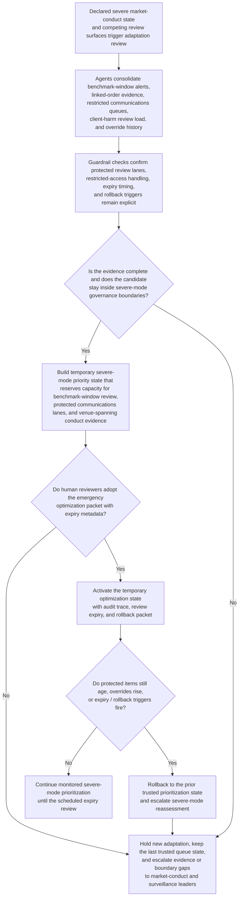
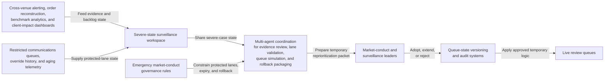

# Trade-surveillance benchmark-manipulation review priority adaptation

## Linked pattern(s)

- `critical-protected-priority-adaptation`

## Domain

Compliance.

## Scenario summary

Market-conduct leadership has already declared a severe surveillance state after linked cross-venue trading bursts, trader-chat fragments, and benchmark-fixing anomalies suggest a credible manipulation threat inside a regulator-sensitive product set. Several existing review surfaces now compete for the same scarce specialist attention: linked-order reconstruction review, restricted communications review, client-harm evidence review, and routine surveillance exception follow-up. The normal prioritization state still surfaces easier low-value alert cleanup and stale documentation checks while supervisors keep manually pulling forward benchmark-window evidence, protected communications lanes, and venue-spanning conduct reviews. The workflow must recommend a temporary severe-mode optimization state that protects the highest-consequence market-conduct review lanes, preserves explicit expiry and rollback controls, and improves scarce-reviewer allocation without selecting the authority lane, planning the response sequence, adjudicating manipulation, contacting regulators, or triggering downstream trading restrictions.

## Target systems / source systems

- Severe-state surveillance workspace with the declared benchmark-manipulation scope, active review backlogs, and current hold state
- Cross-venue alerting systems, order-and-execution reconstruction tools, benchmark-window analytics, and client-impact review dashboards
- Restricted communications review queues, surveillance override history, and aging telemetry from prior severe market-conduct events
- Emergency market-conduct governance rules covering protected review lanes, restricted-access handling, expiry timing, and rollback triggers
- Queue-state versioning and audit systems used by market-conduct and surveillance leaders to adopt, extend, or restore temporary prioritization logic

## Why this instance matters

This grounds the pattern in compliance without drifting into alert triage, authority recommendation, case adjudication, or regulator outreach. The hard problem is how to adapt existing review and routing logic during a declared severe conduct event so benchmark-window evidence, protected communications review, and venue-spanning conduct analysis keep priority when specialist capacity is scarce. The workflow remains inside optimize/adapt territory because it ends at a human-adopted temporary optimization state with expiry and rollback metadata rather than a market-abuse finding or response action.

## Likely architecture choices

- Orchestrated multi-agent coordination fits because linked-order evidence review, protected-lane validation, severe-mode queue simulation, and rollback packaging benefit from distinct roles over one shared severe-case state.
- Human-in-the-loop review is mandatory because market-conduct and surveillance leaders must explicitly adopt, extend, or reject the temporary reprioritization state before it influences live review queues.
- Human-directed autonomy keeps the boundary clean: the workflow can recommend protected-lane capacity reservations and temporary urgency weights, but it must not freeze trading activity, assign investigators, or decide whether manipulation occurred.

## Governance notes

- Benchmark-window evidence review, restricted communications analysis, and venue-spanning conduct reconstruction should remain protected lanes that ordinary severe-mode tuning cannot weaken for throughput convenience.
- Every adaptation package should show which lower-value surveillance exceptions are temporarily deferred and why that trade-off remains acceptable during the severe window.
- Auditability should preserve the baseline and candidate severe-mode states, override clusters, expiry reviews, extension decisions, and rollback triggers for later compliance, legal, and audit review.
- Sensitive trader identities, client details, and restricted communications content should remain in controlled annexes when the main adaptation packet can justify priority protection without broad raw-detail exposure.
- The workflow must not choose who decides the case, plan the conduct response sequence, adjudicate alerts, contact regulators, or trigger downstream restrictions; it only recommends temporary optimization-state changes for existing review surfaces.

## Evaluation considerations

- Reduction in manual overrides and aging for benchmark-window, protected-communications, and venue-spanning conduct-review items after the temporary state is adopted
- Speed from severe market-conduct declaration to a reviewed adaptation packet with explicit expiry and rollback controls
- Rate at which emergency tuning expires or rolls back on schedule instead of persisting as an unreviewed baseline
- Evidence that lower-visibility but protected conduct-review work remains surfaced even when louder routine surveillance exceptions continue entering the queues
