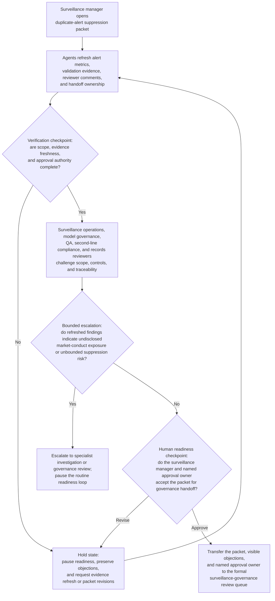
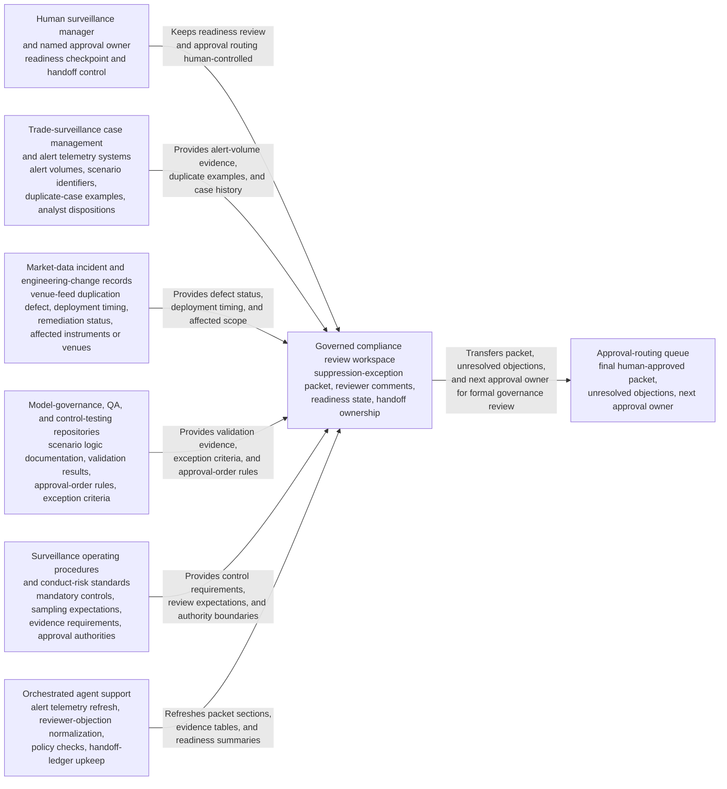

# Trade-surveillance duplicate-alert suppression exception package readiness loop

## Linked pattern(s)

- `approval-centered-collaboration`

## Domain

Compliance.

## Scenario summary

A market-conduct surveillance manager is coordinating a formal exception package because a venue-feed duplication defect after a market data normalization change is causing one surveillance scenario to generate a large volume of duplicate alerts, yet temporarily suppressing a narrowly bounded subset of those alerts requires explicit governance review before any approval owner will consider it. In a governed compliance collaboration workspace, the manager and agent support iterate on the packet as surveillance operations, model governance, QA, second-line compliance, and records reviewers challenge whether the duplicate-alert evidence is current, whether the proposed suppression scope is bounded tightly enough, whether compensating review controls are evidenced clearly, and whether unresolved objections remain visible for the next readiness checkpoint. The agents help preserve conflicting reviewer positions, refresh alert-volume and validation evidence, rewrite the packet to reflect accepted edits and contested issues, and maintain an explicit handoff ledger showing who owns the next approval-readiness checkpoint. The human surveillance manager and named approval owner remain responsible for deciding whether the packet is ready for formal approval review, whether objections require another revision cycle, and whether the request should pause for more evidence or specialist analysis rather than move toward adjudication.

## Target systems / source systems

- Governed compliance review workspace with the draft suppression-exception packet, reviewer comments, readiness status, and named handoff ownership
- Trade-surveillance case management and alert telemetry systems containing alert volumes, scenario identifiers, duplicate-case examples, analyst dispositions, and historical escalation records
- Market-data incident and engineering-change records showing the venue-feed duplication defect, deployment timing, remediation status, and affected instruments or venues
- Model-governance, QA, and control-testing repositories with scenario logic documentation, validation results, defect reproducibility notes, approval-order rules, and exception criteria
- Surveillance operating procedures and conduct-risk standards describing mandatory review controls, sampling expectations, evidence requirements, and segregated approval authorities
- Approval-routing queue where the final human-approved packet, unresolved objections, and next approval owner are transferred for formal governance review

## Why this instance matters

This grounds the pattern in a compliance workflow where the hard work is repeated approval-readiness collaboration on a surveillance-control exception packet without implying that any alert suppression has been approved or may be activated. The scenario is materially distinct from the regulator reporting timeline exception example because the center of gravity is bounded readiness review for an internal market-conduct surveillance control exception rather than a regulator-facing timing package. It shows how agents can help preserve reviewer disagreement, refresh technical and control evidence, and keep approval ownership explicit while still stopping short of adjudicating the exception or changing live surveillance behavior.

## Likely architecture choices

- Human-in-the-loop collaboration should remain primary because market-conduct exposure, compensating-control sufficiency, and exception-risk tolerance require accountable surveillance and compliance ownership.
- An orchestrated multi-agent setup fits when separate agent roles refresh alert telemetry, normalize reviewer objections, verify policy and approval-order completeness, and maintain the shared handoff ledger across several revision rounds.
- Agents may prepare revised packet sections, evidence-response tables, and readiness summaries, but approving suppression, changing scenario logic, or releasing downstream operational instructions should remain explicitly human-controlled.

## Governance notes

- The packet should distinguish raw alert and defect facts, quoted surveillance-control requirements, reviewer objections, agent-drafted revision proposals, and human-accepted statements so downstream approvers can inspect what remains contested.
- Every material claim about duplicate-alert rate, suppression scope, analyst workload impact, compensating review coverage, remediation timing, or affected instrument population should link to inspectable evidence such as telemetry extracts, duplicate-case samples, validation logs, issue records, or procedure references; stale or incomplete support should block readiness.
- Objections from surveillance operations, model governance, QA, second-line compliance, or records reviewers should remain visible in the packet and handoff ledger unless a named human reviewer explicitly accepts the residual risk of carrying them into formal approval.
- The handoff ledger should record the current approval owner, mandatory reviewers, unresolved blockers, and the exact boundary where approval-readiness collaboration ends and the formal human suppression-exception decision begins, preventing the packet from being mistaken for an approved monitoring change.
- Trader, counterparty, and instrument-level data used to evidence duplicate alerts should be minimized to the least necessary scope in the collaboration surface, with role-based access and audit logging for every retrieval, excerpt, or ownership change.

## Evaluation considerations

- Time to produce an internal-review-ready surveillance suppression-exception packet that preserves reviewer disagreement, evidence lineage, and explicit ownership of the next approval handoff
- Reviewer correction rate for sections where agent-assisted revisions understated conduct-risk exposure, overstated compensating-control sufficiency, or implied the packet was ready before required evidence was complete
- Reliability of the handoff ledger, including whether approval owner, pending reviewers, unresolved issues, and accepted residual risks remain synchronized with the latest packet version
- Rate at which formal governance review sends the packet back because the collaboration loop hid objections, lost evidence traceability, or blurred the boundary between readiness and approval
