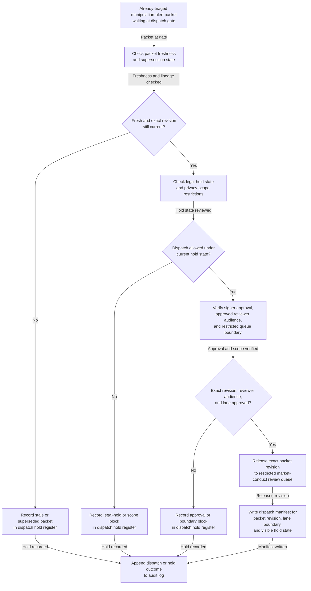

# Trade-surveillance manipulation alert triage packet approved for restricted market-conduct review dispatch

## Linked pattern(s)

- `approval-gated-triage-dispatch`

## Domain

Compliance.

## Scenario summary

A market-abuse surveillance team already has one evidence-backed manipulation-alert packet assembled from earlier alert triage, with the related order and quote sequence, account and employee-access context, duplicate lineage, venue references, and unresolved uncertainty documented. The next step is not to decide whether misconduct occurred, freeze trading, contact the desk, or make any regulator-facing filing; it is to decide whether the exact packet revision may cross into the restricted market-conduct review lane that can trigger those downstream human workflows. The dispatch workflow watches packet freshness, legal-hold state, signer approval, recipient-roster scope, and dispatch-manifest lineage, then releases the triaged packet only when the approved market-conduct reviewer signs that one bounded downstream dispatch for the exact packet revision.

## Target systems / source systems

- Trade-surveillance alerting and case-triage systems holding the already-triaged manipulation packet, alert lineage, duplicate merges, and cited surveillance evidence references
- Order-management, trade-ledger, market-data, and employee-access systems contributing freshness checks, venue context, account linkage, and hold-state references already attached to the packet
- Restricted market-conduct review queue and dispatch-manifest service used to release the exact packet revision into the protected downstream lane
- Approval-routing tooling recording signer identity, approved reviewer audience, queue boundary, sign-off time, and blocked dispatch attempts
- Audit and hold-tracking stores preserving superseded packet revisions, legal-hold status, privacy-scope restrictions, stale-context blocks, and manual override history

## Why this instance matters

This grounds `approval-gated-triage-dispatch` in a compliance setting that is materially different from pharmacovigilance because the packet concerns a sensitive market-conduct surveillance case rather than a product-safety signal. Many compliance programs can triage a potential manipulation alert into one bounded packet, yet still require explicit approval before that packet may enter a restricted review lane with access to employee-linked trading context and consequential downstream authority. The instance keeps the family boundary clean because the workflow owns packet release, hold visibility, recipient scope, and dispatch lineage only, not misconduct adjudication, supervisory action, employee outreach, filing decisions, or downstream review execution.

## Likely architecture choices

- Event-driven monitoring fits because trade corrections, venue context, employee-access information, and legal-hold status can change while the already-triaged packet waits at the dispatch gate.
- Approval-gated execution fits because the packet is prepared for one bounded market-conduct review lane but remains blocked until the required reviewer approves the exact revision and recipient scope.
- Human-in-the-loop review should remain on the normal path because dispatch into a restricted surveillance-review lane expands who may inspect sensitive trading context even though this workflow still stops short of any misconduct finding or response choice.
- The workflow should emit only the released queue entry, dispatch manifest, hold register, and audit trail rather than a misconduct recommendation, desk-interview plan, trading restriction, or regulator communication draft.

## Governance notes

- The dispatch manifest should bind approval to one exact manipulation-alert packet revision, one restricted market-conduct review queue identifier, one approved reviewer audience, and the visible hold state authorized for dispatch.
- Dispatch should remain held when cited trade-ledger or market-data references become stale, the packet is superseded by a newer duplicate-merge result, legal-hold status changes, or the requested downstream lane exceeds the approved reviewer boundary.
- Broad queue views should minimize employee identifiers, account numbers, strategy details, and narrative surveillance notes while preserving traceable references in governed compliance systems.
- Compliance-governance owners must approve changes to signer roles, reviewer-roster boundaries, freshness rules, legal-hold handling, and hold-release logic; this workflow ends before misconduct adjudication, desk outreach, trading restrictions, supervisor instruction, or regulator-facing action begins.

## Evaluation considerations

- Median time from packet readiness to approved restricted-lane dispatch or explicit placement into freshness, scope, or legal-hold state
- Rate of wrong-version, wrong-audience, or stale-context corrections detected after dispatch approval
- Completeness of audit lineage connecting packet revision, cited surveillance sources, signer approval, and the single downstream queue boundary
- Reliability of hold behavior when trade context, employee-access metadata, or legal-hold status changes during the approval window
