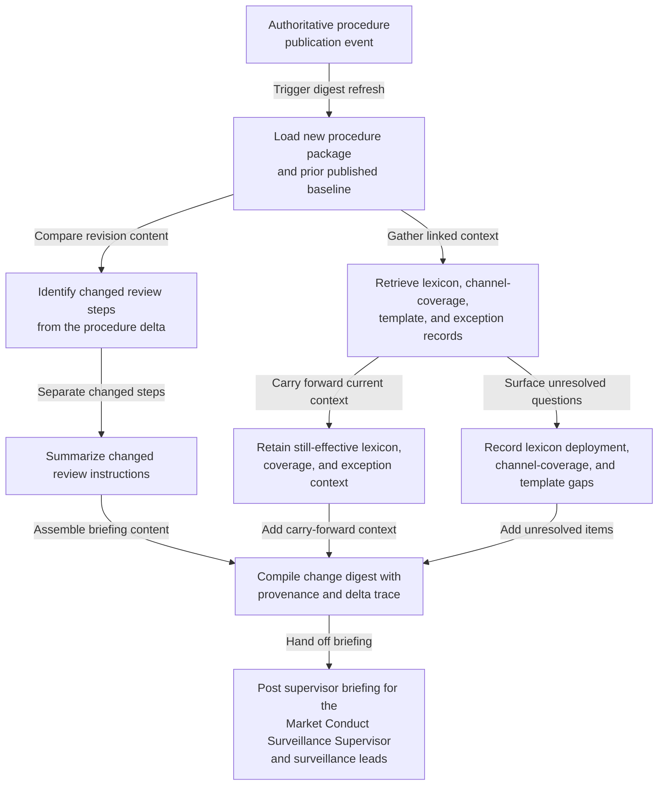

# Trade-surveillance restricted-communications review procedure change digest for market-conduct supervisor briefing

## Linked pattern(s)

- `change-triggered-context-briefing`

## Domain

Compliance.

## Scenario summary

A broker-dealer market-conduct compliance program maintains a controlled restricted-communications review procedure covering approved lexicon packs, channel-coverage assumptions, preservation checkpoints, analyst annotation requirements, employee-role masking rules, and evidence-linkage expectations for surveillance cases. When an authoritative revision of that procedure package is published, the named human briefing owner—the Market Conduct Surveillance Supervisor on duty—needs a grounded digest showing which review steps changed, which prior carry-forward context still governs current surveillance work, and which unresolved questions remain about vendor lexicon deployment, approved-channel coverage, or template alignment. The workflow should stop at a contextual briefing for the supervisor and surveillance leads; it should not triage alerts, reopen cases, route escalations, prepare regulator communications, or direct downstream surveillance execution.

## Target systems / source systems

- Controlled surveillance-procedure repository containing the newly approved restricted-communications review package, prior published baseline, revision metadata, and release notice
- Surveillance lexicon and phrase-pack registry with current approved dictionaries, effective dates, and channel-specific applicability notes referenced by the procedure
- Channel-coverage inventory describing which messaging, voice, and collaboration systems are in scope, which are excluded under approved policy, and what preservation connectors currently back each source
- Restricted surveillance case-template library with the current analyst worksheet, annotation standards, and evidence-linkage checklist that the revised procedure references
- Approved exception register holding temporary channel carve-outs, deferred connector changes, or documented regional deviations that may still carry forward into the briefing
- Controlled supervisor-briefing workspace where the digest, delta trace, prior unresolved items, and source citations are posted for the Market Conduct Surveillance Supervisor
- Change notification feed that emits the authoritative procedure-publication event

## Why this instance matters

This grounds the pattern in compliance work where the trigger is a controlled conduct-surveillance procedure revision rather than a live alert, a case investigation, or a policy attestation cycle. Supervisors often receive a new procedure package and a raw document diff, but still have to reconstruct which review assumptions remain in force for current communications-surveillance work and which implementation questions are still open. The instance shows how a bounded change digest can improve briefing quality, carry forward the right operational context, and preserve source provenance without drifting into case handling, regulator response, or control execution.

## Likely architecture choices

- Event-driven monitoring fits because the digest should refresh when the approved restricted-communications review procedure is published, not only when a supervisor manually requests context.
- A tool-using single agent can compare the new and prior procedure packages, retrieve the linked lexicon, channel-coverage, template, and exception records, and assemble a supervisor-ready brief with claim-to-source mappings.
- Bounded delegation is appropriate because compliance owners can define the trusted source boundary and briefing template while the Market Conduct Surveillance Supervisor retains responsibility for deciding whether any separate review or follow-up is needed.
- The digest should visibly separate newly changed review instructions, unchanged carry-forward context from still-effective coverage and exception records, and unresolved questions such as stale connector mappings or mismatched annotation templates.

## Governance notes

- Only published procedure revisions, approved lexicon packs, current channel-coverage inventories, and sanctioned exception records should feed the digest; analyst chat, draft markup, or live case commentary should remain out of scope unless formally incorporated into the authoritative source bundle.
- Provenance should be explicit for every material statement, including the triggering revision id, superseded baseline version, linked lexicon or channel inventory snapshot, and any prior unresolved item that was carried forward into the new briefing.
- Named human briefing ownership should remain explicit: the Market Conduct Surveillance Supervisor is the accountable recipient for the briefing handoff, while any downstream interpretation, escalation choice, or case-specific action stays outside this workflow.
- If the revised procedure references a lexicon pack, channel connector, or analyst template that does not match the current approved registry, the digest should record that mismatch as an unresolved question instead of implying the review stack is already aligned.
- Sensitive trader identifiers, message excerpts, and investigation notes should not be copied into the briefing unless strictly needed; citations and narrow references are preferred over reproducing protected surveillance content.

## Evaluation considerations

- Percentage of authoritative restricted-communications procedure revisions that produce a digest with complete provenance, carry-forward context, and an explicit unresolved-questions section
- Reviewer correction rate for changed-step summaries, carried-forward channel-coverage assumptions, or lexicon/template mappings during supervisor sampling
- Rate at which stale connector metadata, unsupported exception carry-forward, or ambiguous procedure references are surfaced before supervisors rely on the revised briefing
- Usefulness of the digest for helping surveillance leads understand what changed and what still governs current review practice without drifting into alert triage, case adjudication, or regulator-facing preparation
