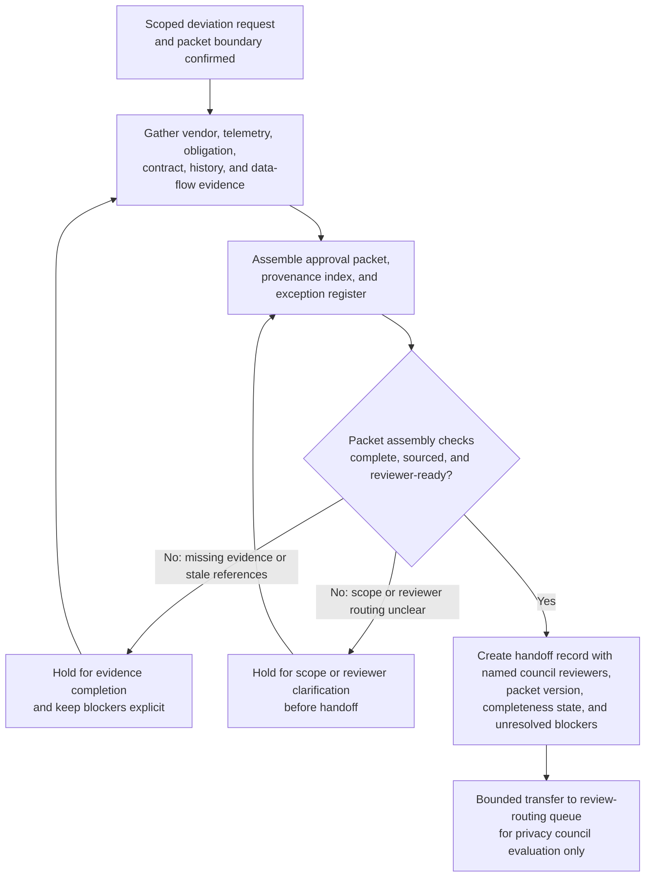

# Vendor biometric retention control deviation approval packet for privacy council review

## Linked pattern(s)

- `approval-packet-generation`

## Domain

Compliance.

## Scenario summary

A privacy compliance manager must assemble a decision-ready approval packet because a physical-security vendor cannot yet produce the contractually required thirty-day deletion evidence for biometric visitor logs after a storage-region migration exposed gaps in the vendor's purge attestations and subprocessor inventory. The workflow gathers the scoped deviation request, deletion-job telemetry, regional biometric-data obligations, contract annexes, prior exception history, data-flow diagrams, and the proposed manual compensating controls into one governed packet for privacy council review. Agents help map packet claims to source evidence, build a reviewer-visible provenance index, keep unresolved issues such as missing subprocessor confirmation or stale DPIA references in an explicit exception register, and prepare the handoff record showing the named council reviewers and current completeness status. The workflow stops at packet generation and handoff; it does not recommend whether the deviation should be granted, adjudicate residual privacy risk, direct the vendor to remediate, or initiate any regulator or data-subject communication.

## Target systems / source systems

- Privacy exception workspace holding the scoped deviation request, packet draft, completeness checklist, and handoff status
- Vendor-risk repository with signed data-processing terms, biometric retention commitments, subprocessor disclosures, and prior exception records
- Privacy engineering and storage telemetry systems containing deletion-job logs, bucket inventories, migration change records, and retention-policy enforcement snapshots
- Data inventory, transfer-mapping, and DPIA repositories documenting affected biometric fields, jurisdictions, processing purposes, and approved safeguards
- Legal and policy libraries containing biometric-data retention rules, regional deletion obligations, privacy-council review criteria, and mandatory disclosure requirements
- Review-routing queue where the completed approval packet, evidence index, exception register, and named human reviewers are transferred for bounded council evaluation

## Why this instance matters

This grounds `approval-packet-generation` in a compliance workflow where the hard part is assembling a trustworthy approval packet from distributed privacy, vendor, and technical evidence without allowing unresolved retention gaps to disappear behind polished narrative. Privacy control deviations often span contract promises, infrastructure telemetry, regulatory obligations, and pending reviewer questions, so reviewers need one inspectable packet that keeps provenance and exceptions visible before they decide whether any temporary deviation is acceptable. The example stays inside the gather-family boundary because the primary outputs are the packet, evidence index, exception register, and handoff record rather than a recommendation, approval outcome, remediation plan, or external filing.

## Likely architecture choices

- Orchestrated multi-agent retrieval and synthesis fit because contract evidence, telemetry proofs, obligation mappings, and exception-state curation often live in separate systems and require coordinated packet assembly.
- Human-in-the-loop checkpoints should remain mandatory so an accountable privacy owner can confirm request scope, required reviewers, and whether unresolved evidence gaps are acceptable to surface in the packet before handoff.
- Agents may normalize biometric data categories, reconcile source identifiers, and draft packet sections, but they should not decide whether the retention deviation is permissible, extend the vendor's exception window, or trigger downstream legal or operational actions.

## Governance notes

- Every consequential claim about affected biometric records, jurisdiction scope, deletion delay, manual compensating control coverage, contract commitments, or review criteria should link to inspectable source evidence in the provenance index.
- The exception register should keep missing subprocessor attestations, stale DPIA references, unresolved jurisdiction questions, and any disputed deletion-log interpretation visible so the packet cannot appear cleaner than the underlying control state.
- The handoff record should name the intended privacy council reviewers, packet version, completeness state, unresolved blockers, and the explicit boundary where packet generation ends and human approval review begins.
- Sensitive biometric evidence, facility-access details, and contract-restricted vendor information should remain access-controlled, minimally excerpted, and fully auditable across packet assembly and handoff.
- If new evidence shows unauthorized biometric use, materially broader data scope, or an active incident requiring containment, the workflow should stop and escalate into investigation or incident handling rather than continue packet assembly.

## Evaluation considerations

- Percentage of privacy council intakes accepted without missing mandatory evidence, routing corrections, or hidden retention exceptions
- Reviewer correction rate for packet sections where agent-assisted synthesis overstated deletion assurance, underreported scope, or implied approval readiness without sufficient support
- Time required for reviewers to trace a challenged packet claim back to the exact contract clause, telemetry record, or DPIA section in the provenance index
- Bounce rate from privacy council review caused by stale evidence, incomplete exception visibility, or unclear handoff ownership
