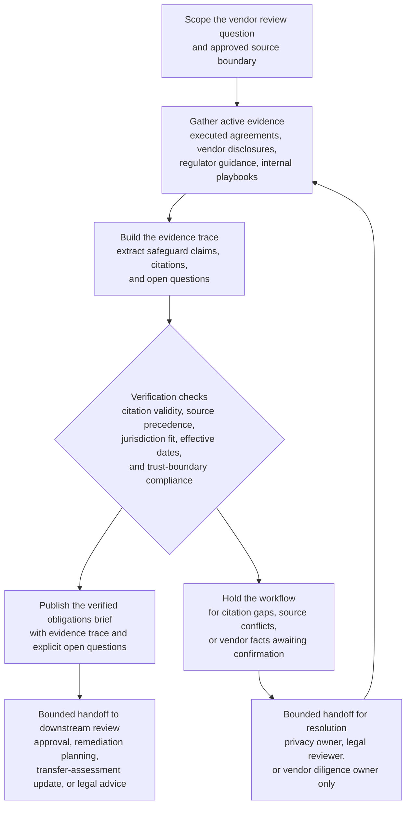

# Vendor data-transfer safeguard obligation synthesis for cross-border review

## Linked pattern(s)

- `research-synthesis-with-citation-verification`

## Domain

Compliance.

## Scenario summary

A privacy compliance team is preparing a pre-review briefing for a vendor that will handle support telemetry and limited customer account data across multiple hosting regions. Before anyone approves the vendor, requests remediation, updates a transfer impact assessment, or gives legal advice, the workflow must assemble a cited current-state obligations brief showing which cross-border transfer safeguards, onward-transfer restrictions, localization commitments, supplementary-control requirements, notice duties, and subcontractor conditions are actually supported by the active source set. The useful output is an evidence-backed synthesis that separates verified obligations from jurisdiction and effective-date ambiguity, source conflicts, and open questions that still require legal or privacy-owner interpretation.

## Target systems / source systems

- Controlled compliance review workspace where the obligations brief, evidence trace, and open-questions ledger are stored
- Executed data processing agreement, standard contractual clauses, regional transfer addenda, and vendor security exhibits in the contract repository
- Vendor trust portal, subprocesser registry, hosting-location disclosures, and technical architecture summaries approved for diligence use
- Internal privacy policy library, transfer-assessment templates, and approved cross-border review playbooks
- Primary-source regulator guidance, statutory text, and supervisory FAQs for the jurisdictions implicated by the proposed transfer path
- Approved exception register and prior review archive containing still-effective derogations, grandfathered commitments, or documented control assumptions

## Why this instance matters

This grounds the gather/synthesize family in a compliance workflow where the hard part is not finding general privacy guidance, but determining which obligations are currently supported by primary sources and executed vendor documents inside an approved trust boundary. Cross-border reviews often mix regulator updates, vendor portal claims, old transfer templates, and internal diligence notes that do not carry the same authority or effective dates. The instance shows why source precedence, citation discipline, and explicit open questions matter before approval, remediation planning, filing, or legal interpretation begins.

## Likely architecture choices

- A tool-using single agent can retrieve the active agreement stack, approved vendor disclosures, relevant regulator materials, and internal review artifacts, then draft a structured synthesis with claim-to-source mappings.
- Human-in-the-loop review should remain mandatory for conflicts between primary law, regulator guidance, and vendor commitments, as well as for any unresolved question about transfer mechanism validity or jurisdictional scope.
- The workflow should preserve an evidence trace that distinguishes binding executed terms, primary-source legal text, regulator guidance, vendor-asserted operational facts, and internal policy overlays.
- Retrieval should stay inside approved trust boundaries, and the synthesis should emit an explicit open-questions section instead of inferring whether ambiguous safeguards are sufficient, enforceable, or complete.

## Governance notes

- Executed agreements, current statutory text, and authoritative regulator guidance should outrank questionnaire answers, sales summaries, slide decks, or copied diligence notes when sources disagree.
- Effective dates, superseded transfer mechanisms, and jurisdiction-specific applicability should be explicit because stale SCC language or outdated adequacy assumptions can distort the brief.
- Approved trust boundaries should be visible in the artifact so reviewers can see which vendor claims came from controlled repositories versus lower-authority disclosures.
- The brief should separate verified obligations, vendor-stated facts awaiting confirmation, and open questions such as subcontractor location gaps, onward-transfer coverage ambiguity, or unclear supplementary-control scope.
- Sensitive contract language, architecture details, and personal-data examples should be minimized in copied excerpts, with citations preferred when they are enough for reviewer inspection.

## Evaluation considerations

- Percentage of material safeguard, localization, notice, and onward-transfer claims backed by inspectable citations to the current approved source set
- Reviewer correction rate for source precedence, jurisdiction mapping, effective-date handling, or citation mismatch during compliance review
- Rate at which unresolved transfer-path ambiguity, missing subprocesser evidence, or conflicting regulator guidance is surfaced explicitly before downstream approval or remediation work starts
- Usefulness of the open-questions section for helping privacy, legal, and procurement reviewers resolve evidence gaps without reconstructing the source corpus from scratch
